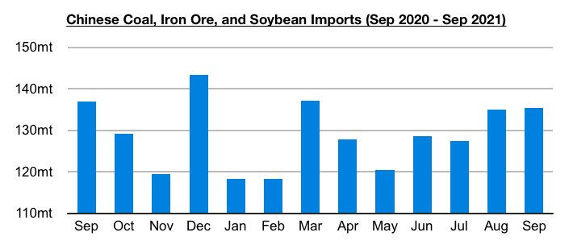
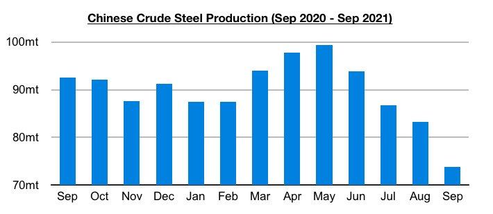
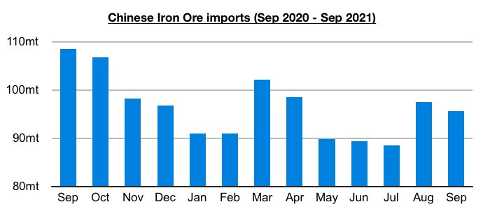

# Recent Rebound in Chinese Dry Bulk Import Volume Routinely Overlooked

**Date:** November 04, 2021  
**Publisher:** Breakwave Advisors | **Category:** Market Insights  
**Original URL:** [https://www.breakwaveadvisors.com/insights/2021/11/4/recent-rebound-in-chinese-dry-bulk-import-volume-routinely-overlooked](https://www.breakwaveadvisors.com/insights/2021/11/4/recent-rebound-in-chinese-dry-bulk-import-volume-routinely-overlooked)  

---

*By Jeffrey Landsberg*

A narrative has continued to dominate media and expert coverage proclaiming that China's dry bulk commodity import demand has been slowing. While steel production has certainly crashed, China's major dry bulk import volume has stayed well above May's recent low and achieved even more strength recently in August and September. October’s data will also very likely show sustained strength.

> **Figure 1: Chart 1 (5)**  
> [Local Asset](file:///C:/Users/Dell/Github/Shipping/corpus/03-breakwave/insights/2021/assets/2021-11-04_recent-rebound-in-chinese-dry-bulk-import-volume-routinely-overlooked_img_chart128529_46d99829ad5e.jpg)

Over the years we have seen both generalists and experts hold a negative China bias. Key aspects including trade volume also often go ignored, and only price is often discussed if price is falling but import volumes are rising. As we have focused on in particular in Commodore's Weekly Dry Bulk Reports and Weekly China Reports in recent months, the divergence in steel production and iron ore imports has been particularly noteworthy. China’s steel production peaked at 99.5 million tons back in May this year and then came under very consistent pressure — but iron ore imports (while falling every month during April through July) rebounded in August and stayed at a moderate level in September.

> **Figure 2: Chart 2 (4)**  
> [Local Asset](file:///C:/Users/Dell/Github/Shipping/corpus/03-breakwave/insights/2021/assets/2021-11-04_recent-rebound-in-chinese-dry-bulk-import-volume-routinely-overlooked_img_chart228429_2c95c73b8960.jpg)

A divergence is China’s steel production and iron ore import volume has been very clear in recent months, but it goes against the narrative of slowing imports and therefore often is not reported. In addition, collectively China's coal, iron ore, and soybean import volume has increased notably since May -- but again such strength often goes unreported.

> **Figure 3: Chart 3 (2)**  
> [Local Asset](file:///C:/Users/Dell/Github/Shipping/corpus/03-breakwave/insights/2021/assets/2021-11-04_recent-rebound-in-chinese-dry-bulk-import-volume-routinely-overlooked_img_chart328229_7b002b7e3d02.jpg)

It is reasonable to hold any bullish or bearish views for China’s overall import prospects looking forward, but some coverage of China recently has not been reasonable and has ignored just how well imports have fared in recent months. We remain most bullish for China’s coal import prospects for the near term. And while iron ore import prospects remain most in question, we continue to stress that iron ore imports can fare well even when steel production declines. This year’s decline in iron ore imports began well before steel production peaked, and a significant improvement has remained in place even though steel production in September reached its lowest level of the year. While it still remains to be seen if China's iron ore imports will climb further in the near term, we remain of our view that there is a solid chance that July's 88.5 million ton import total will mark this year's low.

---

**Tags:** China, Imports, Dry Bulk, Economy  
