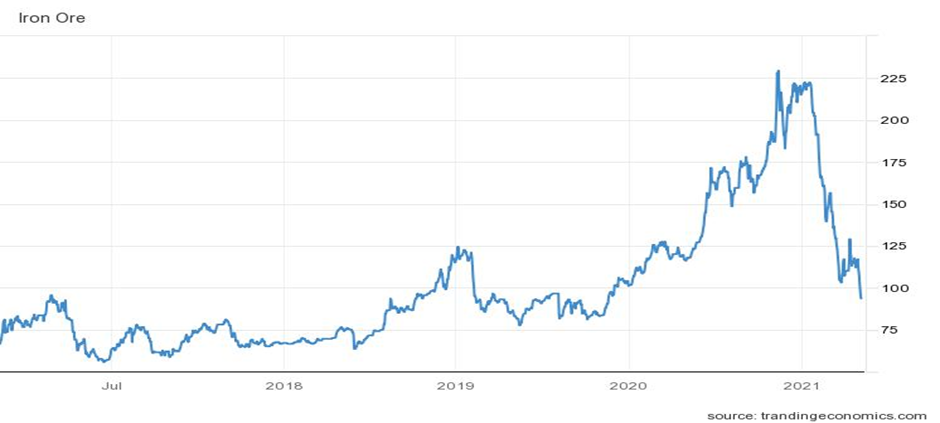
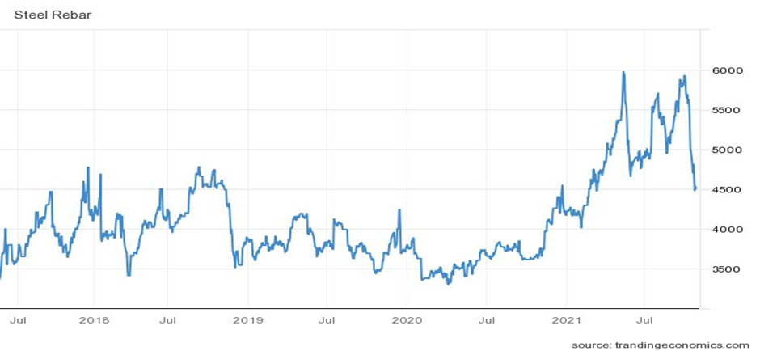
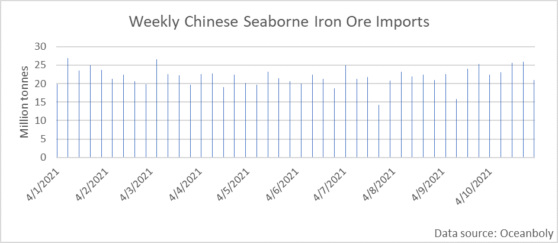
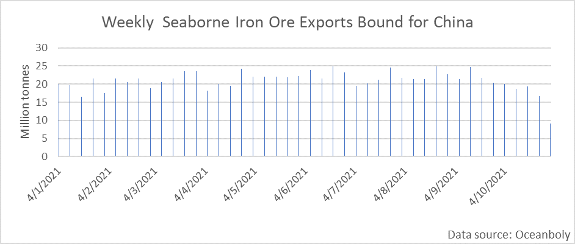

# Iron Ore: Hero to Zero Yet Again

**Date:** November 05, 2021  
**Publisher:** Breakwave Advisors | **Category:** Market Insights  
**Original URL:** [https://www.breakwaveadvisors.com/insights/2021/11/5/iron-ore-hero-to-zero-yet-again](https://www.breakwaveadvisors.com/insights/2021/11/5/iron-ore-hero-to-zero-yet-again)  

---

*By Ulf Bergman*

Following iron ore’s well-publicised two-month slide from the end of July to the end of September, when the commodity dropped more than fifty per cent, the price recovered, and the steel-making ingredient was again, for a time, one of the better performers among the commodities. However, after gaining some thirteen per cent in three weeks, the party ended yet again in the middle of October. Since then, iron ore prices have rejoined the journey south, with the price dropping a further 28 per cent. The latest plunge has brought iron ore below 100 dollars per tonne for the first time since the end of May last year.

> **Figure 1: Ch1**  
> [Local Asset](file:///C:/Users/Dell/Github/Shipping/corpus/03-breakwave/insights/2021/assets/2021-11-05_iron-ore-hero-to-zero-yet-again_img_ch1_717edb328145.png)

Demand for iron ore has softened due to declining steel production in China and increasing signs that both the Chinese and the global economic growth are facing mounting headwinds. While China has imposed curbs on steel production since the middle of the second quarter, restrictions are now being imposed more frequently and see greater compliance. Initially, Beijing’s efforts to manage steel output domestic were aimed at stopping iron ore prices from surging ever higher and reducing emissions from one of China’s largest polluters. However, as the Chinese economy has come under increasing pressure from the problems in its indebted housing sector and power shortages, the steel demand has softened further. The approaching Winter Olympics, due to be held during February in China, has renewed the focus on emission levels. The Chinese leadership is keen on reducing pollution to improve the chances of blue skies for the event.

According to reports from Mysteel, daily steel production during the latter part of October were the lowest since China emerged from the initial lockdowns in March 2020. Local governments’ regular requests to limit output to conserve energy in combination with lacklustre steel demand and softening prices saw many steel mills’ reducing their production. Official data also showed that production fell during September, to the lowest since 2017.

Softening steel demand has also seen the metal’s prices falling. Steel rebar futures in Shanghai have fallen by almost a quarter during the last month. The demand from the Chinese construction sector, which usually accounts for around a quarter of domestic steel demand, remains under pressure after home sales fell and Beijing stepped up its borrowing clampdown. Futures on stainless steel has also retreated in recent days. However, unlike for rebar, the drop is due to an expectation of increasing supplies rather than falling demand. The Chinese stainless steel production is widely expected to increase during November, as some key producing provinces have relaxed their power curbs, with some analysts predicting a fifteen per cent increase.

> **Figure 2: Ch2**  
> [Local Asset](file:///C:/Users/Dell/Github/Shipping/corpus/03-breakwave/insights/2021/assets/2021-11-05_iron-ore-hero-to-zero-yet-again_img_ch2_1476546c46f0.png)

Despite the lacklustre Chinese demand for steel, imports of iron ore remain surprisingly robust. According to data from Oceanbolt, the volumes of iron ore discharged in Chinese ports in October were among the highest on record at 108.3 million tonnes. Weekly imports show no signs of abating as we move into November, with the current week on track to be one of the strongest on record.

> **Figure 3: Ch3**  
> [Local Asset](file:///C:/Users/Dell/Github/Shipping/corpus/03-breakwave/insights/2021/assets/2021-11-05_iron-ore-hero-to-zero-yet-again_img_ch3_141185e05804.png)

While the iron ore imports have remained surprisingly strong in recent weeks and months. Exports bound for Chinese ports have been trending lower in recent weeks, suggesting that volumes discharged in Chinese ports will start to ease in the coming weeks. It typically takes between two and five weeks for a cargo of iron ore to reach the Chinese ports. Hence, there is a delay in how quickly changes in demand will translate into discharged volumes.

> **Figure 4: Ch4**  
> [Local Asset](file:///C:/Users/Dell/Github/Shipping/corpus/03-breakwave/insights/2021/assets/2021-11-05_iron-ore-hero-to-zero-yet-again_img_ch4_ab74f3ab5c3f.png)

The coming weeks are likely to experience falling Chinese iron ore imports, and prices could come under renewed pressure as a result. Despite the recent retreats, both iron ore and steel prices remain high in a historical context. Hence, there is still some downside risks for the prices. Miners are likely to think that the Winter Olympics can not come fast enough. Chinese iron ore demand is unlikely to rebound in any meaningful way until after the games, as the production restrictions have been extended into the new year.

---

**Tags:** Iron Ore, Steel, Price, Economy  
