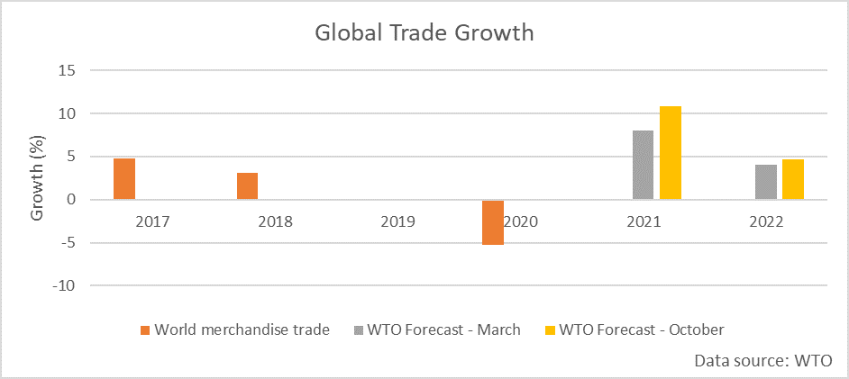
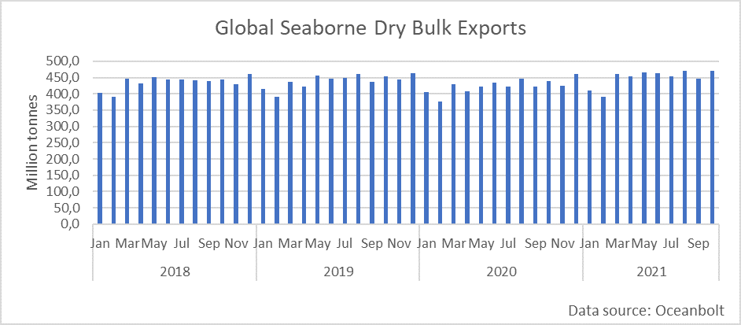
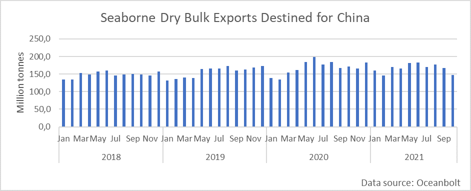

# Global Trade Holding Up Amid Economic Headwinds

**Date:** November 11, 2021  
**Publisher:** Breakwave Advisors | **Category:** Market Insights  
**Original URL:** [https://www.breakwaveadvisors.com/insights/2021/11/11/global-trade-holding-up-amid-economic-headwinds](https://www.breakwaveadvisors.com/insights/2021/11/11/global-trade-holding-up-amid-economic-headwinds)  

---

*By*[*Ulf Bergman*](https://www.linkedin.com/in/ulf-bergman-81570425/)

The global economy may be facing its fair share of dark clouds at the horizon, with the path of the post-pandemic recovery more turbulent than envisaged only a few months ago. China, which spearheaded the global return to growth, looks set to face a decelerating expansion during the last quarter of the year. The country is wrestling with, among other things, problems in the property sector and uncertain energy supplies, which are taking their toll on industrial production. Elsewhere in the world, a resurgence in Covid-cases and supply chain problems are challenging the ongoing recovery.

Despite the economic headwinds, global trade has held up well. Over the weekend, China reported a record monthly trade surplus during October. Exports grew by more than 27 per cent, compared to a year ago, and reached 300.2 billion dollars, extending the run of double-digit monthly growth to thirteen. It was also the third consecutive month of exports beating analysts’ expectations. Imports continued to grow last month, but in a somewhat less spectacular fashion at 20.6 per cent. The strength of the exports drove the trade surplus to a whopping 84.5 billion dollars. The development is likely to be well received by the leadership in Beijing. It will cushion the economy from weakening domestic demand and give policymakers the flexibility to delay the implementation of any additional stimulus initiatives. However, it is unlikely to be enough to avoid further pressure on Chinese growth rates as the economy now is so large that overseas demand can not replace softening consumer spending and investments.

The World Trade Organization has also recently upgraded its outlook for global trade, as it sees demand remaining robust. In March, the Geneva-based organisation expected the flow to grow by eight per cent this year. However, a more robust recovery than expected has seen the projection revised to 10.8 per cent. Next year’s original expectation of a four per cent trade growth has also seen an adjustment, with the WTO expecting it to reach 4.7 per cent.

> **Figure 1: Ch1**  
> [Local Asset](file:///C:/Users/Dell/Github/Shipping/corpus/03-breakwave/insights/2021/assets/2021-11-11_global-trade-holding-up-amid-economic-headwinds_img_ch1_50ebf690da0d.png)

Data from Oceanbolt confirm the robust recovery of global trade in the wake of the pandemic. In October, total dry bulk export volumes edged up to a new monthly record, with 471 million tonnes shipped. Since March, global seaborne volumes have been at par with the pre-pandemic levels of 2019, and last month’s record represented a four per cent increase on the same month two years ago.

> **Figure 2: Ch2**  
> [Local Asset](file:///C:/Users/Dell/Github/Shipping/corpus/03-breakwave/insights/2021/assets/2021-11-11_global-trade-holding-up-amid-economic-headwinds_img_ch2_3806aefe5572.png)

For China, the situation looks rather different. While global monthly exports have remained stable over the last eight months, cargo volumes destined for China have trended lower since June. Last month dry bulk shipments bound for Chinese ports declined by eleven per cent compared to September and were fourteen per cent lower than the same month a year ago. In October, most of the drop can be attributed to declining iron ore volumes, with sixteen million tonnes less shipped to China.

> **Figure 3: Ch3**  
> [Local Asset](file:///C:/Users/Dell/Github/Shipping/corpus/03-breakwave/insights/2021/assets/2021-11-11_global-trade-holding-up-amid-economic-headwinds_img_ch3_d0949824cad7.png)

The shrinking export shipments to China can be seen as leading indicators for the Chinese economy, suggesting growth will remain under pressure in the coming months. Less appetite for iron ore and other commodities from Chinese buyers will see industrial output weaken further. Environmental restrictions ahead of the Winter Olympics and the energy crisis are likely to keep the pressure on the economy, especially as the solid exports enable Beijing to delay any policy initiatives to support growth. Global demand for seaborne dry bulk commodities, on the other hand, looks set to remain robust, especially as flagging demand from Chinese buyers already has been offset globally. The newly approved US infrastructure bill is likely to lend support to the global demand, as is the continued recovery in countries such as India.

---

**Tags:** Global, Economy, Trade, China  
