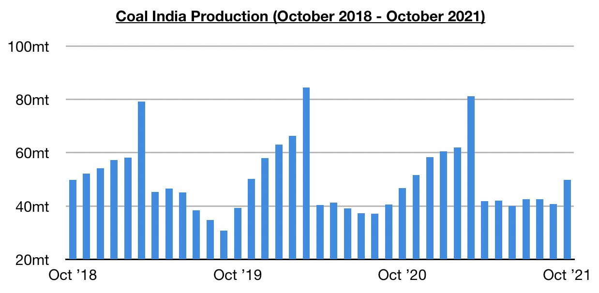
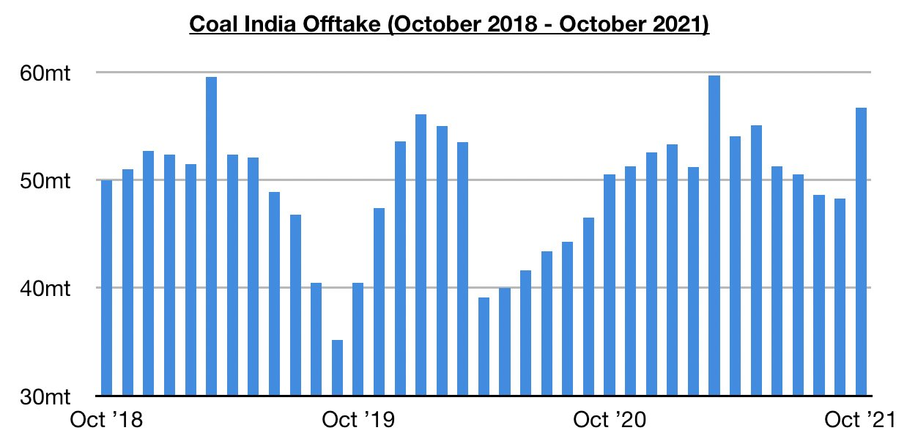
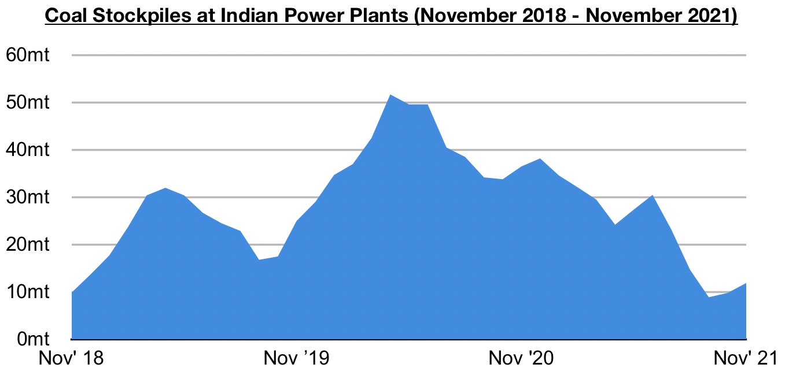

# Increase in Coal India's Production and Offtake

**Date:** November 12, 2021  
**Publisher:** Breakwave Advisors | **Category:** Market Insights  
**Original URL:** [https://www.breakwaveadvisors.com/insights/2021/11/12/increase-in-coal-indias-production-and-offtake](https://www.breakwaveadvisors.com/insights/2021/11/12/increase-in-coal-indias-production-and-offtake)  

---

*By*[*Jeffrey Landsberg*](https://www.linkedin.com/in/jeffrey-landsberg-70ab957/)

Coal India produced 49.8 million tons of coal in October. This is 9.1 million tons (22%) more than was produced in September and up year-on-year by 3 million tons (6%).

> **Figure 1: Chart 1 (6)**  
> [Local Asset](file:///C:/Users/Dell/Github/Shipping/corpus/03-breakwave/insights/2021/assets/2021-11-12_increase-in-coal-indias-production-and-offtake_img_chart128629_09d0b02ee0de.jpg)

Offtake totaled 56.7 million tons, which is 8.4 million tons (17%) more than was seen in September and up year-on-year by 6.2 million tons (12%). Production and offtake last month each came in at their highest levels since March.

> **Figure 2: Chart 2 (5)**  
> [Local Asset](file:///C:/Users/Dell/Github/Shipping/corpus/03-breakwave/insights/2021/assets/2021-11-12_increase-in-coal-indias-production-and-offtake_img_chart228529_3d8337ad503e.jpg)

The increases in Coal India’s production and offtake have been much needed and have helped India’s power plant stockpiles finally increase. Still, though, power plant stockpiles are down year-on-year by 22.3 million tons (-65%). India’s power plant coal stockpiles ended last week at approximately 11.9 million tons. This is 2.1 million tons (21%) more than was stockpiled at the end of the previous week but down year-on-year by 22.3 million tons (-65%). They can meet 7 days of demand, while the normal requirement for this time of year is to meet 21 days of demand.

> **Figure 3: Chart 3 (3)**  
> [Local Asset](file:///C:/Users/Dell/Github/Shipping/corpus/03-breakwave/insights/2021/assets/2021-11-12_increase-in-coal-indias-production-and-offtake_img_chart328329_874f272cdb1e.jpg)

Among all of the nation’s power plants, 16 power plants can now meet only 3 days of demand, 8 can meet only 2 days of demand, 7 can meet only 1 day of demand, and 3 are not able to meet any demand. With India's power plant stockpiles still remaining quite low, the nation's near-term coal import prospects remain encouraging.

---

**Tags:** India, Coal, Energy  
