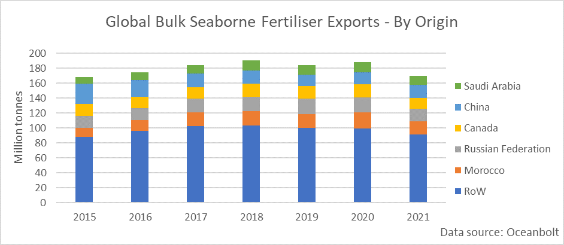
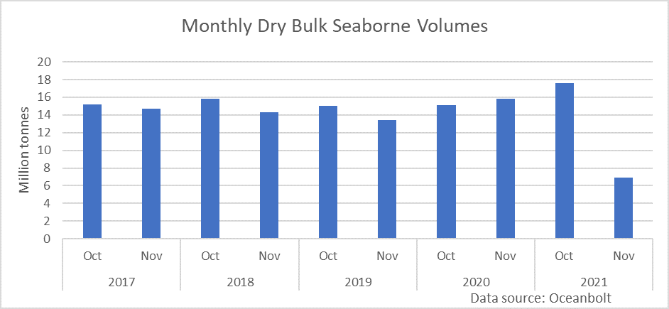
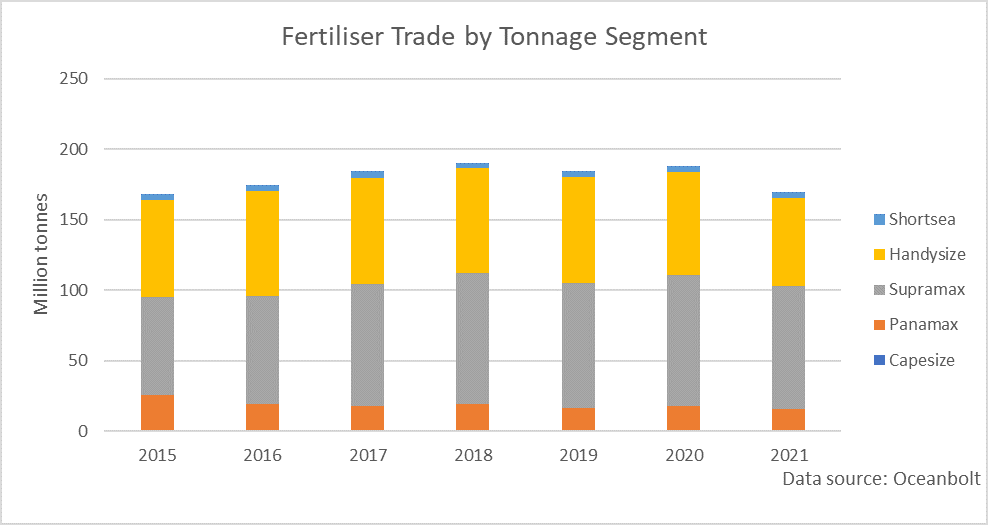

# The Global Fertilizer Trade Under Pressure in the Wake of the Energy Crisis

**Date:** November 16, 2021  
**Publisher:** Breakwave Advisors | **Category:** Market Insights  
**Original URL:** [https://www.breakwaveadvisors.com/insights/2021/11/16/the-global-fertilizer-trade-under-pressure-in-the-wake-of-the-energy-crisis](https://www.breakwaveadvisors.com/insights/2021/11/16/the-global-fertilizer-trade-under-pressure-in-the-wake-of-the-energy-crisis)  

---

*By*[*Ulf Bergman*](https://www.linkedin.com/in/ulf-bergman-81570425/)

Global food prices look set to become collateral damage of the global energy crisis. The ongoing energy squeeze in Europe and elsewhere makes natural gas, the primary feedstock for most nitrogen fertilisers, more expensive. The soaring energy costs are sending fertiliser prices soaring to extraordinary heights, with The Green Markets North American Fertilizer Price Index ending last week just shy of 1100 dollars per short ton. The 4.4 per cent surge on Friday meant that the index has gained around 260 per cent over the preceding eighteen months. Beyond surging prices, many producers warn that the high cost will curtail global fertiliser production, and shortages may develop. Global food prices and supplies may, hence, be hit twice, with rising production costs and falling production, due to lower use of fertilisers, both contributing to increasing food inflation.

In addition to the supply side shock, the two primary producers of fertilisers, China and Russia, are restricting their exports to ensure sufficient supplies for the domestic farmers. Hence, significant importers are facing additional supply constraints and rising crop prices. In the US, one of the largest buyers of synthetic fertilisers, the consumers are already facing the steepest price rises for three decades. Still, inflation rates could rise further as fertiliser shortages could push food prices even higher in the coming months.

Globally, the crop markets, from grains to coffee, are getting a boost from the fertiliser rally as traders brace for potential supply shortages, with the surging input costs threatening to reduce yields across the board. However, as fertiliser and other input costs increase, many farmers are expected to switch crops next year, e,g, from corn to soybeans, to reduce the need for nitrogen-based feed. An extensive substitution of corn could see the crop regaining some of the ground lost since the high in May, as supplies fall.

According to data from Oceanbolt, around 185 million tonnes of fertilisers are shipped onboard dry bulk vessels annually. The trade is not the exclusive domain for dry bulk, as a large part is shipped bagged in containers. Unlike most other dry bulk commodities, China, together with Russia and Morroco, is one of the largest exporters. However, given the diverse nature of the fertiliser market, the world’s second-largest economy is also importing significant volumes. Since 2015, Brazil has been the largest destination for fertilisers shipped in bulk, followed by India and China. Global exports of fertilisers remain diversified, with the top-five producers typically accounting for less than half of the global volumes.

> **Figure 1: Ch1**  
> [Local Asset](file:///C:/Users/Dell/Github/Shipping/corpus/03-breakwave/insights/2021/assets/2021-11-16_the-global-fertilizer-trade-under-pressure-in-the-wake-of-the-energy-crisis_img_ch1_8724807060df.png)

Assuming linearity, export volumes year-to-date suggest that 2021 will surpass the previous record from 2018. The rather simplistic approach indicates that approximately 194 million tonnes of fertilisers will be shipped onboard bulkers during the year, some three million tonnes more than three years ago. However, while volumes remained strong during October, the exports during the current month show weakness compared to previous years. With half of the month behind us, the seven million tonnes shipped would imply the total monthly volumes are some twelve per cent below the same month last year.

> **Figure 2: Ch2**  
> [Local Asset](file:///C:/Users/Dell/Github/Shipping/corpus/03-breakwave/insights/2021/assets/2021-11-16_the-global-fertilizer-trade-under-pressure-in-the-wake-of-the-energy-crisis_img_ch2_3c25cfca8049.png)

The slowdown in export activities indicates that the global energy crisis is starting to affect fertiliser production and exports. If the pattern remains in place for the remainder of the year, export volumes may fail, albeit marginally, to match the yearly record from 2018. A continued reduction in the seaborne transportation of fertilisers would chiefly affect the demand in the Supramax and Handysize segments, which between them account for almost ninety per cent of the trade. Of the two vessel types, Supramaxes have become increasingly dominant at the expense of their smaller siblings. In recent years, Supramaxes have carried around half of the fertilisers that do not see the inside of a container. Hence, a reduction in seaborne exports could put pressure on freight rates in the smaller tonnage segments. The fertiliser trade accounts for approximately eight per cent of the Supramaxes’ annual volumes and ten per cent for the smallest tonnage. The restrictions on Chinese and Russian exports may also alter existing trade flows, as key buyers, such as Brazil and India, are forced to look for alternative sources.

> **Figure 3: Ch3**  
> [Local Asset](file:///C:/Users/Dell/Github/Shipping/corpus/03-breakwave/insights/2021/assets/2021-11-16_the-global-fertilizer-trade-under-pressure-in-the-wake-of-the-energy-crisis_img_ch3_19a9258040b2.png)

---

**Tags:** Global Economy, Trade, Shipping, Energycrisis  
