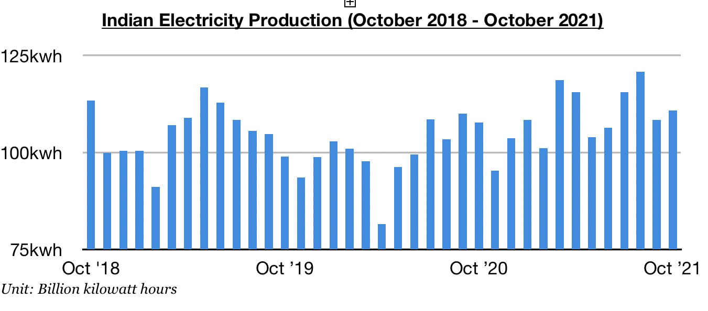
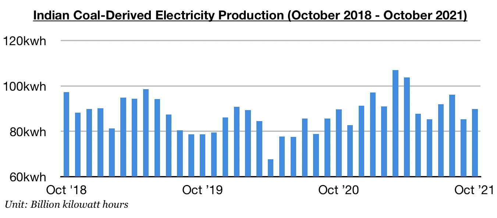
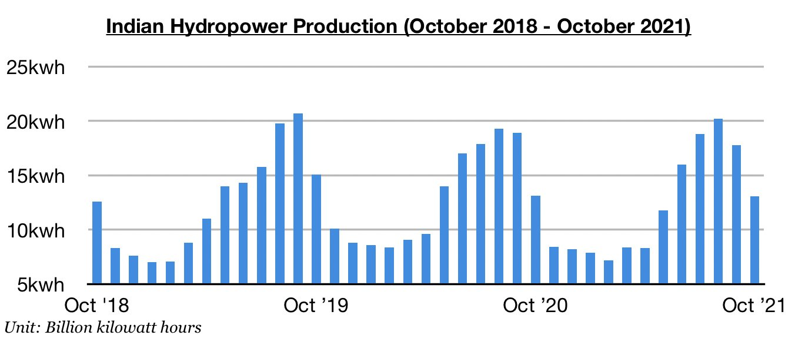
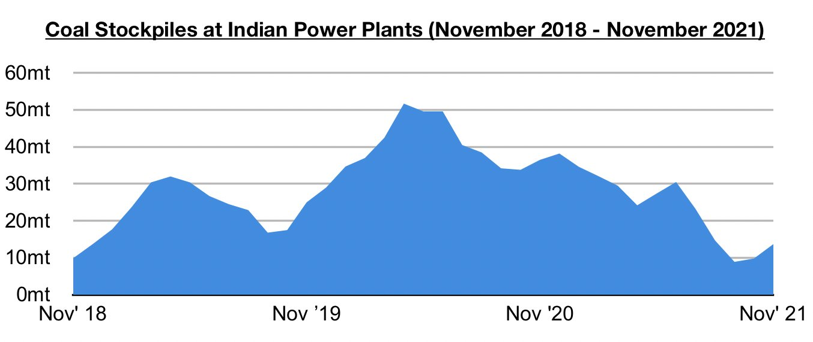

# Rebound in Indian Electricity Production

**Date:** November 17, 2021  
**Publisher:** Breakwave Advisors | **Category:** Market Insights  
**Original URL:** [https://www.breakwaveadvisors.com/insights/2021/11/17/rebound-in-indian-electricity-production](https://www.breakwaveadvisors.com/insights/2021/11/17/rebound-in-indian-electricity-production)  

---

*By*[*Jeffrey Landsberg*](https://www.linkedin.com/in/jeffrey-landsberg-70ab957/)

India produced approximately 110.8 billion kilowatt hours of electricity last month, which is up month-on-month by 2.4 billion kilowatt hours (2%) and up year-on-year by 3.1 billion kilowatt hours (3%). Significant is that September had previously marked the first time all year that India's electricity production contracted on a year-on-year basis. September’s sudden weakness occurred primarily from the nation’s coal shortages, but coal supply has been increasing in recent weeks and has helped allow coal-derived electricity generation to increase. Hydropower production also has recently returned to finding growth again (albeit only a very small amount).

> **Figure 1: Chart 1 (8)**  
> [Local Asset](file:///C:/Users/Dell/Github/Shipping/corpus/03-breakwave/insights/2021/assets/2021-11-17_rebound-in-indian-electricity-production_img_chart128829_a81ab361808c.jpg)

India’s coal-derived electricity generation totaled approximately 89.9 billion kilowatt hours of electricity last month. This has marked a month-on-month increase of 4.5 billion kilowatt hours (5%) and is up year-on-year by 300 million kilowatt hours. Previously, coal-derived electricity generation had contracted on a year-on-year basis by 0.2% in September (which also marked the first time all year that there was a year-on-year contraction).

> **Figure 2: Chart 2 (6)**  
> [Local Asset](file:///C:/Users/Dell/Github/Shipping/corpus/03-breakwave/insights/2021/assets/2021-11-17_rebound-in-indian-electricity-production_img_chart228629_f4207432eb40.jpg)

India’s hydropower production totaled approximately 13.1 billion kilowatt hours last month. This has marked a month-on-month decline of 4.7 billion kilowatt hours (-26%) but is up year-on-year by 10 million kilowatt hours. Previously, hydropower production had contracted on a year-on-year basis by 6% in September (and also experienced year-on-year contractions during January through June).

> **Figure 3: Chart 3 (4)**  
> [Local Asset](file:///C:/Users/Dell/Github/Shipping/corpus/03-breakwave/insights/2021/assets/2021-11-17_rebound-in-indian-electricity-production_img_chart328429_6f118d5f50d8.jpg)

It is positive for the Indian economy that electricity production has rebounded and coal availability has improved. Of note regarding power plant stockpiles is that stockpiles ended last week at approximately 13.7 million tons. This is 1.2 million tons (10%) more than was stockpiled at the end of the previous week but is still down year-on-year by 21 million tons (-61%).

> **Figure 4: Chart 4**  
> [Local Asset](file:///C:/Users/Dell/Github/Shipping/corpus/03-breakwave/insights/2021/assets/2021-11-17_rebound-in-indian-electricity-production_img_chart4_2d7894e3babf.jpg)

India's power plant coal stockpiles can now meet 8 days of demand, while the normal requirement for this time of year is to meet 21 days of demand. Among all of the nation’s power plants, 6 power plants can now meet only 3 days of demand, 11 can meet only 2 days of demand, 8 can meet only 1 day of demand, and 4 are not able to meet any demand. With India's stockpiles still quite low, the nation's near-term coal import prospects remain encouraging.

---

**Tags:** India, Energy, Electricity, Coal  
