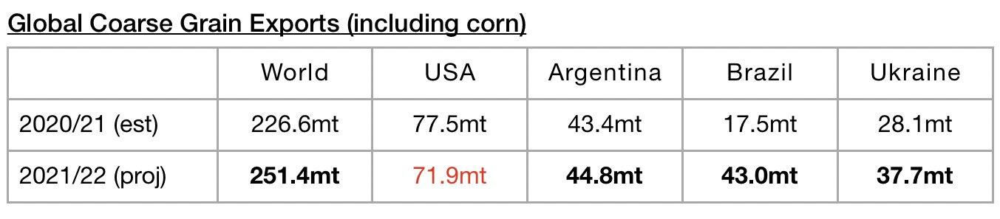
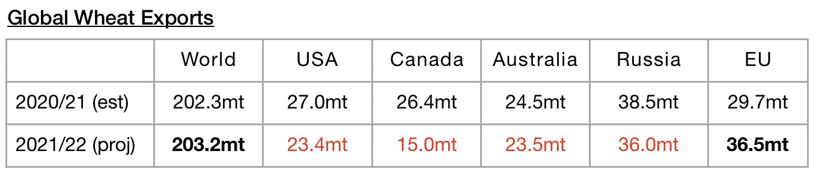
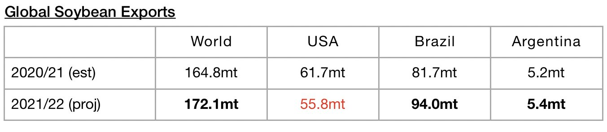
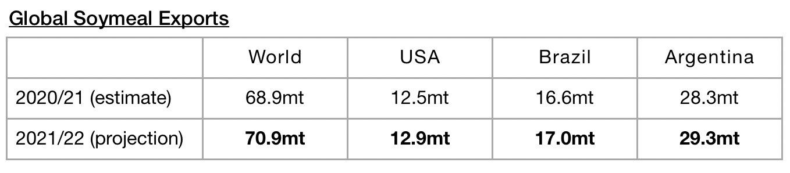

# Even Larger Amount of Global Grain Exports Expected

**Date:** November 18, 2021  
**Publisher:** Breakwave Advisors | **Category:** Market Insights  
**Original URL:** [https://www.breakwaveadvisors.com/insights/2021/11/18/even-larger-amount-of-global-grain-exports-expected](https://www.breakwaveadvisors.com/insights/2021/11/18/even-larger-amount-of-global-grain-exports-expected)  

---

*By*[*Jeffrey Landsberg*](https://www.linkedin.com/in/jeffrey-landsberg-70ab957/)

Global seaborne grain trade prospects for the current 2021/22 season have long remained very bullish, and an even larger amount of exports are now expected. The United States Department of Agriculture has released their latest forecasts for 2021/22 and is now forecasting global grain exports will total 504.2 million tons. This is 5.2 million tons (1%) more than was forecast a month ago and would mark a year-on-year increase of 25.7 million tons (5%). Expectations for global seaborne coarse grain exports remain particularly epic. Global coarse grain exports in 2021/22 are now expected to total 251.4 million tons. This is 1.8 million tons (1%) more than was forecast a month ago and would mark a year-on-year increase of 24.8 million tons (11%).

> **Figure 1: Chart 1 (9)**  
> [Local Asset](file:///C:/Users/Dell/Github/Shipping/corpus/03-breakwave/insights/2021/assets/2021-11-18_even-larger-amount-of-global-grain-exports-expected_img_chart128929_11cf75da844e.jpg)

Global wheat exports are expected to total 203.2 million tons. This is 3.6 million tons (2%) more than was forecast a month ago and would mark a year-on-year increase of 900,000 tons.

> **Figure 2: Chart 2 (7)**  
> [Local Asset](file:///C:/Users/Dell/Github/Shipping/corpus/03-breakwave/insights/2021/assets/2021-11-18_even-larger-amount-of-global-grain-exports-expected_img_chart228729_7a972210a493.jpg)

In addition, global soybean exports (soybeans are not technically classified as a grain) are expected to total 172.1 million tons. This is 1 million tons (-1%) less than was forecast a month ago but would mark a year-on-year increase of 7.3 million tons (4%).

> **Figure 3: Chart 3 (5)**  
> [Local Asset](file:///C:/Users/Dell/Github/Shipping/corpus/03-breakwave/insights/2021/assets/2021-11-18_even-larger-amount-of-global-grain-exports-expected_img_chart328529_6d9981421a92.jpg)

Global soymeal exports are expected to total 70.9 million tons. This is 400,000 tons (1%) more than was forecast a month ago and would mark a year-on-year increase of 2 million tons (3%).

> **Figure 4: Chart 4 (1)**  
> [Local Asset](file:///C:/Users/Dell/Github/Shipping/corpus/03-breakwave/insights/2021/assets/2021-11-18_even-larger-amount-of-global-grain-exports-expected_img_chart428129_b7afb65e88ea.jpg)

---

**Tags:** Economy, Global, Exports, Grains  
