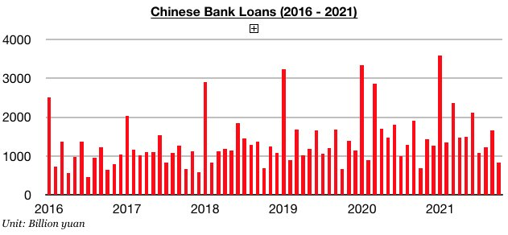
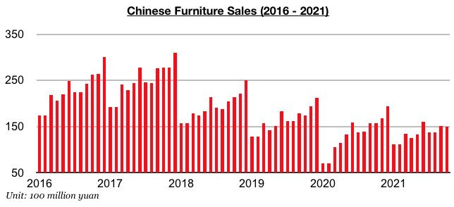
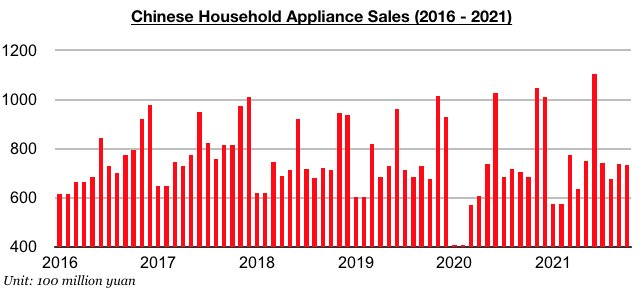
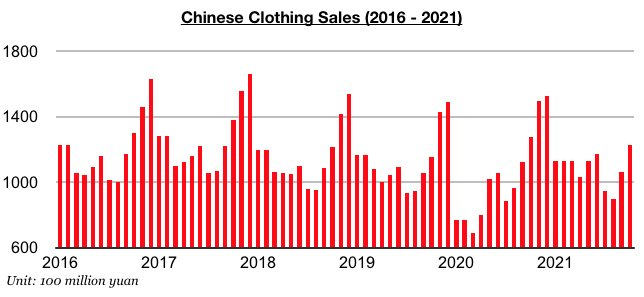

# Chinese Consumer Spending Has Improved But Further Contraction in Domestic Furniture Sales

**Date:** November 25, 2021  
**Publisher:** Breakwave Advisors | **Category:** Market Insights  
**Original URL:** [https://www.breakwaveadvisors.com/insights/2021/11/25/chinese-consumer-spending-has-improved-but-further-contraction-in-domestic-furniture-sales](https://www.breakwaveadvisors.com/insights/2021/11/25/chinese-consumer-spending-has-improved-but-further-contraction-in-domestic-furniture-sales)  

---

*By*[*Jeffrey Landsberg*](https://www.linkedin.com/in/jeffrey-landsberg-70ab957/)

China’s retail sales in October grew year-on-year by 4.9%. This has marked a second consecutive month where growth has increased (one month prior in September, growth rose to 4.4%). Prior to September, China's retail sales growth had fallen for five consecutive months during April through August, and by August growth had fallen to only 2.5%. Overall, it is encouraging that retail sales growth continues to increase. As we have also discussed in earlier work, also remaining encouraging is that the year-on-year growth in new loans has continued to rise. The first half of 2021 saw new loans grow year-on-year by 8%, but during July through October new loans have grown year-on-year by 11%.

> **Figure 1: Chart 1 (10)**  
> [Local Asset](file:///C:/Users/Dell/Github/Shipping/corpus/03-breakwave/insights/2021/assets/2021-11-25_chinese-consumer-spending-has-improved-but-further-contraction-in-domestic-furni_img_chart1281029_22ddd9ca9ffa.jpg)

Pockets of contraction still remain in consumer spending, however, including furniture sales contracting even further last month due to weakness in the housing market. Furniture sales in China totaled approximately 14.9 billion yuan last month, which has marked a year-on-year contraction of 5%. Furniture sales in China have now declined on a year-on-year basis for three consecutive months

> **Figure 2: Chart 2 (8)**  
> [Local Asset](file:///C:/Users/Dell/Github/Shipping/corpus/03-breakwave/insights/2021/assets/2021-11-25_chinese-consumer-spending-has-improved-but-further-contraction-in-domestic-furni_img_chart228829_4f1532fb05ba.jpg)

Appliance sales (which includes consumer electronics) continue to fare particularly well. Household appliance sales totaled approximately 73.5 billion yuan, which has marked a year-on-year increase of 7%. Household appliance sales have now increased on a year-on-year basis during twelve of the last thirteen months.

> **Figure 3: Chart 3 (6)**  
> [Local Asset](file:///C:/Users/Dell/Github/Shipping/corpus/03-breakwave/insights/2021/assets/2021-11-25_chinese-consumer-spending-has-improved-but-further-contraction-in-domestic-furni_img_chart328629_4c489977c397.jpg)

Clothing sales (which includes garments, footwear, hats, and knitwear) declined on a year-on-year basis again last month, but the pace of contraction has continued to slow. Clothing sales in China totaled approximately 122.7 billion yuan, which has marked a year-on-year contraction of 4%. China’s domestic clothing sales have now declined on a year-on-year basis for three consecutive months, but last month’s 4% year-on-year contraction is moderately below the 6% year-on-year contraction seen in September and 7% year-on-year contraction seen in August. Last month’s 122.7 billion yuan in clothing sales also marks the largest total seen since December.

> **Figure 4: Chart 4 (2)**  
> [Local Asset](file:///C:/Users/Dell/Github/Shipping/corpus/03-breakwave/insights/2021/assets/2021-11-25_chinese-consumer-spending-has-improved-but-further-contraction-in-domestic-furni_img_chart428229_4aace04cb97e.jpg)

---

**Tags:** Sales, Retail, China, Economy  
