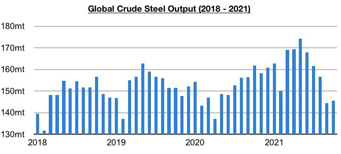
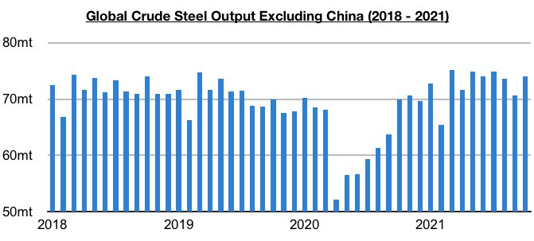
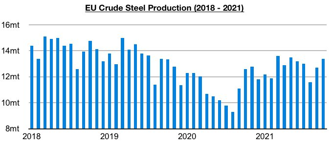
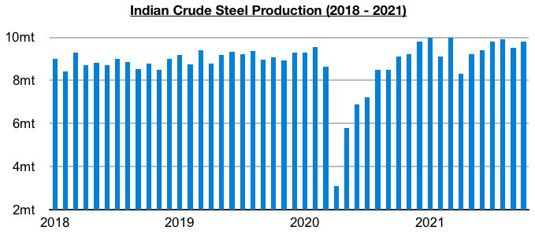
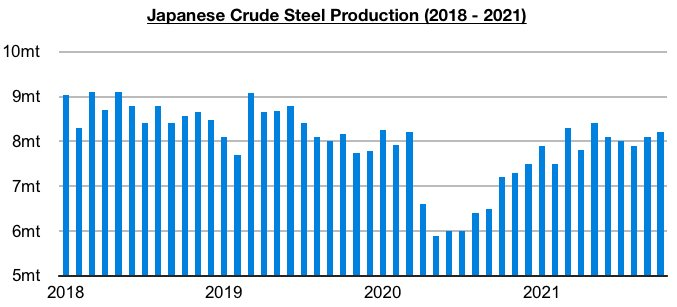

# Steel Production Remains Strong Outside of China

**Date:** December 03, 2021  
**Publisher:** Breakwave Advisors | **Category:** Market Insights  
**Original URL:** [https://www.breakwaveadvisors.com/insights/2021/12/2/steel-production-remains-strong-outside-of-china](https://www.breakwaveadvisors.com/insights/2021/12/2/steel-production-remains-strong-outside-of-china)  

---

*By*[*Jeffrey Landsberg*](https://www.linkedin.com/in/jeffrey-landsberg-70ab957/)

The most recently released data shows that global crude steel production totaled approximately 145.7 million tons in October. This is up month-on-month by 1.3 million tons (1%) but is 16.2 million tons (-10%) less than was reported last year for October 2020’s production. The year-on-year contraction has remained entirely due to the contraction in Chinese steel production. Outside of China, steel production has continued to rise on a year-on-year basis.

> **Figure 1: Chart 1 (11)**  
> [Local Asset](file:///C:/Users/Dell/Github/Shipping/corpus/03-breakwave/insights/2021/assets/2021-12-03_steel-production-remains-strong-outside-of-china_img_chart1281129_68e20ec8152c.jpg)

Global crude steel production outside of China totaled approximately 74.1 million tons in October. This is up month-on-month by 3.5 million tons (5%), is 4.2 million tons (6%) more than was reported last year for October 2020’s production, and is fairly close to the record 75.2 million tons produced in March. Global crude steel production outside of China remains very likely to set an annual record this year. So far this year, production has averaged 72.7 million tons per month. This is up by 10.1 million tons (16%) from the same period in 2020, is up by 1.9 million tons (3%) from the same period in 2019, and is up by 700,000 tons (1%) from the same period in 2018. Global steel production outside of China last set a record in 2018, and this year is finally likely to see a new record set again.

> **Figure 2: Chart 2 (9)**  
> [Local Asset](file:///C:/Users/Dell/Github/Shipping/corpus/03-breakwave/insights/2021/assets/2021-12-03_steel-production-remains-strong-outside-of-china_img_chart228929_8fa688ac721c.jpg)

Also of note is that steel production has remained particularly strong in the European Union, India, and Japan. The European Union produced approximately 13.4 million tons of crude steel last month. This is 700,000 tons (6%) more than was produced in September and is 800,000 tons (6%) more than was reported last year for October 2020's production.

> **Figure 3: Chart 3 (7)**  
> [Local Asset](file:///C:/Users/Dell/Github/Shipping/corpus/03-breakwave/insights/2021/assets/2021-12-03_steel-production-remains-strong-outside-of-china_img_chart328729_519809444a14.jpg)

India produced approximately 9.8 million tons of crude steel last month. This is 300,000 tons (3%) more than was produced in September and is 700,000 tons (8%) more than was reported last year for October 2020's production.

> **Figure 4: Chart 4 (3)**  
> [Local Asset](file:///C:/Users/Dell/Github/Shipping/corpus/03-breakwave/insights/2021/assets/2021-12-03_steel-production-remains-strong-outside-of-china_img_chart428329_23177872a15b.jpg)

Japan produced approximately 8.2 million tons of crude steel last month. This is 100,000 tons (1%) more than was produced in September and is 1 million tons (14%) more than was reported last year for October 2020's production.

> **Figure 5: Chart 5**  
> [Local Asset](file:///C:/Users/Dell/Github/Shipping/corpus/03-breakwave/insights/2021/assets/2021-12-03_steel-production-remains-strong-outside-of-china_img_chart5_45ea67a09693.jpg)

---

**Tags:** Steel, Global, China, Production  
