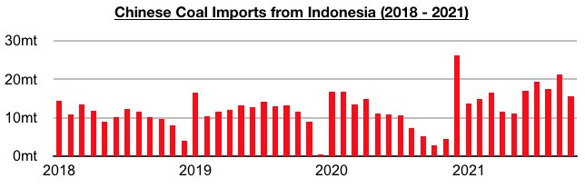
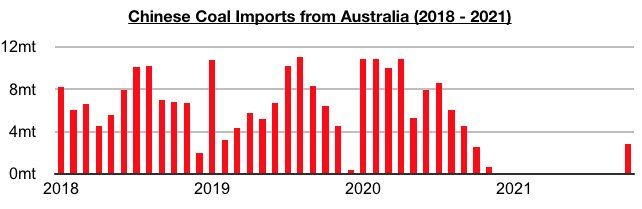
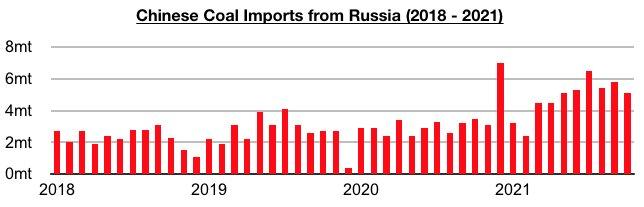
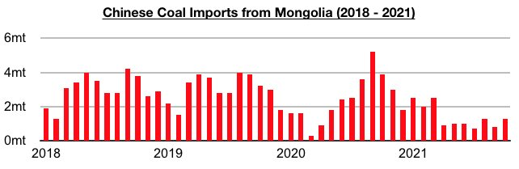

# Indonesia Remains China's Primary Source of Imported Coal

**Date:** December 08, 2021  
**Publisher:** Breakwave Advisors | **Category:** Market Insights  
**Original URL:** [https://www.breakwaveadvisors.com/insights/2021/12/8/indonesia-remains-chinas-primary-source-of-imported-coal](https://www.breakwaveadvisors.com/insights/2021/12/8/indonesia-remains-chinas-primary-source-of-imported-coal)  

---

*By*[*Jeffrey Landsberg*](https://www.linkedin.com/in/jeffrey-landsberg-70ab957/)

Coal import data for October by origin shows that imports from Indonesia have remained China's primary source of imports. October also finally saw imports from Australia however. Imports from Indonesia totaled approximately 15.6 million tons, which is down month-on-month by 5.8 million tons (-27%) but up year-on-year by 12.8 million tons (457%).

> **Figure 1: Chart 1 (1)**  
> [Local Asset](file:///C:/Users/Dell/Github/Shipping/corpus/03-breakwave/insights/2021/assets/2021-12-08_indonesia-remains-chinas-primary-source-of-imported-coal_img_chart128129_1519e0ac66cb.jpg)

Imports from Australia totaled approximately 2.8 million tons. This is up month-on-month by 2.8 million tons and up year-on-year by 300,000 tons (12%). Previously, China had not officially imported Australian coal since November 2020. As we discussed back in our October 11th Weekly China Report, several Australian cargoes that had long been stored in warehouses in China were finally cleared in October. These cargoes had made up the majority of the 2.8 million tons of Australian coal officially imported.

> **Figure 2: Chart 2**  
> [Local Asset](file:///C:/Users/Dell/Github/Shipping/corpus/03-breakwave/insights/2021/assets/2021-12-08_indonesia-remains-chinas-primary-source-of-imported-coal_img_chart2_d57a1680b067.jpg)

Imports from Russia totaled approximately 5.1 million tons, which is down month-on-month by 700,000 tons (-12%) but up year-on-year by 1.6 million tons (46%).

> **Figure 3: Chart 3**  
> [Local Asset](file:///C:/Users/Dell/Github/Shipping/corpus/03-breakwave/insights/2021/assets/2021-12-08_indonesia-remains-chinas-primary-source-of-imported-coal_img_chart3_5e0c126acf38.jpg)

Imports from Mongolia totaled approximately 1.3 million tons, which is up month-on-month by 500,000 tons (63%) but down year-on-year by 2.6 million tons (-67%). Imports from Mongolia have remained under sporadic pressure from the Chinese government due to Mongolian coronavirus cases.

> **Figure 4: Chart 4 (2)**  
> [Local Asset](file:///C:/Users/Dell/Github/Shipping/corpus/03-breakwave/insights/2021/assets/2021-12-08_indonesia-remains-chinas-primary-source-of-imported-coal_img_chart428229_64ea6fdeb36e.jpg)

Of note among the more minor coal exporters is that imports from the United States totaled approximately 800,000 tons. This is down month-on-month by 700,000 tons (-47%) but up year-on-year by 800,000 tons. Imports from Canada totaled approximately 500,000 tons. This is down month-on-month by 500,000 tons (-50%) but up year-on-year by 100,000 tons (25%). Imports from the Philippines totaled approximately 400,000 tons. This is down month-on-month by 700,000 tons (-64%) and down year-on-year by 200,000 tons (-33%). Imports from South Africa totaled approximately 300,000 tons. This is down month-on-month by 400,000 tons (-57%) and up year-on-year by 300,000 tons. Imports from Colombia totaled approximately 100,000 tons. This is down month-on-month by 300,000 tons (-75%) but up year-on-year by 100,000 tons.

---

**Tags:** Coal, Imports, Indonesia, China  
