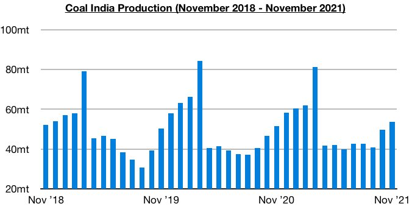
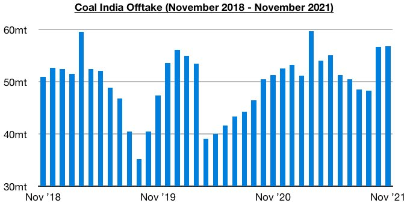
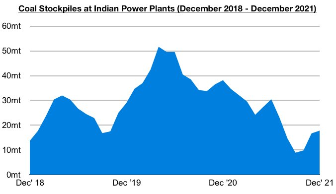

# Coal India's Production Continues to Climb But Power Plant Stockpiles Remain Relatively Low

**Date:** December 10, 2021  
**Publisher:** Breakwave Advisors | **Category:** Market Insights  
**Original URL:** [https://www.breakwaveadvisors.com/insights/2021/12/10/coal-indias-production-continues-to-climb-but-power-plant-stockpiles-remain-relatively-low](https://www.breakwaveadvisors.com/insights/2021/12/10/coal-indias-production-continues-to-climb-but-power-plant-stockpiles-remain-relatively-low)  

---

*By Jeffrey Landsberg*

Coal India produced approximately 53.8 million tons of coal last month, which marks a month-on-month increase of 4 million tons (8%) and a year-on-year increase of 2.1 million tons (4%). Coal India’s production has continued to climb dramatically since September and has continued to lead to a rise in the nation’s power plant stockpiles. However, production has still remained well below Q1’s level and coal import prospects remain encouraging.

> **Figure 1: Chart 1 (3)**  
> [Local Asset](file:///C:/Users/Dell/Github/Shipping/corpus/03-breakwave/insights/2021/assets/2021-12-10_coal-indias-production-continues-to-climb-but-power-plant-stockpiles-remain-rela_img_chart128329_47bfed61d699.jpg)

Coal India's offtake totaled 56.8 million tons last month, which marks a month-on-month increase of just 100,000 tons and a year-on-year increase of 5.5 million tons (11%). Offtake has now increased on a year-on-year basis for nine consecutive months, and last month climbed to just below the all-time high of 59.7 million tons sent to customers in March.

> **Figure 2: Chart 2 (2)**  
> [Local Asset](file:///C:/Users/Dell/Github/Shipping/corpus/03-breakwave/insights/2021/assets/2021-12-10_coal-indias-production-continues-to-climb-but-power-plant-stockpiles-remain-rela_img_chart228229_8da013d98c36.jpg)

India’s power plant coal stockpiles started this month at approximately 17.8 million tons, which is 19.7 million tons (-53%) less than was stockpiled a year ago. Stockpiles have been climbing since mid-October due in large part from the ongoing increase in Coal India's production. However, stockpiles still remain down considerably on a year-on-year basis. As of the start of this month, stockpiles could meet 10 days of demand even though the normal requirement for this time of year is still to meet 21 days of demand. Among the power plants, 4 power plants can meet only 3 days of demand, 10 can meet only 2 days of demand, 7 can meet only 1 day of demand, and 6 are not able to meet any demand.

> **Figure 3: Chart 3 (3)**  
> [Local Asset](file:///C:/Users/Dell/Github/Shipping/corpus/03-breakwave/insights/2021/assets/2021-12-10_coal-indias-production-continues-to-climb-but-power-plant-stockpiles-remain-rela_img_chart328329_7cf8ebddcc0c.jpg)

---

**Tags:** India, Coal, Imports, Production  
