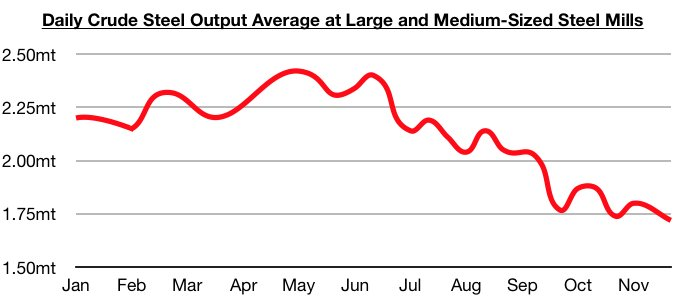
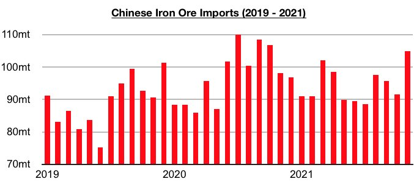

# Wait, China Enjoys Purchasing Imported Iron Ore Cargoes at Cheaper Prices?

**Date:** December 17, 2021  
**Publisher:** Breakwave Advisors | **Category:** Market Insights  
**Original URL:** [https://www.breakwaveadvisors.com/insights/2021/12/17/wait-china-enjoys-purchasing-imported-iron-ore-cargoes-at-cheaper-prices](https://www.breakwaveadvisors.com/insights/2021/12/17/wait-china-enjoys-purchasing-imported-iron-ore-cargoes-at-cheaper-prices)  

---

*By Jeffrey Landsberg*

Yes. China enjoys purchasing imported iron ore cargoes at cheaper prices. We continue to stress that China’s iron ore imports can fare well even when steel production declines. This year’s decline in iron ore imports began well before steel production peaked, and a rebound has remained in place even though steel production has continued to decline. As we have stressed often in Commodore's Weekly Dry Bulk Reports and Weekly China Reports throughout this year, historically it has been global iron ore production that dictates China’s iron ore import volume. Recent months have continued to show that China's iron ore imports can easily increase even when steel production is declining.

The most recently released data shows that China's crude steel production at large and medium-sized mills in China averaged 1.72 million tons during the last ten days of November. This is down by 3% from the previous ten days, down year-on-year by 17%, and marks the lowest level seen all year.

> **Figure 1: Chart 1 (6)**  
> [Local Asset](file:///C:/Users/Dell/Github/Shipping/corpus/03-breakwave/insights/2021/assets/2021-12-17_wait-china-enjoys-purchasing-imported-iron-ore-cargoes-at-cheaper-prices_img_chart128629_2ba585bfe609.jpg)

China’s iron ore imports most recently totaled 105 million tons in November. This is up month-on-month by 15%, up year-on-year by 7%, and marks the largest amount imported all year.

> **Figure 2: Chart 2 (5)**  
> [Local Asset](file:///C:/Users/Dell/Github/Shipping/corpus/03-breakwave/insights/2021/assets/2021-12-17_wait-china-enjoys-purchasing-imported-iron-ore-cargoes-at-cheaper-prices_img_chart228529_c2c371c7c871.jpg)

Overall, we continue to stress that iron ore imports can easily climb when China's steel production is declining. We have reiterated this point often in recent months as we have continued to see mainstream coverage ignoring that China has been ramping up its iron ore imports. China’s crude steel production peaked at 99.5 million tons in May this year and has come under very consistent pressure. However, iron ore imports — while falling every month during April through July — finally rebounded in August and most recently in November set a 2021 record.

---

**Tags:** China, Imports, Iron Ore  
