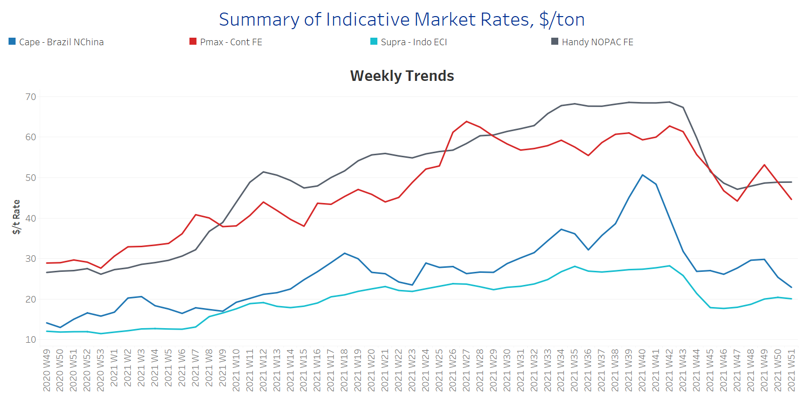
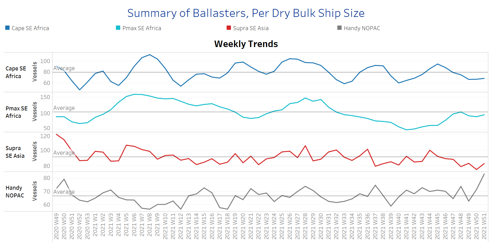
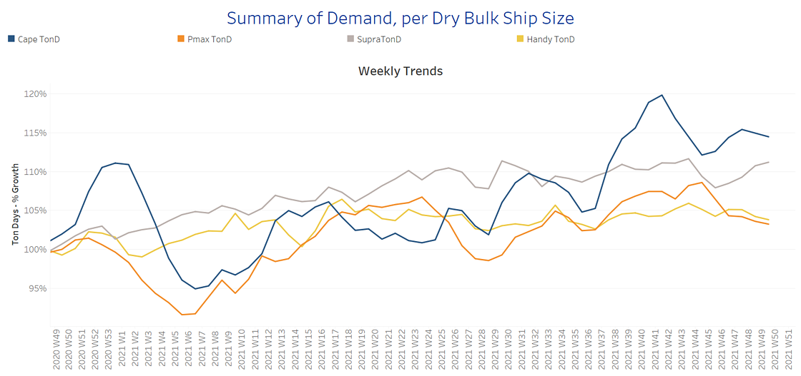
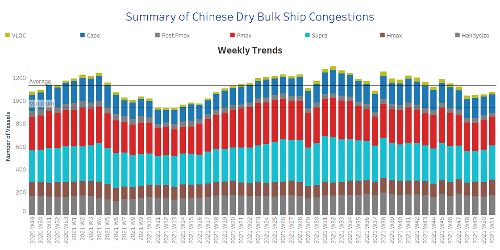

# Dry Weekly Market Monitor

**Date:** December 22, 2021  
**Publisher:** Breakwave Advisors | **Category:** Market Insights  
**Original URL:** [https://www.breakwaveadvisors.com/insights/2021/12/22/dry-weekly-market-monitor](https://www.breakwaveadvisors.com/insights/2021/12/22/dry-weekly-market-monitor)  

---

Week 51 comes to confirm that the sentiment of December is supportive for an upward push of rates in the smaller ship sizes. Few days before Christmas, Capesize rates fell to the lowest level of one month, however, the demand trend line keeps an optimistic trend for an upcoming rebound. In the Panamax segment, the market experiences the same downward direction and the spike comes from the smallest ship size segment, the handysize. Looking at the evolution of demand, the last month of this year continues to pave the way for Capesize and supramax ship size segments, despite the rates falling over the last days.

The supply of ships sailing in ballast remains below the average trend line for Capesize, Panamax and supramax, whereas, in the handysize segment, the number of ships sailing in ballast status in NOPAC areas has increased further from the previous week and seems that this triggers an upward incline in the sentiment of handysize rates. The trend of port congestion in China continues to decline on the larger sizes, but the number of smaller vessels in the lineup remains relatively steady.

In another positive sign for growth in the Chinese economy, the People’s Bank of China reduced the rate on a one-year prime loan to 3.80 percent from 3.85 percent. This is the first cut since April 2020, at the beginning of coronavirus and follows the reduction in the reserve requirement ratio we mentioned last week, which released close to USD 200bn into the financial system.

### Section 1 - Freight - Market Rates ($/T) - Weaker

‘The Big Picture’ - Capesize and Panamax Bulkers and Smaller Ship Sizes

> **Figure 1: Ch1**  
> [Local Asset](file:///C:/Users/Dell/Github/Shipping/corpus/03-breakwave/insights/2021/assets/2021-12-22_dry-weekly-market-monitor_img_ch1_0692ffa70397.png)

Following the highs recorded at Week 49 for Capesize ships, the momentum was weakened for two consecutive weeks with Brazil to NChina rates now heading below $23/ton, however, the market remains healthy compared to December 2020. In the Panamax segment, the decreasing trend is even more pronounced with Cont-Far East rates at less than $45/t, while it seems a challenge for the market to fetch again levels in the range of $50/t.

In the handysize segment, NOPAC to FE rates hold the upward trend of previous week, whereas supramax lost their momentum and posed a soft trend by holding the solid levels of the last three weeks. NOPAC to FE rates are now nearing $49/t, while supramax Indo ECI rates kept levels little above $20/t.

### Section 2 - Supply - Ballasters View Number of Vessels - Decreasing

Supply Trend Lines for Key Load Areas

> **Figure 2: Ch2**  
> [Local Asset](file:///C:/Users/Dell/Github/Shipping/corpus/03-breakwave/insights/2021/assets/2021-12-22_dry-weekly-market-monitor_img_ch2_de187638418a.png)

The supply trend line has kept the decreasing trend from Week 49 up to now as we mentioned in our previous Weekly Monitor. However, this week comes with a significant spike in the handysize NOPAC area.

We see for the current week a 30% increase in the number of ships sailing in ballast in NOPAC area compared to week 49, whereas Capesize and supramax segments appear to be the ones with the sharpest decrease over the last days in the number of ballasters.

It is very interesting to see that although the number of ships sailing in ballast has fallen to the lowest levels from Capesize to supramax ships, the direction of freight rates in the last two weeks is declining. It seems that this shortage of ships is not supportive for a new spike of momentum as the port congestion issue has remained softer and demand in ton days growth presents a mild outlook for the last quarter of this year.

### Section 3 - Demand - In Ton Days

### Increasing for Supramax

Evolution of Demand -% Growth

> **Figure 3: Ch3**  
> [Local Asset](file:///C:/Users/Dell/Github/Shipping/corpus/03-breakwave/insights/2021/assets/2021-12-22_dry-weekly-market-monitor_img_ch3_59441311fddb.png)

The opening of the third week of December comes to confirm that the increasing trend in ton days demand growth remains in the supramax segment.

In the Capesize segment, the momentum has now started to decrease with challenges from the Chinese economy and levels of steel production during December. It is very supportive that November was a month with increased levels of steel production and imports, however, December is always a month with weaker growth and the days before the Chinese New Year.

### Section 4 - Chinese Port Congestions - Number of Vessels - Decreasing

Dry bulk ships congested around Chinese ports

> **Figure 4: Ch4**  
> [Local Asset](file:///C:/Users/Dell/Github/Shipping/corpus/03-breakwave/insights/2021/assets/2021-12-22_dry-weekly-market-monitor_img_ch4_b51bfe5ab752.png)

Week 51 keeps the decreasing trend below the average trend line of previous weeks, however, we see a sense of upward trend stemming from the smaller ship sizes.

In the Capesize segment, the number of ships congested around Chinese ports has decreased by 20% compared to the levels of ten weeks ago, whereas in the handysize segment, we notice similar levels of congestion.

---

**Tags:** Shipping, Dry Bulk, Capesize, Panamax  
