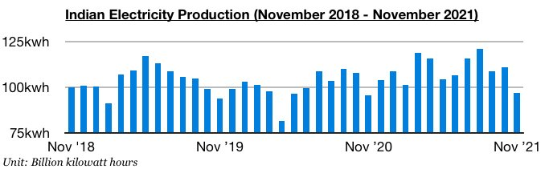
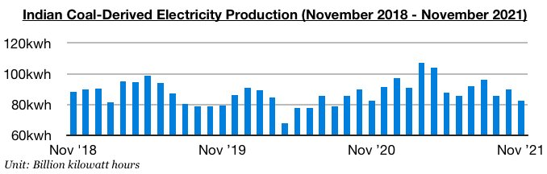
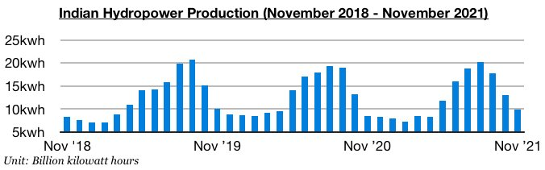

# Small Growth in Indian Electricity Production

**Date:** December 23, 2021  
**Publisher:** Breakwave Advisors | **Category:** Market Insights  
**Original URL:** [https://www.breakwaveadvisors.com/insights/2021/12/23/small-growth-in-indian-electricity-production](https://www.breakwaveadvisors.com/insights/2021/12/23/small-growth-in-indian-electricity-production)  

---

*By*[*Jeffrey Landsberg*](https://www.linkedin.com/in/jeffrey-landsberg-70ab957/)

India produced approximately 96.7 billion kilowatt hours of electricity last month, which is down month-on-month by 14.1 billion kilowatt hours (-13%) but up year-on-year by 1.4 billion kilowatt hours (1%). The month-on-month decline is normal and occurs every November. More significant is that electricity production grew on a year-on-year basis again. September had marked the first time all year that India's electricity production contracted on a year-on-year basis (due primarily from the nation’s coal shortages), but electricity production has now increased on a year-on-year basis for two straight months. Coal-derived generation remains relatively weak, though, but hydropower output has recently experienced strong year-on-year growth.

> **Figure 1: Chart 1 (10)**  
> [Local Asset](file:///C:/Users/Dell/Github/Shipping/corpus/03-breakwave/insights/2021/assets/2021-12-23_small-growth-in-indian-electricity-production_img_chart1281029_5651f90e3938.jpg)

India’s coal-derived electricity generation totaled approximately 82.4 billion kilowatt hours of electricity last month. This has marked a month-on-month decline of 7.5 billion kilowatt hours (-8%) and is down year-on-year by 200 million kilowatt hours. Coal-derived electricity generation has now contracted on a year-on-year basis (albeit by a small amount) during two of the last three months.

> **Figure 2: Chart 2 (8)**  
> [Local Asset](file:///C:/Users/Dell/Github/Shipping/corpus/03-breakwave/insights/2021/assets/2021-12-23_small-growth-in-indian-electricity-production_img_chart228829_b91fbfa40b81.jpg)

India’s hydropower production totaled approximately 9.8 billion kilowatt hours last month. This has marked a month-on-month decline of 3.3 billion kilowatt hours (-25%) but is up year-on-year by 1.4 billion kilowatt hours (17%). The year-on-year growth marks the largest seen all year.

> **Figure 3: Chart 3 (6)**  
> [Local Asset](file:///C:/Users/Dell/Github/Shipping/corpus/03-breakwave/insights/2021/assets/2021-12-23_small-growth-in-indian-electricity-production_img_chart328629_1c19d5f20cb8.jpg)

Overall, India's electricity production growth has still not recovered to the strength seen before the nation first started experiencing significant coal shortages, and coal-derived electricity generation continues to be affected. At the same time, though, the nation's coal stockpiles have managed to rise primarily as Coal India has been able to increase their output in recent months. Coal stockpiles at India's power plants have increased to approximately 21.7 million tons. This is up by 1.5 million tons (7%) from the previous week but is still down year-on-year by 16.6 million tons (-43%).

---

**Tags:** Electricity, Production, Energy, India  
