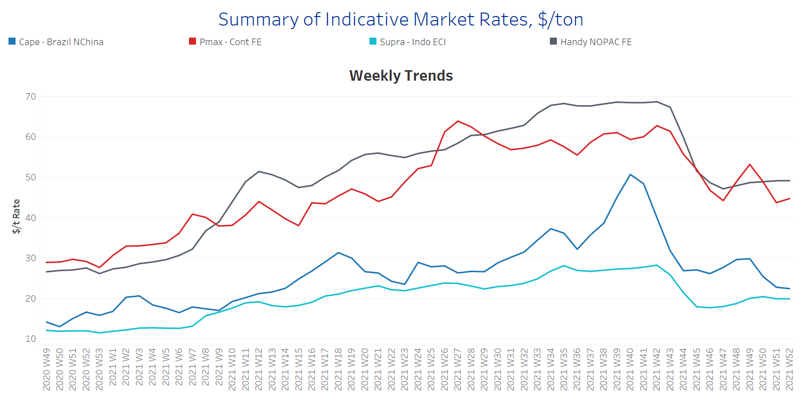
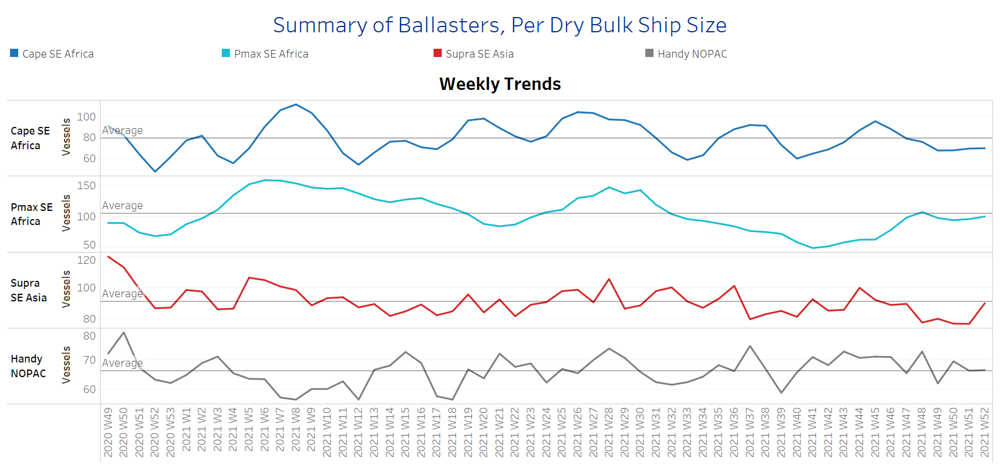
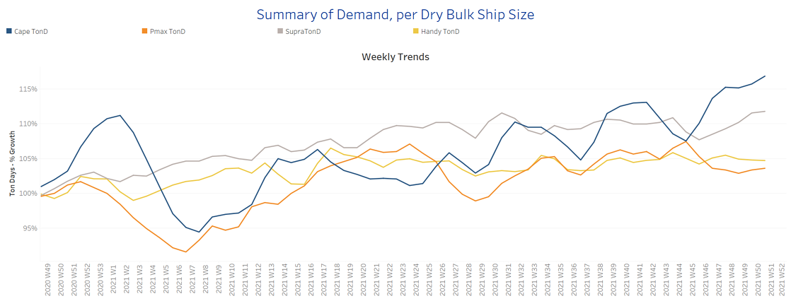
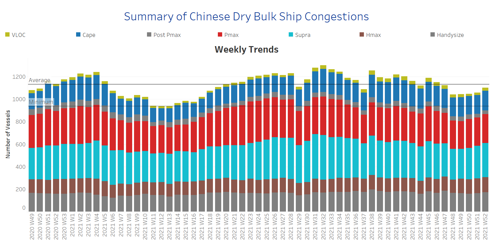

# Signal Weekly Report

**Date:** December 29, 2021  
**Publisher:** Breakwave Advisors | **Category:** Market Insights  
**Original URL:** [https://www.breakwaveadvisors.com/insights/2021/12/29/signal-weekly-report](https://www.breakwaveadvisors.com/insights/2021/12/29/signal-weekly-report)  

---

The last week of December comes with negative momentum of rates for capesize, supramax and handysize, while rates for panamax bulkers improved slightly compared to last week's levels. Freight rates for capesize bulkers are still facing negative pressure, whereas the demand, in ton days, posed an increase despite the festive season and the estimates for a slower Chinese economic growth. In the previous week, we reported a decrease in the growth of capesize demand that seems to be not permanent.

On the supply side, handysize vessels remain the only ones with the number of ships sailing in ballast status, in NOPAC area, to increase at levels above the one year average. Looking at the port congestion, the current week brings an increase in the number of vessels congested around China, however, the volume of ships remains below the one year average for four weeks in a row.

The challenges from the Chinese economy are even more pronounced with iron ore prices in decline as the growth for the world’s second largest economy weakens. The strong volatility in iron ore prices is set to continue in 2022 as the rebound in steel production seems unlikely due the usual seasonal output constraints combined with the upcoming Winter Olympics in February. Beyond that, the main headwinds will be the Chinese government's goal for less carbon emissions, while a debt-laden property sector is weighing on steel consumption and broader growth.

### Section 1 - Freight - Market Rates ($/T) - Weaker

‘The Big Picture’ - Capesize and Panamax Bulkers and Smaller Ship Sizes

> **Figure 1: Ch1**  
> **Interactive Data & Source:** [Signal Ocean Platform](https://www.thesignalgroup.com/signal-ocean-platform) | [Local Asset](file:///C:/Users/Dell/Github/Shipping/corpus/03-breakwave/insights/2021/assets/2021-12-29_signal-weekly-report_img_ch1_1e28ef25af57.png)

- Week 52 begins with Brazil to North China rates at levels below $22.5/ton, while the year will end with week 40 of October recording the highest level for this year ~$51/ton.
- In the panamax segment, Continent to Far East Rates are on increase towards $45/ton and it remains to be seen if Chinese coal demand will continue to strengthen this sentiment.
- In the supramax and handysize segment, rates hold a steady momentum. In the supramax segments, Indo-ECI rates are hovering around $20/ton, and handysize NOPAC to FE rates at $49/ton.

### Section 2 - Supply - Ballasters View Number of Vessels - Increasing

Supply Trend Lines for Key Load Areas

> **Figure 2: Ch2**  
> **Interactive Data & Source:** [Signal Ocean Platform](https://www.thesignalgroup.com/signal-ocean-platform) | [Local Asset](file:///C:/Users/Dell/Github/Shipping/corpus/03-breakwave/insights/2021/assets/2021-12-29_signal-weekly-report_img_ch2_956eec786f86.png)

- The number of vessels sailing in ballast has now again started to increase for capesize and panamax vessels nearing the one year average number, for capesize~80 vessels, and panamax~100 vessels.
- Supramax ships sailing in ballast status in SE Asia are now nearing the average number of 90 vessels, and it remains to be seen whether this increasing momentum will continue in the coming days.
- In the handysize segment, the number of vessels sailing in ballast status in the NOPAC area has increased above the one year average ~70 vessels from the previous week till now.

### Section 3 - Demand - In Ton Days

Increasing Evolution of Demand -% Growth

> **Figure 3: Ch3**  
> **Interactive Data & Source:** [Signal Ocean Platform](https://www.thesignalgroup.com/signal-ocean-platform) | [Local Asset](file:///C:/Users/Dell/Github/Shipping/corpus/03-breakwave/insights/2021/assets/2021-12-29_signal-weekly-report_img_ch3_8f2ca6d143d8.png)

- The last week of December holds the increasing trend in ton days demand for the supramax segment, whereas the handysize and panamax vessels have not yet shown indications of rebound.
- In the capesize segment, we see an increase towards the end of this year that will support the upward movement of rates, however, there are mixed fears for the duration of this due to the festive season and usual slowdown of Chinese iron ore demand.

### Section 4 - Chinese Port Congestions - Number of Vessels - Increasing

Dry bulk ships congested around Chinese ports

> **Figure 4: Ch4**  
> **Interactive Data & Source:** [Signal Ocean Platform](https://www.thesignalgroup.com/signal-ocean-platform) | [Local Asset](file:///C:/Users/Dell/Github/Shipping/corpus/03-breakwave/insights/2021/assets/2021-12-29_signal-weekly-report_img_ch4_e81d258f897b.png)

- Week 52 confirms the upward trend of congested vessels witnessed from previous week. The total number is now nearing the levels of week 46 and is one step before touching the one year average.
- The impact of congestion on freight rates seems to be reflected in handysize, where rates have been pushed upwards for the last days of December.

Data Source:[Signal Ocean Platform](https://www.thesignalgroup.com/signal-ocean-platform)

---

**Tags:** Shipping, Rates, Dry Bulk  
