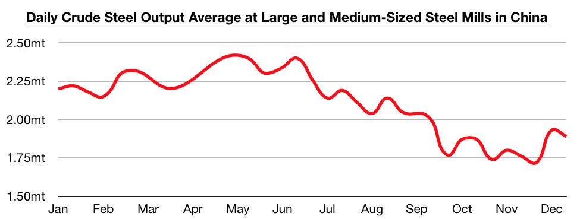
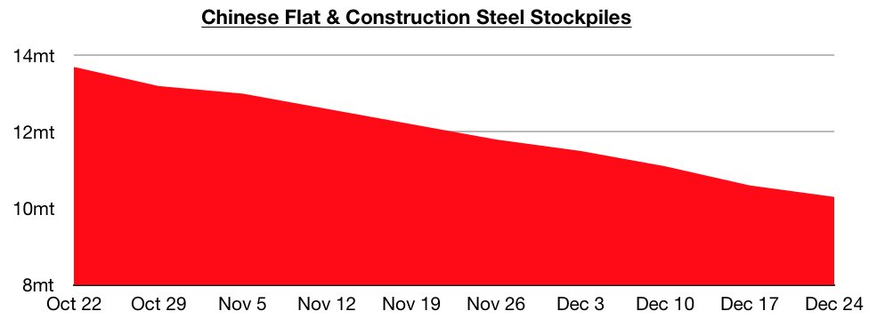
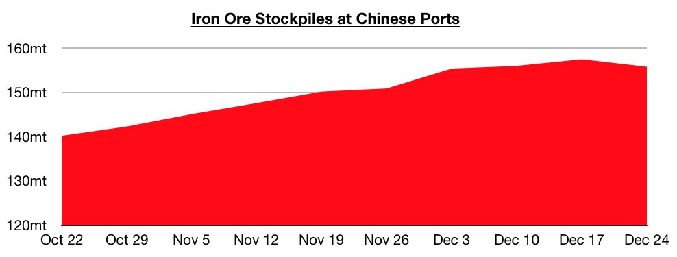

# Most Recent Changes in China

**Date:** January 02, 2022  
**Publisher:** Breakwave Advisors | **Category:** Market Insights  
**Original URL:** [https://www.breakwaveadvisors.com/insights/2021/12/30/most-recent-changes-in-china](https://www.breakwaveadvisors.com/insights/2021/12/30/most-recent-changes-in-china)  

---

*By Jeffrey Landsberg*

The most recent data from the China Iron and Steel Association (CISA) shows daily crude steel output at large and medium-sized mills averaged 1.89 million tons during December 11 - December 20. This is 2% lower than was seen during the previous ten days but is still well above this year's low (steel output reached a low of 1.76 million tons in late November). On a year-on-year basis, this production level is down by 14%. A 14% year-on-year contraction is still not a positive development in its own right, but remaining of note is that steel output during September, October, and November all contracted on a year-on-year basis by over 20%.

> **Figure 1: Chart 1 (12)**  
> [Local Asset](file:///C:/Users/Dell/Github/Shipping/corpus/03-breakwave/insights/2022/assets/2022-01-02_most-recent-changes-in-china_img_chart1281229_3c831260e68b.jpg)

Also of note is that flat and construction steel stockpiles at warehouses in major cities began this week at 10.3 million tons. This is down week-on-week by 300,000 tons (-3%) but up year-on-year by 1.8 million tons (21%).

> **Figure 2: Chart 2 (10)**  
> [Local Asset](file:///C:/Users/Dell/Github/Shipping/corpus/03-breakwave/insights/2022/assets/2022-01-02_most-recent-changes-in-china_img_chart2281029_a0c94eddd07a.jpg)

In the iron ore market, of note is that 155.8 million tons of iron ore is now stockpiled at Chinese ports. This is 1.7 million tons (-1%) less than was stockpiled a week ago but is up year-on-year by 28.8 million tons (23%). Previously, stockpiles had increased for twelve consecutive weeks. Also of note is that global iron ore prices have climbed even higher. Spot benchmark Australian iron ore, for example, began this week at approximately $116/ton FOB. This is up week-on-week by $7 (6%).

> **Figure 3: Chart 3 (8)**  
> [Local Asset](file:///C:/Users/Dell/Github/Shipping/corpus/03-breakwave/insights/2022/assets/2022-01-02_most-recent-changes-in-china_img_chart328829_310ef296ffad.jpg)

Elsewhere, of note is that the most recent data as of December 26th shows coal stockpiles at China's six major coastal power plants remain at 11.7 million tons. This is unchanged from the previous week and is down year-on-year by 2.8 million tons (-19%). Also of note and significant is that the daily coal burn rate at the six major coastal power plants has come in at 877,000 tons, which marks the highest daily burn rate ever seen. The previous daily burn rate record was 855,000 tons back in mid-July, and as another point of reference the daily burn rate a year ago stood at 701,000 tons. The coastal power plant stockpiles are now able to meet 13 days of demand. Prior to this week, there was no period in 2021 or 2020 where stockpiles were able to meet only 13 days of demand.

Also of note is new daily coronavirus cases continue to climb in China. Each of the last three days have seen at least 200 new daily coronavirus cases reported in China. This marks a feat previously not seen since March 2020. New restrictions remain in place in China, including the city of Xi'an (home to 13 million people) remaining in lockdown. Residents are still not allowed to leave the city and are only allowed to leave their homes to shop for essentials or get tested. Overall, it remains to be seen when the outbreak will subside, and in our view it is also becoming increasingly likely that foreign visitors will not be allowed into China for the Olympics. No signs yet, though, that the Olympics will not be held in February as planned.

---

**Tags:** Economy, China, Steel, Iron Ore  
