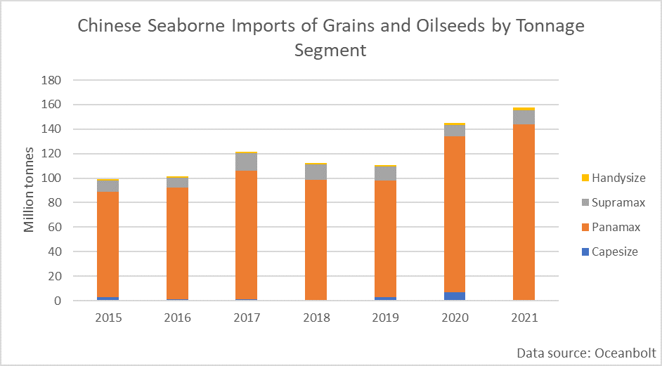
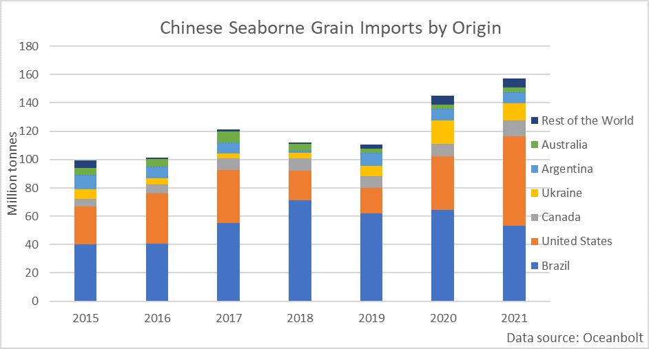

# Chinese Food Security Ambitions to Continue to Fuel Seaborne Imports of Grains and Oilseeds

**Date:** January 05, 2022  
**Publisher:** Breakwave Advisors | **Category:** Market Insights  
**Original URL:** [https://www.breakwaveadvisors.com/insights/2022/1/4/chinese-food-security-ambitions-to-continue-to-fuel-seaborne-imports-of-grains-and-oilseeds](https://www.breakwaveadvisors.com/insights/2022/1/4/chinese-food-security-ambitions-to-continue-to-fuel-seaborne-imports-of-grains-and-oilseeds)  

---

*By Ulf Bergman*

During the last few years, China has signalled that it aims to boost its food security by increasing the domestic output of many staples for Chinese consumers. The country’s ministry of agriculture reaffirmed the ambition in the final days of last year. Among other things, the Chinese leadership wants the nation to produce 95 per cent of the pork required for the domestic market by 2025 and be fully self-sufficient for poultry and eggs. Domestic pork production has suffered over the last few years, as the African swine flu decimated the hog herd in the world’s largest market for pork meat. However, after an extensive programme to restore the country’s pig numbers, the size of the flock has reached a six-year high and is seventeen per cent larger than when the disease struck. Pork futures in China also shed some fifty per cent during last year, as the supply situation improved in the country.

Last year’s rapid reestablishment of the hog herd helped push Chinese seaborne imports of grains and oilseeds to a new record. According to data from cargo tracking platform Oceanbolt, almost 160 million tonnes were discharged in Chinese ports during the past twelve months, beating the previous year by eight per cent.

> **Figure 1: Ch1**  
> [Local Asset](file:///C:/Users/Dell/Github/Shipping/corpus/03-breakwave/insights/2022/assets/2022-01-05_chinese-food-security-ambitions-to-continue-to-fuel-seaborne-imports-of-grains-a_img_ch1_59631d5ec163.png)

The Panamax segment has long dominated Chinese seaborne imports of agricultural commodities, with average annual volumes accounting for 88 per cent of cargoes carried since 2015. Last year’s increasing imports primarily benefitted the Panamaxes. Especially as the largest vessels, the Capesizes, retreated following a brief foray into the trade during 2020 when their freight rates were low, and the segment clinched some five per cent of cargoes carried.

The two-year-old phase one trade deal between the US and China has failed to meet its lofty ambitions, with Chinese imports falling well short of the set goals. However, US farmers are likely to view the deal with a degree of affection, as their exports to China have almost doubled compared to the average for the five years prior to the agreement. Since 2019 Chinese imports of grains and oilseeds have increased by 47 million tonnes, with all but two tonnes covered by increased US exports. At the same time, the previous holder of the crown as China’s largest supplier of agricultural commodities, Brazil, has seen its shipments falling, both in absolute and relative terms. While the phase one deal has provided an incentive for Chinese buyers to source grains from the US rather than Brazil, adverse weather conditions affecting the crop sizes in the South American country have also contributed to falling export volumes. The shift to imports from the US has not affected the tonne-mile demand in any material way. The ports on the US Gulf Coast and the Eastern Seaboard add to the distances sailed, but the shorter voyages from the US Pacific ports to the Chinese market have offset any aggregate increase.

> **Figure 2: Ch2**  
> [Local Asset](file:///C:/Users/Dell/Github/Shipping/corpus/03-breakwave/insights/2022/assets/2022-01-05_chinese-food-security-ambitions-to-continue-to-fuel-seaborne-imports-of-grains-a_img_ch2_2cb28edb496c.png)

The irony of China’s ambitions for a high degree of self-sufficiency for meat is that it is likely to fuel continued strong demand for seaborne imports of soybeans and other feed grains in the short to medium term. According to official customs data, the country imported 11.3 million tonnes of corn and 100.3 million tonnes of soybeans in 2020, but those records are likely to be exceeded as cargo data point towards even higher imports during the past twelve months. The goal to produce almost all pork meat domestically by 2025 will see further expansion of the pig herd, which at this stage will increase the demand for foreign-produced grains and oilseeds. The Chinese leadership has also highlighted the need to expand the domestic grain output to decrease the dependency on overseas supplies, paving the way for more land to be used for crops and increasing the use of genetically modified crops. However, such a process is likely to take some time, and in the meantime, Chinese pig breeders will have to rely on imported feed to meet the production goals. Hence, freight rates in the Panamax segment will continue to be supported by robust Chinese demand for agricultural commodities.

---

**Tags:** Economy, Shipping, China, Imports  
