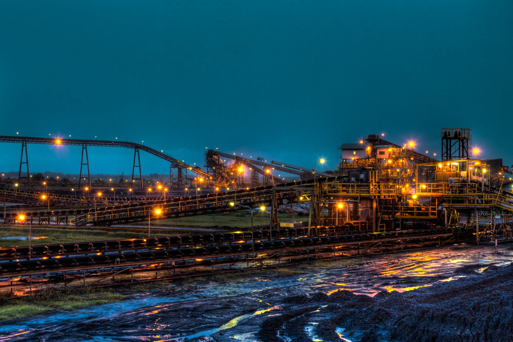

# Energy Prices the Catalyst of Revolution

**Date:** January 06, 2022  
**Publisher:** Breakwave Advisors | **Category:** Market Insights  
**Original URL:** [https://www.breakwaveadvisors.com/insights/2022/1/6/energy-prices-the-catalyst-of-revolution](https://www.breakwaveadvisors.com/insights/2022/1/6/energy-prices-the-catalyst-of-revolution)  

---

*By*[*Jeffrey Landsberg*](https://www.linkedin.com/in/jeffrey-landsberg-70ab957/)

In September when we first started to believe the world was at risk of suffering a winter energy crisis, coal stockpiles in China and India (the world's two largest consumers of thermal coal) had fallen to low levels and remained on the decline. Each nation eventually began to aggressively increase their domestic coal production and finally take glaring problems more seriously, but not before electricity shortages resulted in power rationing and production stoppages. While coal stockpiles in both China and India have improved since then, other countries have been witnessing their own energy and electricity shortages intensify.

As we discussed in a client note earlier this week, the Indonesian government at the start of the year announced that a ban on coal imports would be in place during all of January due to low thermal coal stockpiles at Indonesian power plants. In that note we also discussed that the ban could be lifted this week (still no official decision has been announced as of time of writing this note and we continue to believe the ban will be at least partially lifted) -- but even if the ban is partially lifted, Indonesia is clearly not as flush with thermal coal as is normally the case.

> **Figure 1: Unsplash Image F1b0 Iuaxo4**  
> **Interactive Data & Source:** [Twitter](https://twitter.com/jardemalie/status/1478397365283430409?ref_src=twsrc%5Etfw%7Ctwcamp%5Etweetembed%7Ctwterm%5E1478397365283430409%7Ctwgr%5E%7Ctwcon%5Es1_&ref_url=https%3A%2F%2Fcentralasia.liveuamap.com%2Fen%2F2022%2F4-january-aerial-view-of-protest-in-almaty) | [Local Asset](file:///C:/Users/Dell/Github/Shipping/corpus/03-breakwave/insights/2022/assets/2022-01-06_energy-prices-the-catalyst-of-revolution_img_unsplash-image-f1b0-iuaxo4_3532ab458e39.jpg)

Indonesia is the world's largest exporter of thermal coal, but the world is clearly changing and coal (and all energy assets) are becoming much more crucial to hold and obtain for every nation. The production growth in heavy polluting commodities such as thermal coal has been limited in recent years due to the ESG movement, but growth in renewable sources of electricity has still not been able to meet the world's ever increasing demand for electricity. This has been one major factor behind the ongoing global energy crisis.

New this week is that surging gas prices have led to significant unrest in Kazakhstan. Protesters and rioters have stormed the streets, government buildings and police vehicles have been damaged, destroyed, and confiscated, hundreds of people have been injured, and hundreds of protestors and rioters have been jailed. Kazakhstan's president responded by dismissing his entire cabinet, declaring a state of emergency, and completely shutting down the internet. Some of the videos that have made it out have been stunning:[**Aerial View**](https://twitter.com/jardemalie/status/1478397365283430409?ref_src=twsrc%5Etfw%7Ctwcamp%5Etweetembed%7Ctwterm%5E1478397365283430409%7Ctwgr%5E%7Ctwcon%5Es1_&ref_url=https%3A%2F%2Fcentralasia.liveuamap.com%2Fen%2F2022%2F4-january-aerial-view-of-protest-in-almaty),[**Security Forces**](https://t.me/Zanamiviehali/9971),[**Military Retreat**](https://twitter.com/Liveuamap/status/1478474332682739715),[**Protestors**](https://twitter.com/Liveuamap/status/1478636553454985220),[**Detained**](https://twitter.com/Liveuamap/status/1478392753952276484),[**March**](https://twitter.com/Liveuamap/status/1478420139968278529). On Wednesday there were was even reports of protesters[**Attempting To Take Over The Presidential Palace**](https://twitter.com/visegrad24/status/1478798551543169025)**.**

We live in a world where it is not unheard of for governments to shut down the internet during periods of unrest and where crippling protests and riots have become commonplace. These extreme actions by governments and citizens are nothing new. What is new in the internet age, though, is that the world is in the midst of an energy crisis. We are only one week into the new year and already the world's largest thermal coal exporter banned coal exports and one nation is facing the possibility of a complete regime change. The next fifty-one weeks will be interesting. We anticipate all energy assets (including coal) will be in great demand this year and respective shipping markets will continue to benefit.

---

**Tags:** Energy, Crisis, Coal, Shipping  
