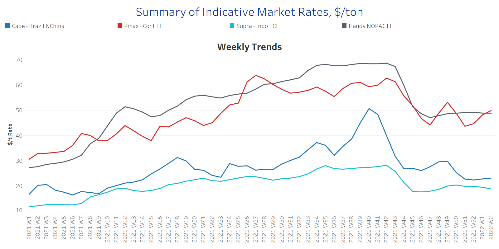
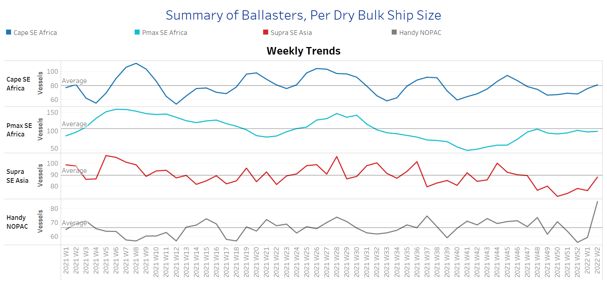
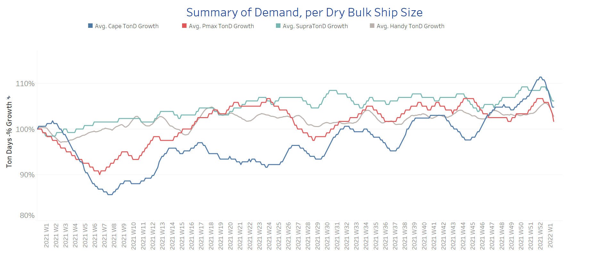
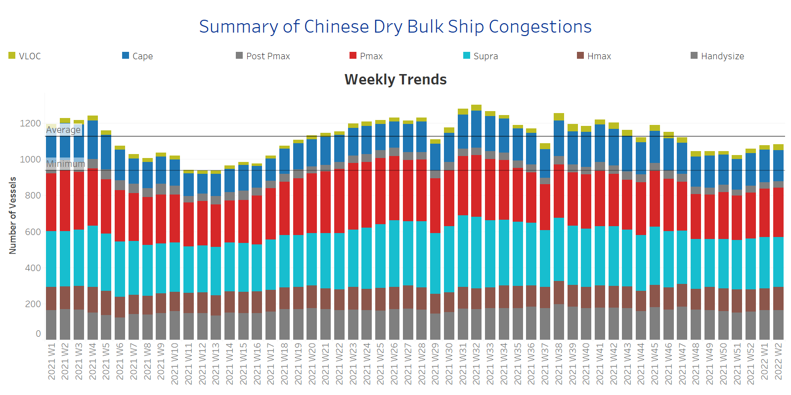

# Signal Weekly Report

**Date:** January 11, 2022  
**Publisher:** Breakwave Advisors | **Category:** Market Insights  
**Original URL:** [https://www.breakwaveadvisors.com/insights/2022/1/11/signal-weekly-report](https://www.breakwaveadvisors.com/insights/2022/1/11/signal-weekly-report)  

---

Few days before the Chinese New Year, the freight market momentum is softening especially for the smaller ship sizes, however, Panamax gave signs of upward movements for the first two weeks of the new year. Capesize freight rates are hovering around a steady-state with no spikes seen over the start of this year.

On the supply side, the number of vessels sailing in ballast towards key loading areas for all main dry bulk ship sizes is on the increase, while, the number for the handysizes is surpassing the average trend of a year. As far as demand is concerned, the first two weeks saw a decreasing trend in growth compared to the upward movements during the fourth quarter of last year.

The current week comes with important news in Vale’s iron ore production. The Brazilian miner said on Monday it has partially halted operations at its Southeastern and Southern iron-ore systems due to heavy rains that are affecting the state of Minas Gerais, but reiterated 2022 production guidance as the Northern system was not affected. The miner is currently taking all measures needed to resume activities, but it did not provide a detailed timeframe for the recovery of operations.

## Section 1 - Freight -Market Rates ($/T) - Weaker

‘The Big Picture’ - Capesize and Panamax Bulkers and Smaller Ship Sizes

> **Figure 1: Ch1**  
> **Interactive Data & Source:** [Signal Ocean Platform](https://www.thesignalgroup.com/signal-ocean-platform) | [Local Asset](file:///C:/Users/Dell/Github/Shipping/corpus/03-breakwave/insights/2022/assets/2022-01-11_signal-weekly-report_img_ch1_2e5552f594cd.png)

- The current week intensifies the recovery of the Panamax segment seen towards the end of last year and Continent to Far East Rates are now edging towards $50/ton, compared to the lows of Week 51, 2021 ~$44/ton. In the Capesize segment, rates have kept a steadiness within the range from $22 to $23/ton.

- In the supramax segment, rates fell now below the barrier of $19/ton and continue the decreasing momentum of the last weeks of previous year.
- Handysize rates are also on a declining trend with rates at less than $49/ton compared to the highs of Week 49, 2021~$53/ton.

## Section 2 - Supply - Ballasters View

## Number of Vessels -Increasing

Supply Trend Lines for Key Load Areas

> **Figure 2: Ch2**  
> **Interactive Data & Source:** [Signal Ocean Platform](https://www.thesignalgroup.com/signal-ocean-platform) | [Local Asset](file:///C:/Users/Dell/Github/Shipping/corpus/03-breakwave/insights/2022/assets/2022-01-11_signal-weekly-report_img_ch2_bf2d5117f871.png)

- The number of vessels sailing in ballast keeps the increasing momentum of the Weeks 51 and 52 of 2021. Capesize vessels are now standing one step above the one-year average number~80 vessels, however, in the Panamax the number remains below the average~100 vessels despite the recent increase.

- In the supramax segment, the number of ballasters has increased to 88, and is now nearing to surpass the average of 90 vessels, while handysize ballasters in NOPAC has moved up to 85 compared to the low of ~55 ships at Week 52, 2021.

## Section 3 - Demand - In Ton Days

## Decreasing

> **Figure 3: Ch3**  
> **Interactive Data & Source:** [Signal Ocean Platform](https://www.thesignalgroup.com/signal-ocean-platform) | [Local Asset](file:///C:/Users/Dell/Github/Shipping/corpus/03-breakwave/insights/2022/assets/2022-01-11_signal-weekly-report_img_ch3_881107abb6c1.png)

- The first days of the new year reversed the increasing trend in ton days demand we noticed at the fourth quarter of last year.

- The trend now moves to lower growth in ton days for all main dry bulk ship sizes. For Capesize ships, the increase at the end of last year surpassed all other sizes, however, it is now verging near to the percentage growth seen in the Panamax segment.
- In smaller ship sizes, the decrease in the demand growth for Supramax ships is also falling to the levels of Capesize and Panamax segments. It is worth noting that the demand growth for supramax ships appears to be above that of the handysize ships.
- Overall, demand seems challenging for the evolution of freight rates in the days before the Chinese New Year.

## Section 4 - Chinese Port Congestions -

## Number of Vessels -Increasing

## Dry Bulk Ships Congested Around Chinese Ports

> **Figure 4: Ch4**  
> **Interactive Data & Source:** [Signal Ocean Platform](https://www.thesignalgroup.com/signal-ocean-platform) | [Local Asset](file:///C:/Users/Dell/Github/Shipping/corpus/03-breakwave/insights/2022/assets/2022-01-11_signal-weekly-report_img_ch4_f089b715dda0.png)

- The first two weeks keep the upward trend of congested vessels witnessed since Week 52.

- The number now is the highest since Week 48, 2021, but below the average trend of one year of ~1127 vessels.
- The increase stems from the Panamax segment, where we see around 274 congested vessels compared to 247 at Week 51, 2021, which pushed upward momentum of freight rates.

Data Source:[Signal Ocean Platform](https://www.thesignalgroup.com/signal-ocean-platform)

---

**Tags:** Shipping, Dry Bulk, Freight Rates  
