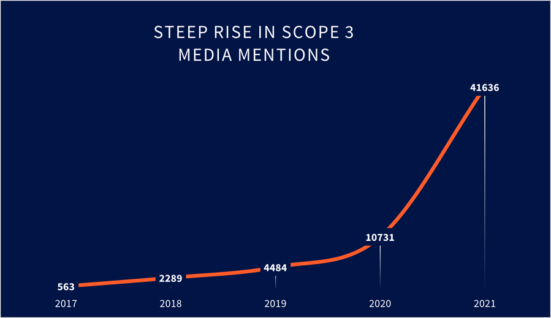
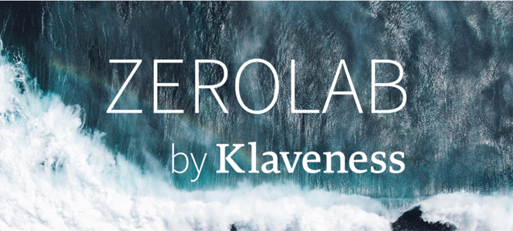

# ZeroLab Sensemaking

**Date:** January 12, 2022  
**Publisher:** Breakwave Advisors | **Category:** Market Insights  
**Original URL:** [https://www.breakwaveadvisors.com/insights/2022/1/11/zerolab-sensemaking](https://www.breakwaveadvisors.com/insights/2022/1/11/zerolab-sensemaking)  

---

> **Figure 1: Quick Media Search Shows That “Shipping + Climate” Generated**  
> *A quick media search shows that “shipping + climate” generated more than 236 000 hits in 2021, up from 113 040 mentions in 2020. For “Scope 3 emissions” the trend is even stronger*  
> **Interactive Data & Source:** [Eur03 Safelinks Protection Outlook](https://eur03.safelinks.protection.outlook.com/?url=https%3A%2F%2Fcyfmz04.na1.hubspotlinks.com%2FBtc%2FLW%2B113%2Fcyfmz04%2FVWKCfk3wl6XrW3TyWGR6d1GjhVrHz2f4CWfqpN5NMMmc3lScmV1-WJV7CgKmSN34xyDKPHnm6W3gSK7H731dKDVt1BF68Fn5DvN2jQyRw9LxggVM0F3S6NQ6M3VWQ7NB8ffTtbN63xhPJznQy5VwvdF08V71NVV9KLbm7SvtH5W2kmLMH88z_8QVYfVBD1FJ27YW1yW3YG47fbCBW2VDKhs1T6HKXN52dGfyHrxwKV9-ztn5VlbFKW1Mr9_h1Vqy9WW7mjNlH8lTPHpW3kCZrX7djcGfW7Ss1JF2NgFxhW50bvZw64GHYBVRk7Wl2nMVQHW2gDb_52rGQfZW3DsYrD2nLmJmW8-fyfZ7RxwhjW1nZt7q3cm0F5W8FLkqb24yyhM3cqv1&data=04%7C01%7Cmsk%40klaveness.com%7C6d824392f4b4455f107608d9d1c04b5e%7C38a1c2106de6423398b2c4192613b373%7C0%7C0%7C637771446098589326%7CUnknown%7CTWFpbGZsb3d8eyJWIjoiMC4wLjAwMDAiLCJQIjoiV2luMzIiLCJBTiI6Ik1haWwiLCJXVCI6Mn0%3D%7C3000&sdata=1T49uSarrZbO7CgC0WzoDZlBUv3W%2Bb5mMmhaz4%2BopS4%3D&reserved=0) | [Local Asset](file:///C:/Users/Dell/Github/Shipping/corpus/03-breakwave/insights/2022/assets/2022-01-12_zerolab-sensemaking_img_unnamed28129_b6eff79e390f.png)

### What's Trending?

### Good Cop / Bad Cop

COP26 came and went in November. Those who hoped for major action towards the Paris Agreement were disappointed, but we still think there was an impact as the net-zero commitments from companies outpaced regulatory advances. Net-zero is rapidly becoming the organizing principle for businesses.

Ahead of COP, a coalition of more than 200 companies signed[A Call to Action for Shipping Decarbonization](https://eur03.safelinks.protection.outlook.com/?url=https%3A%2F%2Fcyfmz04.na1.hubspotlinks.com%2FBtc%2FLW%2B113%2Fcyfmz04%2FVWKCfk3wl6XrW3TyWGR6d1GjhVrHz2f4CWfqpN5NMMmc3lScmV1-WJV7CgKmSN34xyDKPHnm6W3gSK7H731dKDVt1BF68Fn5DvN2jQyRw9LxggVM0F3S6NQ6M3VWQ7NB8ffTtbN63xhPJznQy5VwvdF08V71NVV9KLbm7SvtH5W2kmLMH88z_8QVYfVBD1FJ27YW1yW3YG47fbCBW2VDKhs1T6HKXN52dGfyHrxwKV9-ztn5VlbFKW1Mr9_h1Vqy9WW7mjNlH8lTPHpW3kCZrX7djcGfW7Ss1JF2NgFxhW50bvZw64GHYBVRk7Wl2nMVQHW2gDb_52rGQfZW3DsYrD2nLmJmW8-fyfZ7RxwhjW1nZt7q3cm0F5W8FLkqb24yyhM3cqv1&data=04%7C01%7Cmsk%40klaveness.com%7C6d824392f4b4455f107608d9d1c04b5e%7C38a1c2106de6423398b2c4192613b373%7C0%7C0%7C637771446098589326%7CUnknown%7CTWFpbGZsb3d8eyJWIjoiMC4wLjAwMDAiLCJQIjoiV2luMzIiLCJBTiI6Ik1haWwiLCJXVCI6Mn0%3D%7C3000&sdata=1T49uSarrZbO7CgC0WzoDZlBUv3W%2Bb5mMmhaz4%2BopS4%3D&reserved=0), calling on governments to commit to decarbonizing shipping by 2050. This is a great example of how shipping is converging on the net-zero target.

Also notable was the signing of the[Clydebank Declaration](https://eur03.safelinks.protection.outlook.com/?url=https%3A%2F%2Fcyfmz04.na1.hubspotlinks.com%2FBtc%2FLW%2B113%2Fcyfmz04%2FVWKCfk3wl6XrW3TyWGR6d1GjhVrHz2f4CWfqpN5NMMmc3lScmV1-WJV7CgVPrW7jj_Jf99FbrSW1MfG8m6KYjXbN54hHmWP0CHbW1C7fVh2JVrJlW5xJX-T4bmMDtW1yNlY271LLGLW64vrfx87rqD6W1sBrcW3jGxqCN77nRXh16Ch-W7g0XWD8Fq2knW3CZftt33S1CBW58hSw_6TCWjFW1V_-Hz4s5CnRN96Yn2yY9ZB0W9hdfxJ4jT-sJVtgGPH7CKXfpW5kwHBZ5zMvj7W6hBhn46TT26dW3y5NMj8P4V3DW2_2GjJ6KNvpXW5SSDSM7RztbhW3g66XR8F4--NW7_DDCP4PhmtKV83fLh652M2yW2Z-zD_8CcWQvW2vglXB7CzsbT3csh1&data=04%7C01%7Cmsk%40klaveness.com%7C6d824392f4b4455f107608d9d1c04b5e%7C38a1c2106de6423398b2c4192613b373%7C0%7C0%7C637771446098589326%7CUnknown%7CTWFpbGZsb3d8eyJWIjoiMC4wLjAwMDAiLCJQIjoiV2luMzIiLCJBTiI6Ik1haWwiLCJXVCI6Mn0%3D%7C3000&sdata=8D5BUS4yN8q4Dx7IPdXDdYv9lfDl5Ljws1S67BOI6mw%3D&reserved=0), calling for the creation of international partnerships to accelerate the introduction of zero-emissions shipping on corridors between two or more countries. In ZeroLab, we have been working on this concept for some time and have identified up to 60% emission reduction potential on selected routes, most of them reducing cost at the same time.

Our CEO Lasse Kristoffersen sums up our position nicely in[an interview with Splash,](https://eur03.safelinks.protection.outlook.com/?url=https%3A%2F%2Fcyfmz04.na1.hubspotlinks.com%2FBtc%2FLW%2B113%2Fcyfmz04%2FVWKCfk3wl6XrW3TyWGR6d1GjhVrHz2f4CWfqpN5NMMlX3lSc3V1-WJV7CgBVTV3KPm-702H92N1X0VbpXY3y5N3CdMgGLLwqWVrc6Zc5J4CwzW2QxF3x477xfBW6Qr25Y8DcCXTW8MWcbL5qykwtW5lPzH29bMsQ-V6bbhs6HryxnW2G8SSM2hdRq7W5MD3d84WMnw7TYwzT4NB_JzW39jg0z54b08jW7lxQvs8xTpQyW1SzCZb5l7l75W6fQc1m3QwgqCN61QxY2GNRlfVBKwvs3nJFqMW3KqMG-2RkZ1YVH2GG36Tk3dWW8rhjZC4Dv7hyW7MlX614RF7ffW1TqWgy79h-F3W6B1KtP3qx7w83j611&data=04%7C01%7Cmsk%40klaveness.com%7C6d824392f4b4455f107608d9d1c04b5e%7C38a1c2106de6423398b2c4192613b373%7C0%7C0%7C637771446098589326%7CUnknown%7CTWFpbGZsb3d8eyJWIjoiMC4wLjAwMDAiLCJQIjoiV2luMzIiLCJBTiI6Ik1haWwiLCJXVCI6Mn0%3D%7C3000&sdata=LCtlMHo9T%2B8ajKujvY7CvEx2q79SzUJMVpsmC7kklqo%3D&reserved=0)*"Business and private sector is moving faster than policies and regulations. Hence, IMO regulations will not trigger the kick-off of the transformation but be critically necessary for a global scaling of it."*

### Carbon Pricing Through the Roof

We made a few predictions for 2021, one of which concerned carbon pricing. Already in May Head of ZeroLab, Martin Prokosch, said that the price of carbon emissions is only going to increase, and that it needs to hit $100 per tCO2e to have an impact on shipping decarbonization efforts. In December 2021, the EU carbon price reached an unprecedented $99 per tCO2e. It is still a year to go before shipping companies must start paying for GHG emissions in the EU, but carbon price developments this year underlines the urgency for both shipowners and charterers alike to device emission reduction plans.

### Charterers Step Up

A second prediction for ZeroLab at the beginning of 2021 was that charterers increasingly care about their scope 3 emissions from shipping. The traction that the Sea Cargo Charter has experienced is evidence to that, with 25 major charterers to begin reporting emissions from their shipping activities in 2022.

Within two months of launching an[Emissions Tracker](https://eur03.safelinks.protection.outlook.com/?url=https%3A%2F%2Fcyfmz04.na1.hubspotlinks.com%2FBtc%2FLW%2B113%2Fcyfmz04%2FVWKCfk3wl6XrW3TyWGR6d1GjhVrHz2f4CWfqpN5NMMlX3lSc3V1-WJV7CgZcBW5W7vJS7Q051SN1ymRw29R1K3W1yPnhD2SKmxCN5MwVxzCHHG4W1T8vJ32QzbhLW1tbSRS5PSr-SM6YlhBj20B_VfSWNQ45323JW8chTJl91pfh8W7KRWh392l_zVW2rDPJ72mYrVPVqKr8z3hH053W3XdCTp286RjpW2vPYYt1SpJFFW2TRVcR5--N-KW76jhW41Zp_r2W5DTfT91KThn3N8Mvd6fGH6PRW7WYBzQ1C3QkLW3d9ZKg71sWK-W7mV8Xh72-HVdW4kglf14fvwHTW6bQ-wS45g6b_W1Kwplc5mkp1B3pqW1&data=04%7C01%7Cmsk%40klaveness.com%7C6d824392f4b4455f107608d9d1c04b5e%7C38a1c2106de6423398b2c4192613b373%7C0%7C0%7C637771446098589326%7CUnknown%7CTWFpbGZsb3d8eyJWIjoiMC4wLjAwMDAiLCJQIjoiV2luMzIiLCJBTiI6Ik1haWwiLCJXVCI6Mn0%3D%7C3000&sdata=RhSXKbqohuLREGpO6bSxVWk19wLYJyCBFCZpooqzDMs%3D&reserved=0)for charterers together with Klaveness Digital, we are excited to announce that two major charterers have signed on to have a continuously updated view on total emissions by commodity, volume, and ship type as well as the EU ETS exposure from their shipments and alignment with the Sea Cargo Charter trajectory.

Is addressing your organization’s Scope 3 shipping emissions worth it? Read our advice on the[5 questions you should ask](https://eur03.safelinks.protection.outlook.com/?url=https%3A%2F%2Fcyfmz04.na1.hubspotlinks.com%2FBtc%2FLW%2B113%2Fcyfmz04%2FVWKCfk3wl6XrW3TyWGR6d1GjhVrHz2f4CWfqpN5NMMl15knJmV3Zsc37CgCHZN8bdmXzNTlNSW5LhqRY7pz7YBW549QqC1jp0GwVMXZFZ23mt9KW93bGVv6K3RYfW1p4JQN3mdgqvW8gMtV71rg-ksW582PGG3Fm-bnW71-5NL5jSdQtW2YxFjS2FllMpW1sdm1b548lq1W6NQmmq6PGqFYW54mq443ngySDW5LYtfc9f8Yd6W4dLtRz967nkcV2tJ8t7BQswhW63x9nP7xvb9QW14Z81w6CM16mW95ysNd4cKxHXW6NrGNg6z5G6tW95rxTv51LJxlW1cFQDw6-Jc2sN1XGKjnTl49JW6kp8qD3pQt8zW2bhJhL5ZtB4wW2X6Vj17C-c8DW89L7dX1DDdKbN1K3jWQPcqwmW3vqFJz7G6lbvW1Y_HG55dWJB7W5LcHy09hq0DSW22vZKf2d3w-cW90Cm-N6ND3v3W6DY7m067y_XM34Yn1&data=04%7C01%7Cmsk%40klaveness.com%7C6d824392f4b4455f107608d9d1c04b5e%7C38a1c2106de6423398b2c4192613b373%7C0%7C0%7C637771446098589326%7CUnknown%7CTWFpbGZsb3d8eyJWIjoiMC4wLjAwMDAiLCJQIjoiV2luMzIiLCJBTiI6Ik1haWwiLCJXVCI6Mn0%3D%7C3000&sdata=zjAMJr%2BnA2jvTPMTjFQSs5IoPPkR%2FcmOfDJgTLRkNKk%3D&reserved=0)when assessing if your supply chain emissions strategy should target shipping emissions. The article was originally published in Aluminium International Today Nov/Dec’21 edition.

### Greenfreight Launched with Klaveness Chartering

Upon voyage completion, cargo customers with Klaveness Chartering now receive an emission receipt including the option to compensate the CO2-emissions with a virtual fuel switch to sustainable biofuel, allowing the charterer to reduce emissions from 25-100 percent through the purchase of Scope 3 emission rights

> **Figure 2: Digitalization and Decarbonization Vol**  
> *Digitalization and Decarbonization Vol.3: Who isActuallyDriving Decarbonization in Shipping?*  
> **Interactive Data & Source:** [Eur03 Safelinks Protection Outlook](https://eur03.safelinks.protection.outlook.com/?url=https%3A%2F%2Fcyfmz04.na1.hubspotlinks.com%2FBtc%2FLW%2B113%2Fcyfmz04%2FVWKCfk3wl6XrW3TyWGR6d1GjhVrHz2f4CWfqpN5NMMmw3lScGV1-WJV7Cg--8W6Fd2lR5S2fzMW42htPz36hB4jVGV7Zt6gdrKlW2mv91t1xd60PW28lFLG6zxP4YW1f7Z7c1tFF6FW2kRW492q46rWW6j_Tfs7fjk3WW10fk8n1Rm90lW8KQX1093K7L3W8ZsHLm6QX-YFW6zQppn8ZSrrdW4ZzCvH1C6lb0W3ml01j8T80xmW6M9pQ04SLNYsW1sZ5Fc6HZD1cW2kCDnw1xJ_ZJW3rKrfd2WK8FGW23NrgC47k8rDW4wJqSN6MrRNhW6PLpw57jtyfpW8tdnhk7XtPhdW8y9RCm1cRYx5W3xcK138Z82Z8W8xL8_r8K9qX8W9gd5pb2g5J5wW91Mhr-3hRw7tN2ZwtHczSFRM3hV71&data=04%7C01%7Cmsk%40klaveness.com%7C6d824392f4b4455f107608d9d1c04b5e%7C38a1c2106de6423398b2c4192613b373%7C0%7C0%7C637771446098589326%7CUnknown%7CTWFpbGZsb3d8eyJWIjoiMC4wLjAwMDAiLCJQIjoiV2luMzIiLCJBTiI6Ik1haWwiLCJXVCI6Mn0%3D%7C3000&sdata=kDzo%2BzBPSNBmKP0UDOSwv40aJUdO1yyK65TQbCKqAoY%3D&reserved=0) | [Local Asset](file:///C:/Users/Dell/Github/Shipping/corpus/03-breakwave/insights/2022/assets/2022-01-12_zerolab-sensemaking_img_unnamed_36cb92bad371.png)

### A Year in Review

### Recommended Reading

2021 was a good year for high-quality reports on how shipping can decarbonize. Those that made it to our top 3 list are:

- **Industry Transition Strategy**([Executive summary](https://eur03.safelinks.protection.outlook.com/?url=https%3A%2F%2Fcyfmz04.na1.hubspotlinks.com%2FBtc%2FLW%2B113%2Fcyfmz04%2FVWKCfk3wl6XrW3TyWGR6d1GjhVrHz2f4CWfqpN5NMMmw3lScGV1-WJV7Cg--8W6Fd2lR5S2fzMW42htPz36hB4jVGV7Zt6gdrKlW2mv91t1xd60PW28lFLG6zxP4YW1f7Z7c1tFF6FW2kRW492q46rWW6j_Tfs7fjk3WW10fk8n1Rm90lW8KQX1093K7L3W8ZsHLm6QX-YFW6zQppn8ZSrrdW4ZzCvH1C6lb0W3ml01j8T80xmW6M9pQ04SLNYsW1sZ5Fc6HZD1cW2kCDnw1xJ_ZJW3rKrfd2WK8FGW23NrgC47k8rDW4wJqSN6MrRNhW6PLpw57jtyfpW8tdnhk7XtPhdW8y9RCm1cRYx5W3xcK138Z82Z8W8xL8_r8K9qX8W9gd5pb2g5J5wW91Mhr-3hRw7tN2ZwtHczSFRM3hV71&data=04%7C01%7Cmsk%40klaveness.com%7C6d824392f4b4455f107608d9d1c04b5e%7C38a1c2106de6423398b2c4192613b373%7C0%7C0%7C637771446098589326%7CUnknown%7CTWFpbGZsb3d8eyJWIjoiMC4wLjAwMDAiLCJQIjoiV2luMzIiLCJBTiI6Ik1haWwiLCJXVCI6Mn0%3D%7C3000&sdata=kDzo%2BzBPSNBmKP0UDOSwv40aJUdO1yyK65TQbCKqAoY%3D&reserved=0)) by Mærsk Mc-Kinney Møller Center for Zero Carbon Shipping
- **A Strategy for the Transition to Zero-Emission Shipping**([here](https://eur03.safelinks.protection.outlook.com/?url=https%3A%2F%2Fcyfmz04.na1.hubspotlinks.com%2FBtc%2FLW%2B113%2Fcyfmz04%2FVWKCfk3wl6XrW3TyWGR6d1GjhVrHz2f4CWfqpN5NMMmw3lScGV1-WJV7CgL2HW2NZzK136qvl-W3d0KY_8B51p8W92JZrp97M2KKW1PV3cv3qZTM_W8gmPGG4qNbm5W5rLWsv8gF5MbW5KPl2T1QjZLMW2YmVDX2dyd8TW5Hl-Tl2kRVMJVg6JJC5pVYZ9W1fncX18_NsMMW3RWwZf1XcgHpW3Rq8pz8ZmqKnW8ln9kH3XJSzBW72DkkL5Bj_gQW1GtvkX2t8JS9W5CXr_K1Sb10jVtKny15MS2H3VjJzSG7-5YQmW2VPnb81GlSRjW6HlTkd8dvhzqW5kvFYt2HGmX_W4VLc-63v8MnwVlnw5K1jwzQ9W2hq-tP4s4V9BW37Hrln5hnjb_N60DZpyf9pVfW6R5g9B2SldxS3c7R1&data=04%7C01%7Cmsk%40klaveness.com%7C6d824392f4b4455f107608d9d1c04b5e%7C38a1c2106de6423398b2c4192613b373%7C0%7C0%7C637771446098745546%7CUnknown%7CTWFpbGZsb3d8eyJWIjoiMC4wLjAwMDAiLCJQIjoiV2luMzIiLCJBTiI6Ik1haWwiLCJXVCI6Mn0%3D%7C3000&sdata=f%2FU9ei9HFur41cnl5VIcRDVliy%2FvW33JcMOXd7tNbFY%3D&reserved=0)) by UMAS for the Getting to Zero Coalition
- **The Pathway to Net Zero report**([here](https://eur03.safelinks.protection.outlook.com/?url=https%3A%2F%2Fcyfmz04.na1.hubspotlinks.com%2FBtc%2FLW%2B113%2Fcyfmz04%2FVWKCfk3wl6XrW3TyWGR6d1GjhVrHz2f4CWfqpN5NMMlX3lSc3V1-WJV7CgTtMW1cyB512kQCkDW2W7wrQ7v237cN3TdhXGhpHRVW5tLqqw2LLQ_9VR95B04dQMG6W4jZ9701JDmTJW8_V33r827SbrN4-rgFD3s1NfW9k1xyr5f_QPpW3y2flF2Rfnt6W4QZLNT5nM_KPW8MKlVY3fWLS_W7DmrhG5-VW-lW3Ygg8J68Lzd7W76_nf22TpLbxW85LLmR4-z0RZW96nmnp6WWG9nW4P83zk1qfCw6W4p91G06XH3zXW74sBzQ3rCS4tW6rTKZ13Wt3LRW5dbfsG5FqlQFW92f86x1ynw79W3nkVQq2WgJGw3n9k1&data=04%7C01%7Cmsk%40klaveness.com%7C6d824392f4b4455f107608d9d1c04b5e%7C38a1c2106de6423398b2c4192613b373%7C0%7C0%7C637771446098745546%7CUnknown%7CTWFpbGZsb3d8eyJWIjoiMC4wLjAwMDAiLCJQIjoiV2luMzIiLCJBTiI6Ik1haWwiLCJXVCI6Mn0%3D%7C3000&sdata=0hdhOA4xUv%2FTbjE8GbEPM0ZujwoFkPsqCb7cmS57oQc%3D&reserved=0)) by DNV

### Webinars

Together with our colleagues in Klaveness Digital we embarked on a webinar series to show how digitalization and decarbonization goes hand in hand.

### Digitalization and Decarbonization Vol.1: The Supply Chain Opportunity

Read the TradeWinds[recap](https://eur03.safelinks.protection.outlook.com/?url=https%3A%2F%2Fcyfmz04.na1.hubspotlinks.com%2FBtc%2FLW%2B113%2Fcyfmz04%2FVWKCfk3wl6XrW3TyWGR6d1GjhVrHz2f4CWfqpN5NMMl15knJmV3Zsc37CgYxlW1JdVLM8c52R7W1bwG3G7Cb2DgW4KzFlk64VWqGN7XKJ_TZlTj3V-jHDJ7H0mdbW3VBwmn7Tz4T_W8TXMF283zBtXN6412Dhcv0znN3qztzlkwcVfN8SSs9Gz3GtmW25qfWw3lJqmNN8VkvyBLJCTfN3TDpj3zN0F8W9g39M57Zvm9vW4hJHww2D95HrW6w7XKr82cPzwW7V39T07kYv5JTsc4T2m5H9kW233TzW7fH-lmW8Fd4g-39_1d7W1ls1b54Pdp8_W1BXLXQ3Fbp1DW5RK1334wScT-W3dLlwd1FvMcGW7zT4xy1syvfwVl_HtF8pNPbMW1GmxCv75hCnlVLJD5d5kl_kyW5vbrxR8fcfD-W7qRvQ81gHTjBW8Xl4tc9jWbLcW3pYScd4cDt1_W1Q6FWt8SyjyBN4tTvLqbsPxd3bsY1&data=04%7C01%7Cmsk%40klaveness.com%7C6d824392f4b4455f107608d9d1c04b5e%7C38a1c2106de6423398b2c4192613b373%7C0%7C0%7C637771446098745546%7CUnknown%7CTWFpbGZsb3d8eyJWIjoiMC4wLjAwMDAiLCJQIjoiV2luMzIiLCJBTiI6Ik1haWwiLCJXVCI6Mn0%3D%7C3000&sdata=kJQasRe7VeJepuJNXawLsMgYQJVd%2BdU%2F%2B5m0IXia6Yk%3D&reserved=0)where our Sustainability Lead Ingrid Kylstad says its time for charterers to get to grips with Scope 3 emissions and watch the complete webinar[here](https://eur03.safelinks.protection.outlook.com/?url=https%3A%2F%2Fcyfmz04.na1.hubspotlinks.com%2FBtc%2FLW%2B113%2Fcyfmz04%2FVWKCfk3wl6XrW3TyWGR6d1GjhVrHz2f4CWfqpN5NMMmQ3lScZV1-WJV7CgLf8W779S-Q2XKxYlN9gmrMv2P2_WW6Pvn5c8t8J1XW8Zvr473Zbj9PW8z40jV73ZYNvTqQ3m3zY5f0V8pn3_1ZksXGVN4X1861CZCkW6M3XBR4YNym0W5PL1Mb1d7psTVr9KBM98cDBqW4lf_-d5RdwN2W1BtlMd6mfC4sW3hy3T66yFhmhW4HsKKY7dr43jW1RkWRm3knKZ-N1wD1Z6Cvq6SN7X_K1CFBDJqW3XBP2Y2nyF25W5kxBhb7bmDY8N9gMbJP7k-mVW2GmKTk5DNTW-W1NMT7r59d2TPW6vMKQY8zlvW-W5nY2xm5jg1J1W9cGZ414Tx1C2W7vXXq14xz8yrW73p26H7bMDZPW53jSK_4VhMdWW54_MPT21NGfP3hYk1&data=04%7C01%7Cmsk%40klaveness.com%7C6d824392f4b4455f107608d9d1c04b5e%7C38a1c2106de6423398b2c4192613b373%7C0%7C0%7C637771446098745546%7CUnknown%7CTWFpbGZsb3d8eyJWIjoiMC4wLjAwMDAiLCJQIjoiV2luMzIiLCJBTiI6Ik1haWwiLCJXVCI6Mn0%3D%7C3000&sdata=CIcYSwCdTJtFmzuA7T44FGzfy%2BTAUQ5BvhgMgzezJUM%3D&reserved=0)

### Digitalization and Decarbonization Vol.2: The Future of Supply Chain Management

Read the TradeWinds[recap](https://eur03.safelinks.protection.outlook.com/?url=https%3A%2F%2Fcyfmz04.na1.hubspotlinks.com%2FBtc%2FLW%2B113%2Fcyfmz04%2FVWKCfk3wl6XrW3TyWGR6d1GjhVrHz2f4CWfqpN5NMMkL5knJ3V3Zsc37CgDplW4kRsJC3vPBctW6TJhXJ7rXLbTW3382fv7Hc8h_W6fhPVg4KzZSmW3j99jD1PcBRcW86X8Zq6nh7FHW8gWzdG3gF9dGW7gj4pp8cHK_PW6NC3WJ3Mkf8CW20hzFK3PYc9DW8rjZnq4d3f6gW1dbYd13-cRhhM1VGQlPBfkPW6SMY5d7LqkqtW50SXQL7rlp2WW4q6WKd4MHWFNW2Bsc2h3wPmyKW2cWwgV6r27D5N7mr_gmR-S3QW7B5_Z04gW7_1W2rJ9gX3z4P1QVL0hH514H7gYW2fgYby5R74TXN1dpQCW58M7NVrjKtT2ZLvLDN6Ptvsv8m5cNW5x_Ccd5JzDvlW751sRm6d6zZNW2D75Ly82ZNq6W5FXKwb4SNK0hW7tqYC46FGKRGW78213M46_tnS3mpC1&data=04%7C01%7Cmsk%40klaveness.com%7C6d824392f4b4455f107608d9d1c04b5e%7C38a1c2106de6423398b2c4192613b373%7C0%7C0%7C637771446098745546%7CUnknown%7CTWFpbGZsb3d8eyJWIjoiMC4wLjAwMDAiLCJQIjoiV2luMzIiLCJBTiI6Ik1haWwiLCJXVCI6Mn0%3D%7C3000&sdata=VbkTH4axUXSWrSe1Q70FjQlref5UaQcpE6RKgmrIB5c%3D&reserved=0)to learn how Head of ZeroLab Martin Prokosch thinks carbon pricing will impact freight bills and watch the complete webinar[here](https://eur03.safelinks.protection.outlook.com/?url=https%3A%2F%2Fcyfmz04.na1.hubspotlinks.com%2FBtc%2FLW%2B113%2Fcyfmz04%2FVWKCfk3wl6XrW3TyWGR6d1GjhVrHz2f4CWfqpN5NMMl15knJmV3Zsc37CgC95N9d1r_5rcqb9W5jTLnC396QS6N6-CJmpvL6lqW7mL0MX1ssQtJN1fWQRpBBhpRW1lLJLl5S0zqYW799M5c85Xz1mW5pV_BT7g72XPW3XfS8P2NMg23W4FJLHQ2X7kxTW7mytQk8r3XK2W33D6fR6hjXQnW3P6Ccs6SYXVsVcv8tK89cfQDW9h6yXy4XbwWqW1fMnDr402q1nW8GqzTG2WXbJhW4cz-JM4lr1lMW1mv-vg2ZkGCzVm2Smt3w0NRgW30ZJ2l8vflPzW2V_fzx6C3rd_W7d32jw8f-dGHW6S6f1T41J35xN2t4Ml_HrHwlW5K1TPf5btr3CW7jrwQz2_-HxXW4K2sPB39jtY5W64jPln7Zq8VDW3CwZHQ6hDswTW1JS7Mh3698ybN2Xz719QJjTMW6r6wX_4gw1lPW9gBx3f7GttsY3ndS1&data=04%7C01%7Cmsk%40klaveness.com%7C6d824392f4b4455f107608d9d1c04b5e%7C38a1c2106de6423398b2c4192613b373%7C0%7C0%7C637771446098745546%7CUnknown%7CTWFpbGZsb3d8eyJWIjoiMC4wLjAwMDAiLCJQIjoiV2luMzIiLCJBTiI6Ik1haWwiLCJXVCI6Mn0%3D%7C3000&sdata=3nDaZu0VSGkFGmYgaYQ85o0WLj%2FkxrFgI56frek%2FbCM%3D&reserved=0)

Read the TradeWinds[recap](https://eur03.safelinks.protection.outlook.com/?url=https%3A%2F%2Fcyfmz04.na1.hubspotlinks.com%2FBtc%2FLW%2B113%2Fcyfmz04%2FVWKCfk3wl6XrW3TyWGR6d1GjhVrHz2f4CWfqpN5NMMkL5knJ3V3Zsc37CgVgyVlNSqp7p3m8XW8YsJ8F8NS-DBW95ffSc4xvbXXV4pm-Z1TJH32W3dbrmp7Ny7tlW55GddQ4XX6wHW1bkfCv4CfXk8W7r4TPh4Xmb7wN3NLCc7l5mw1W3G0p_889lxLTW8xhWpy7BsZGhW6GQv145sJnpZW6M-pfz3BynpHW1ZvMGL30B5STW68Zhd22G972mW7rMk1P414Fk3W9dbYMn2dls36W55_THs4Nw6wqW8VG8Gw4SlH6FW5nHjBW86kjL3Vq6JGv22t0c7W2jCPkY52RzG9N2ctBwqjhhwQW4YZpy856X1gTW498ks67bb86dVmXF1q8gcMrmW6qqc2J2tSDm-W199FcH5ngcXRN6VQXbPqCWf4W2hWQZm6ZqFmRW8D8FqC4LdL8CW2fQg6N5RkRK03c6J1&data=04%7C01%7Cmsk%40klaveness.com%7C6d824392f4b4455f107608d9d1c04b5e%7C38a1c2106de6423398b2c4192613b373%7C0%7C0%7C637771446098745546%7CUnknown%7CTWFpbGZsb3d8eyJWIjoiMC4wLjAwMDAiLCJQIjoiV2luMzIiLCJBTiI6Ik1haWwiLCJXVCI6Mn0%3D%7C3000&sdata=0wIqNiAgL6juvjGADtihHz5VkV%2BKc6kpDCPqiPW1C00%3D&reserved=0)of the webinar for a good summary of the discussion between Kuehne + Nagel, Anglo America, ZeroLab and Klaveness Digital and watch the complete webinar[here](https://eur03.safelinks.protection.outlook.com/?url=https%3A%2F%2Fcyfmz04.na1.hubspotlinks.com%2FBtc%2FLW%2B113%2Fcyfmz04%2FVWKCfk3wl6XrW3TyWGR6d1GjhVrHz2f4CWfqpN5NMMl15knJmV3Zsc37CgDK0W2H20x82vj-80W2CZkCq95msyjW7RdJMH7ZGhzHW2MC1R08DP2z-VHsckS2NKqbTF89g6NY2llTW6qG0Tt6wzxVjW1Zy3nY3cTH9nN1T5qrClLX68W1Pxm809692QYN12Q3-J4PjDPW6jNk9K6nzflqW5nxYsM8KTc5LMNLTwX_ljBPW1w2xG96LzK7lF4C0HD1pVXSW5m8jZH9cw9bHW3jj6Mp23qWxmW3JMmGr2dxWYNW8TKJ9S6dPLfLW5DlK4y7JRl0XW9dVP1y5lYDFtW1szWRz8xjTWSW3fqL782ctL-RW5Dbk-07mSdTZW617-784qc8kyW7vWk155VGbxDW8lxL9K2YWFHNW2yFBzS86lb4XVlb7KT40sfMSW6V30Pw6d5PZzW2zx5Bm7rtPnZW129ST990PW_-W7pj3qh8KtMtr34LQ1&data=04%7C01%7Cmsk%40klaveness.com%7C6d824392f4b4455f107608d9d1c04b5e%7C38a1c2106de6423398b2c4192613b373%7C0%7C0%7C637771446098745546%7CUnknown%7CTWFpbGZsb3d8eyJWIjoiMC4wLjAwMDAiLCJQIjoiV2luMzIiLCJBTiI6Ik1haWwiLCJXVCI6Mn0%3D%7C3000&sdata=56oRlOY7MB9yClzJi4RF0S8XDm0vXuGqfu7HQ3jUui4%3D&reserved=0)

### Predictions for 2022

### Hot:

- **Sea Cargo Charter:**2021 marks the first reporting year for signatories to the SCC. By mid-June the vessel category climate alignment score and total annual activity climate alignment score will be published. We expect this to support a growing interest in shipping emissions from cargo owners, including target setting.
- **Energy efficiency is the new ammonia (sort of):**While everyone was busy discussion future fuel options in 2021, we predict that we will hear much more about energy efficiency in 2022. Future fuels will be expensive, and reduced fuel consumption will improve the business case for zero-emission fuel. In addition, shipowners will begin preparations for EEXI compliance in 2023, something that will only increase the attention being paid to energy efficiency.

### Not:

- **LNG as long-term climate solution:**The discussion on the role of LNG will no doubt continue, but an increased focus on lifecycle emissions will highlight that LNG is first and foremost a transitional fuel.
- **Carbon offsets:**The only was to reduce emissions from shipping is… to reduce emissions from shipping. Carbon offsets generated outside the sector should not be used to claim carbon-neutrality. In 2022, we expect that companies will become more aware of the need to cut emissions in-sector first before compensating outside.

---

**Tags:** Shipping, Decarbonization, Emissions  
