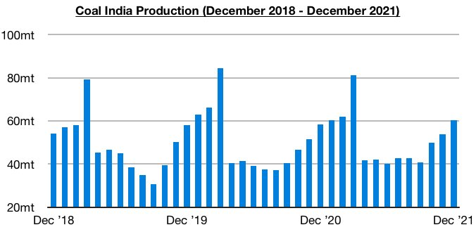
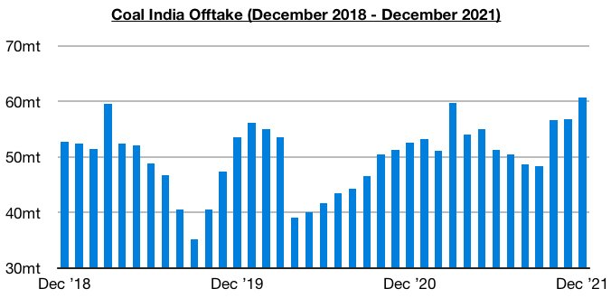
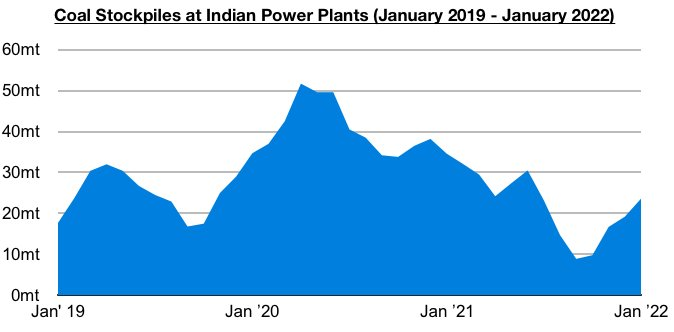
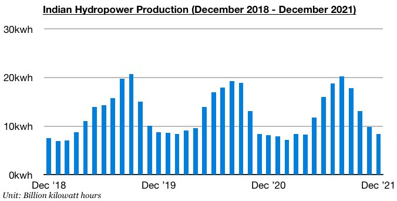

# Recent Developments in Indian Coal and Electricity Markets

**Date:** January 14, 2022  
**Publisher:** Breakwave Advisors | **Category:** Market Insights  
**Original URL:** [https://www.breakwaveadvisors.com/insights/2022/1/13/recent-developments-in-indian-coal-and-electricity-markets](https://www.breakwaveadvisors.com/insights/2022/1/13/recent-developments-in-indian-coal-and-electricity-markets)  

---

*By*[*Jeffrey Landsberg*](https://www.linkedin.com/in/jeffrey-landsberg-70ab957/)

Coal India continues to do an admirable job in increasing its coal production. Coal India produced approximately 60.2 million tons of coal last month, which marks a month-on-month increase of 6.4 million tons (12%) and a year-on-year increase of 1.9 million tons (3%). Coal India’s production has continued to climb dramatically since September and has continued to lead to a rise in the nation’s power plant stockpiles.

> **Figure 1: Chart 1 (13)**  
> [Local Asset](file:///C:/Users/Dell/Github/Shipping/corpus/03-breakwave/insights/2022/assets/2022-01-14_recent-developments-in-indian-coal-and-electricity-markets_img_chart1281329_bc17b68f6e07.jpg)

Offtake totaled 60.7 million tons last month, which marks a month-on-month increase of 3.9 million tons (7%) and a year-on-year increase of 8.1 million tons (15%). Offtake has now increased on a year-on-year basis for ten consecutive months, with last month’s volume setting an all-time high.

> **Figure 2: Chart 2 (11)**  
> [Local Asset](file:///C:/Users/Dell/Github/Shipping/corpus/03-breakwave/insights/2022/assets/2022-01-14_recent-developments-in-indian-coal-and-electricity-markets_img_chart2281129_c2b00545ac64.jpg)

The ongoing climb in Coal India's production and offtake has been a primary reason for the nation's power plant stockpiles rising to even higher levels recently. India’s power plant coal stockpiles ended last week at approximately 23.6 million tons, which is 1 million tons (4%) more than was stockpiled at the end of the previous week. While stockpiles have been climbing since mid-October, they are still down year-on-year by 13.3 million tons (-26%) and India's coal import prospects remain bullish.

> **Figure 3: Chart 3 (9)**  
> [Local Asset](file:///C:/Users/Dell/Github/Shipping/corpus/03-breakwave/insights/2022/assets/2022-01-14_recent-developments-in-indian-coal-and-electricity-markets_img_chart328929_80a1b052f03e.jpg)

Also helpful for Indian coal import prospects is that thermal coal-derived has returned to finding growth. India’s coal-derived electricity generation totaled approximately 93.4 billion kilowatt hours last month. This has marked a month-on-month increase of 10.9 billion kilowatt hours (13%) and is up year-on-year by 2 billion kilowatt hours (2%). Last month’s year-on-year growth has marked the largest year-on-year growth seen since August.

> **Figure 4: Chart 3 (9)**  
> [Local Asset](file:///C:/Users/Dell/Github/Shipping/corpus/03-breakwave/insights/2022/assets/2022-01-14_recent-developments-in-indian-coal-and-electricity-markets_img_chart328929_80a1b052f03e.jpg)

In addition, India's hydropower output has continued to decline on a month-on-month basis (which is normal for this year) and has also recently experienced only very small year-on-year growth. India’s hydropower output totaled approximately 8.4 billion kilowatt hours last month. This has marked a month-on-month decline of 1.4 billion kilowatt hours (-14%) and marks year-on-year growth of only 200 million kilowatt hours (2%). Previously, India's hydropower output in November had increased year-on-year by 16%, which marked the largest year-on-year growth seen all year.

> **Figure 5: Chart 5 (1)**  
> [Local Asset](file:///C:/Users/Dell/Github/Shipping/corpus/03-breakwave/insights/2022/assets/2022-01-14_recent-developments-in-indian-coal-and-electricity-markets_img_chart528129_b40d893fc9ce.jpg)

---

**Tags:** India, Coal, Energy, Electricity  
