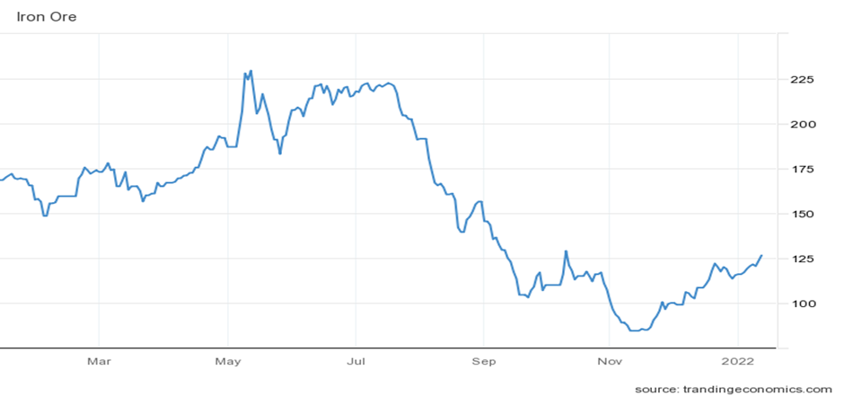
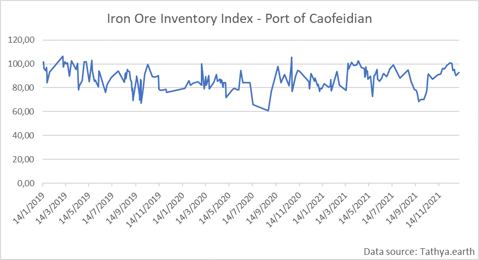
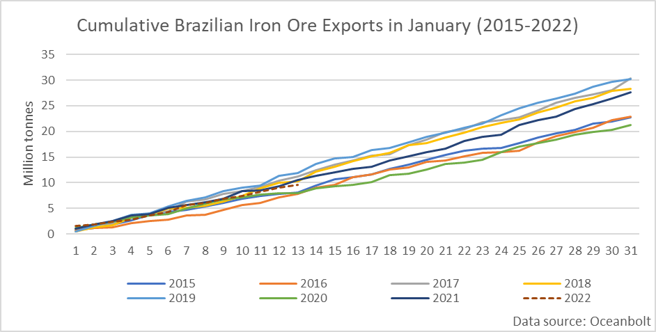
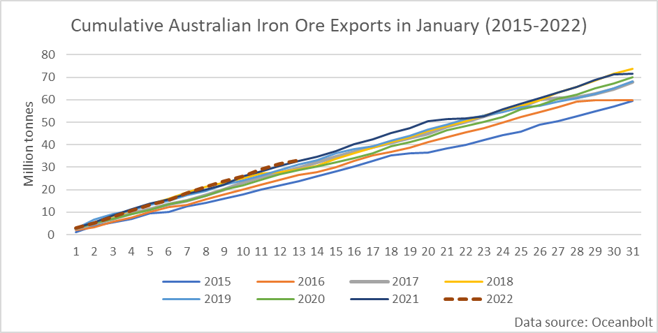
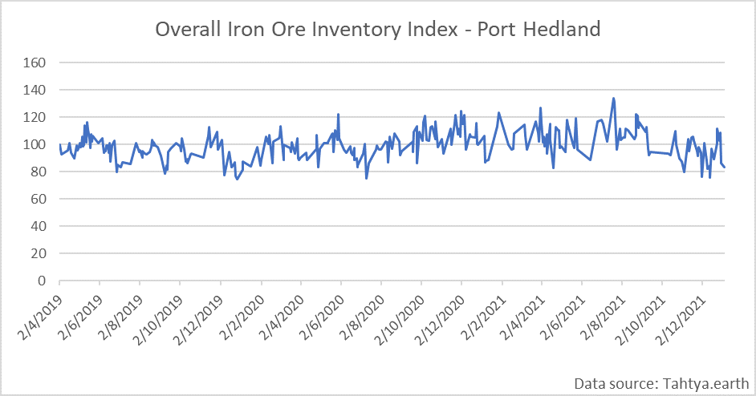

# Iron Ore: Prices Benefitting from Supply Disruptions and Lower Chinese Inflation

**Date:** January 15, 2022  
**Publisher:** Breakwave Advisors | **Category:** Market Insights  
**Original URL:** [https://www.breakwaveadvisors.com/insights/2022/1/14/iron-ore-prices-benefitting-from-supply-disruptions-and-lower-chinese-inflation](https://www.breakwaveadvisors.com/insights/2022/1/14/iron-ore-prices-benefitting-from-supply-disruptions-and-lower-chinese-inflation)  

---

*By*[*Ulf Bergman*](https://www.linkedin.com/in/ulf-bergman-81570425/)

After an eventful year, which saw iron ore prices gaining around fifty per cent in five months to a new record followed by a retreat of epic proportions that gave up all the gains with a considerable margin, the last two months have seen prices recovering. Since the middle of November, iron ore spot prices for delivery in the Chinese port of Tianjin has surged by approximately fifty per cent and are currently at their highest since the middle of October.

### Iron Ore with 63.5 per Cent Fe Content – Usd/tonne

> **Figure 1: Ch1**  
> [Local Asset](file:///C:/Users/Dell/Github/Shipping/corpus/03-breakwave/insights/2022/assets/2022-01-15_iron-ore-prices-benefitting-from-supply-disruptions-and-lower-chinese-inflation_img_ch1_9f9bd71cb256.png)

The recent gains have been driven by expectations of a rebound in demand for the steel-making ingredient, at the same time as supplies have been hampered by the adverse weather conditions affecting the world’s second-largest largest provider of the commodity.

A faster than expected improvement of China’s consumer and factory-gate inflation prospects will leave more room for easing monetary policy in the coming months. Next week’s release of economic growth rate figures is also widely expected to confirm that a slowdown is currently underway. According to the National Bureau of Statistics, China’s official producer price index rose by 10.3 per cent in the twelve months ending in December, well below the 12.9 per cent growth recorded in the previous month. Consumer prices have also stabilised, with the annual gain in December moderating to 1.5 per cent from 2.3 per cent in November. Hence, once the Chinese New Year and Winter Olympics are out of the way, there should be a greater prospect of pro-cyclical policies that will boost the demand for iron ore. The clampdown on emissions in the steel industry is also likely to ease as the requirement for blue skies over the Olympics fades.

Chinese steel mills have also been restocking iron ore in anticipation of a pick up in demand for steel later, and stockpiles have been shrinking across most Chinese ports handling the commodity in recent weeks. According to satellite data from Tathya, inventories in China’s largest iron ore port, Caofeidian, reached their highest levels since April in the middle of December but have since declined sharply.

> **Figure 2: Ch2**  
> [Local Asset](file:///C:/Users/Dell/Github/Shipping/corpus/03-breakwave/insights/2022/assets/2022-01-15_iron-ore-prices-benefitting-from-supply-disruptions-and-lower-chinese-inflation_img_ch2_1c227a984724.png)

Shrinking iron ore inventories across Chinese ports could herald a recovery in Chinese demand should the expected post-Olympics economic stimulus materialise. However, increasing infection rates in the wake of the arrival of the new Omicron variant could cause disruptions to both demand and port operations. China’s zero-covid policy could also potentially lead to new restrictions in the country’s second-largest iron ore port, Tianjin, as cases have been detected in the city. Any terminal closures would increase waiting times and force vessels to divert to alternative ports, causing a ripple effect of congestion across the region. Hence, reducing tonnage availability and providing some support to freight rates during what is typically the soft patch of the year.

It is not only the expectation of a stimulus-driven recovery in Chinese iron ore demand that has driven prices higher. Extreme rainfalls in southeastern Brazil has brought mining operations and rail transportation to a standstill. While the deluge hit region of Minas Gerais accounts for around forty per cent of Vale’s annual production, the company is still expecting to produce between 320 million and 335 million tonnes during this year. Nevertheless, analysts now expect output to be towards the lower end of the spectrum due to the stoppages. The heavy rains have also brought back concerns over the state of several tailings dams, which could potentially cause longer-term disruptions to production.

The weather-induced disruptions to the Brazilian iron ore production have resulted in export volumes falling behind last year’s. Month to date, export volumes are around a million tonnes lower than the same period the previous year, according to cargo tracking data from Oceanbolt. However, while the exports are lagging last year’s volumes, they are in line with the average for the preceding seven years.

> **Figure 3: Ch3**  
> [Local Asset](file:///C:/Users/Dell/Github/Shipping/corpus/03-breakwave/insights/2022/assets/2022-01-15_iron-ore-prices-benefitting-from-supply-disruptions-and-lower-chinese-inflation_img_ch3_ac11e2df2e1b.png)

For the world’s largest exporter of iron ore, Australia, the year has started better. Volumes of seaborne exports are marginally ahead of last year’s record. Some 33 million tonnes have left Australia during the first thirteen days of the year, with almost 80 per cent destined for Chinese ports. So far this month, Australia has shipped fifteen per cent more iron ore than the average for the same period in the previous seven years.

> **Figure 4: Ch4**  
> [Local Asset](file:///C:/Users/Dell/Github/Shipping/corpus/03-breakwave/insights/2022/assets/2022-01-15_iron-ore-prices-benefitting-from-supply-disruptions-and-lower-chinese-inflation_img_ch4_19f1ea500b77.png)

The strong start of the year for Australian iron ore exports has seen inventories in Port Hedland falling following a build-up in the days leading up to Christmas. Levels are now in the low-end of the range seen in recent years. Hence, any disruptions to the iron ore production due to Australia’s rapidly rising Omicron infection levels could see shipments failing to continue to meet previous record levels.

> **Figure 5: Ch5**  
> [Local Asset](file:///C:/Users/Dell/Github/Shipping/corpus/03-breakwave/insights/2022/assets/2022-01-15_iron-ore-prices-benefitting-from-supply-disruptions-and-lower-chinese-inflation_img_ch5_0e22bd9df074.png)

Iron ore prices may continue to benefit from supply-side disruptions in the near term due to adverse weather and the continued spread of the new Omicron variant of the coronavirus. On the other hand, Seaborne volumes may come under pressure for the same reasons and add to the current seasonal weakness facing the dry bulk shipping sector. However, the increasing likelihood of disruptions in and around many Chinese ports, as the country tries to limit the spread of the new variant, could offset some of the weakness as it lowers the tonnage supply.

---

**Tags:** Iron Ore, Supply, Exports, Price  
