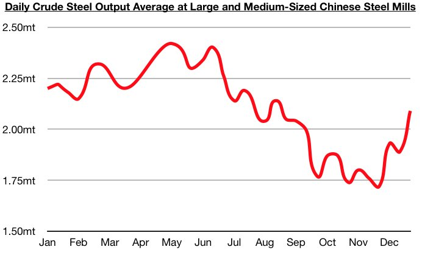

# Rain, Steel, and Cuddly Pets

**Date:** January 16, 2022  
**Publisher:** Breakwave Advisors | **Category:** Market Insights  
**Original URL:** [https://www.breakwaveadvisors.com/insights/2022/1/15/rain-steel-and-cuddly-pets](https://www.breakwaveadvisors.com/insights/2022/1/15/rain-steel-and-cuddly-pets)  

---

*By Jeffrey Landsberg*

As has been widely reported this week, heavy rainfall in Brazil has led to iron ore transportation and production disruptions. Vale this week has announced that it has partially halted trains service on the Estrada de Ferro Vitória a Minas railway and the production in the Southeastern and Southern Systems to guarantee the safety of its employees and communities due to the heavy rainfall. However, Vale has also reiterated that its 2022 production guidance of 320-335 million tons remains intact.

As we have stressed in Commodore's Weekly Dry Bulk Reports many times, Vale's guidance should always be taken with a grain of salt. More real and promising, though, is that China's steel production has recently increased. The most recently released data shows that daily crude steel output at large and medium-sized mills averaged 2.09 million tons during December 21 - December 31. This is 11% higher than was seen during the previous ten days and marks the highest steel production level seen since August. On a year-on-year basis, this production level is down by only 3%.

> **Figure 1: Chart 1 (14)**  
> **Interactive Data & Source:** [Wired](https://www.wired.com/story/could-being-cold-actually-be-good-for-you/) | [Local Asset](file:///C:/Users/Dell/Github/Shipping/corpus/03-breakwave/insights/2022/assets/2022-01-16_rain-steel-and-cuddly-pets_img_chart1281429_4df5bb52f79f.jpg)

Overall, it is certainly helpful for the dry bulk shipping market that Chinese steel production has found significant support and the dry bulk market will benefit this year if China's steel production is able to stay resilient. Also likely to remain significant to the dry bulk market this year is the global energy crisis. While Indonesia's coal shortage has come to an end and a semblance of stability has returned to Kazakhstan, an energy crisis very much remains intact in the world at large. Energy prices remain high and the Northern Hemisphere peak winter demand season remains in its infancy.

Going forward, we expect that new developments in both energy exporting nations and of course consuming nations will continue to arise during the next several months. Of note now, though, is that it is becoming ever more "interesting" seeing just how some with authority, influence, and even means to provide electricity have been publicly addressing the crisis. At the start of the year, Wired informed the world that[being cold could actually be good for us](https://www.wired.com/story/could-being-cold-actually-be-good-for-you/). SSE Energy Services, one of Britain's largest energy providers, carried the torch even further this week advising its customers that having a cuddle with pets, keeping the oven open after cooking, doing jumps, and eating hearty bowls of porridge[are all good ways to help stay warm this winter](assets/2022-01-16_rain-steel-and-cuddly-pets_cant-afford-heat-house-cuddle-cat-sa_34cfb8530afd.html). The company has since apologized.

> **Figure 2: Market Chart 2**  
> [Local Asset](file:///C:/Users/Dell/Github/Shipping/corpus/03-breakwave/insights/2022/assets/2022-01-16_rain-steel-and-cuddly-pets_img_image1_7e5d558e7206.jpg)

We are only two weeks into the new year and the world's largest thermal coal exporter has had to temporarily ban exports, one nation has faced the possibility of a regime change, one media outlet has suggested that being cold could be good for us, and one energy provider has advised to cuddle pets and leave ovens open to help stay warm. The next fifty weeks are sure to remain interesting, and we continue to anticipate that all energy assets (including coal) will be in great demand.

---

**Tags:** Energy, Coal, Steel  
