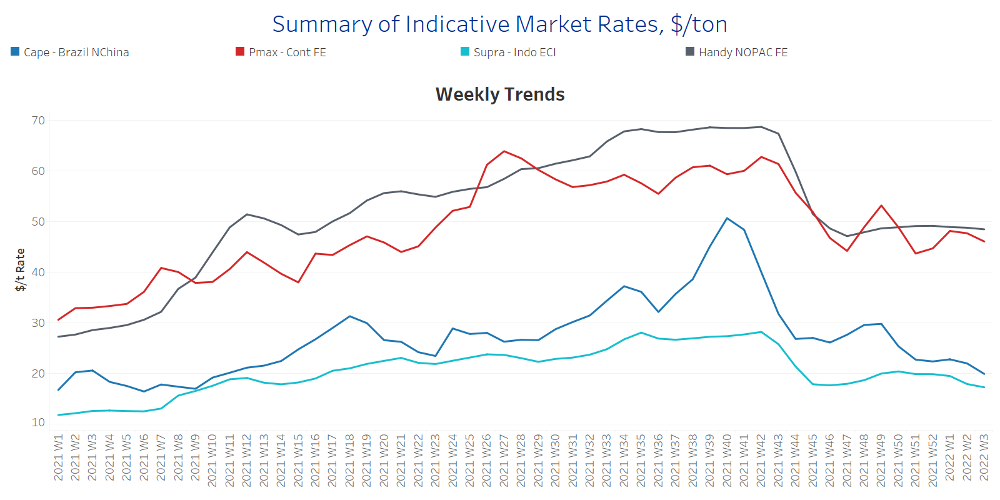
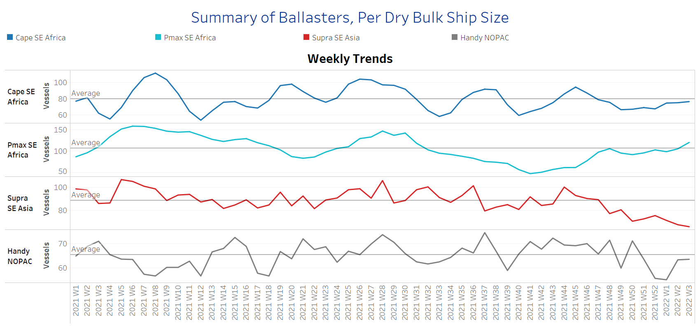
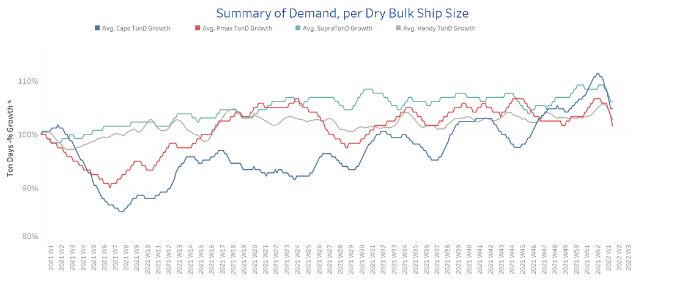
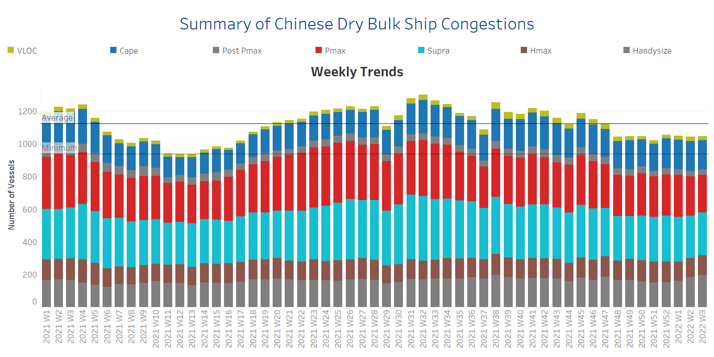

# Signal Dry Bulk Weekly Report

**Date:** January 19, 2022  
**Publisher:** Breakwave Advisors | **Category:** Market Insights  
**Original URL:** [https://www.breakwaveadvisors.com/insights/2022/1/19/signal-weekly-report](https://www.breakwaveadvisors.com/insights/2022/1/19/signal-weekly-report)  

---

Freight market rates are falling with**Brazilian iron ore weather**dampening the capesize vessel earnings. Heavy rainfall has disrupted southeastern Brazil's giant iron ore industry, with the world's No. 2 producer Vale appearing to have partially suspended services on the Estrada de Ferro Vitoria a Minas railway as well as production at its southeastern and southern systems. In the iron ore market, prices are loosening on indications of continuing China’s economic weakness. The central bank cut the borrowing costs of its medium-term loans for the first time since April 2020, which confirmed the slowdown of expansion for the world’s second largest economy.

In the coal segment, the gradual relaxation of Indonesian export ban helped Pacific freight market sentiment, however, cargo enquiry remained soft and panamax - supramax rates eventually appeared on a downward pressure. Fresh news emerged this week that Indonesia may release an additional 22 ships amid the coal export ban (34 ships are already released for export).

## Section 1 - Freight -Market Rates ($/T) - Weaker

‘The Big Picture’ - Capesize and Panamax Bulkers and Smaller Ship Sizes

> **Figure 1: Ch1**  
> **Interactive Data & Source:** [Signal Ocean Platform](https://www.thesignalgroup.com/signal-ocean-platform) | [Local Asset](file:///C:/Users/Dell/Github/Shipping/corpus/03-breakwave/insights/2022/assets/2022-01-19_signal-weekly-report_img_ch1_875cb3e35297.png)

- Freight market weakness in the capesize, panamax and supramax segment is deepening, while handysize size appears to be the only one that maintains a steadiness of performance compared to the levels of Week 49, 2021.

- Capesize Brazil to NChina rates dropped below $20/t (vs ~$30/t Week 49, 2021) and Panamax Continent to Far East rates are now ~$46/t vs $(53/t at Week 49 of last year.
- In the supramax segment, Indo ECI rates keep decreasing trend at the levels of less than $20/t, and hover around $17.5/t for the current week.
- Handysize NOPAC FE rates maintain a pace of steadiness at levels within the range of $48-$49/t.

## Section 2 - Supply - Ballasters View

## Number of Vessels -Increasing

Supply Trend Lines for Key Load Areas

> **Figure 2: Ch2**  
> **Interactive Data & Source:** [Signal Ocean Platform](https://www.thesignalgroup.com/signal-ocean-platform) | [Local Asset](file:///C:/Users/Dell/Github/Shipping/corpus/03-breakwave/insights/2022/assets/2022-01-19_signal-weekly-report_img_ch2_426ad7c402af.png)

- The number of vessels sailing in ballast status is evolving above the average trend line for the handysize and panamax segment, at levels of above 65 for handysize and 100 for panamax.

- In the capesize segment, the number is still nearing to move above, however, with signs of steadiness for the first three weeks of the year~80 vessels.
- In SE Asia, the number of supramax vessels sailing in ballast status is now less than 70 with soft signs of an accelerated increase in the next few days.

## Section 3 - Demand - In Ton Days

## Decreasing

> **Figure 3: Ch3**  
> **Interactive Data & Source:** [Signal Ocean Platform](https://www.thesignalgroup.com/signal-ocean-platform) | [Local Asset](file:///C:/Users/Dell/Github/Shipping/corpus/03-breakwave/insights/2022/assets/2022-01-19_signal-weekly-report_img_ch3_56bd743728f3.png)

- Looking at the evolution of demand growth, the current fundamentals for the iron market and Chinese economy are not expected to change till the end of the Chinese New Year.

- Thus, the capesize picture has not yet reversed to a firm increase and in the panamax segment, the situation remains worsened.

## Section 4 - Chinese Port Congestions -

## Number of Vessels -Decreasing

## Dry Bulk Ships Congested Around Chinese Ports

> **Figure 4: Ch4**  
> **Interactive Data & Source:** [Signal Ocean Platform](https://www.thesignalgroup.com/signal-ocean-platform) | [Local Asset](file:///C:/Users/Dell/Github/Shipping/corpus/03-breakwave/insights/2022/assets/2022-01-19_signal-weekly-report_img_ch4_aa76e16233de.png)

- The number of congestion remains hovering below the average of ~1120 vessels since Week 46, 2021.

- The last days emerge with falling levels from the beginning of this year, which implies that the impact on upward pressure on freight rates will be minimal for January.
- It is worth noting that handysize remains the size with an increasing number of congested vessels ~ 190 vessels compared to ~160 at the first week of this year.

Data Source:[Signal Ocean Platform](https://www.thesignalgroup.com/signal-ocean-platform)
