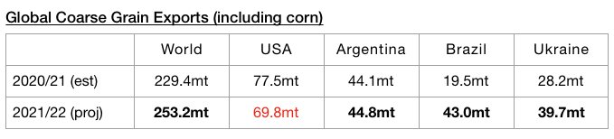
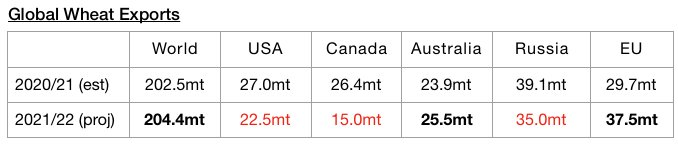
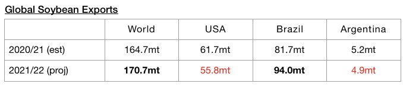
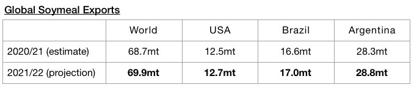

# Global seaborne grain trade

**Date:** January 20, 2022  
**Publisher:** Breakwave Advisors | **Category:** Market Insights  
**Original URL:** [https://www.breakwaveadvisors.com/insights/2022/1/20/w4rf15aavhostkk1kykaqgo3nfyr85](https://www.breakwaveadvisors.com/insights/2022/1/20/w4rf15aavhostkk1kykaqgo3nfyr85)  

---

*By*[*Jeffrey Landsberg*](https://www.linkedin.com/in/jeffrey-landsberg-70ab957/)

While global seaborne grain trade prospects for the current 2021/22 season remain quite bullish, expectations for trade volumes have been lowered recently. The United States Department of Agriculture has released their latest forecasts for 2021/22 and is now forecasting global grain exports will total 507.5 million tons. This is 1.5 million tons less than was forecast a month ago but would mark a year-on-year increase of 25.3 million tons (5%). Expectations for global seaborne coarse grain exports remain particularly robust. Global coarse grain exports in 2021/22 are now expected to total 253.2 million tons. This is just 600,000 tons less than was forecast a month ago and would mark a year-on-year increase of 23.8 million tons (10%).

> **Figure 1: Chart 1 (15)**  
> [Local Asset](file:///C:/Users/Dell/Github/Shipping/corpus/03-breakwave/insights/2022/assets/2022-01-20_w4rf15aavhostkk1kykaqgo3nfyr85_img_chart1281529_24fc5ff9be3f.jpg)

Global wheat exports are expected to total 204.4 million tons. This is 1.1 million tons (-1%) less than was forecast a month ago but would mark a year-on-year increase of 1.9 million tons (1%).

> **Figure 2: Chart 2 (12)**  
> [Local Asset](file:///C:/Users/Dell/Github/Shipping/corpus/03-breakwave/insights/2022/assets/2022-01-20_w4rf15aavhostkk1kykaqgo3nfyr85_img_chart2281229_342a5d2ac455.jpg)

In addition, global soybean exports (soybeans are not technically classified as a grain) are expected to total 170.7 million tons. This is 1.6 million tons (-1%) less than was forecast a month ago but would mark a year-on-year increase of 6 million tons (3%).

> **Figure 3: Chart 3 (10)**  
> [Local Asset](file:///C:/Users/Dell/Github/Shipping/corpus/03-breakwave/insights/2022/assets/2022-01-20_w4rf15aavhostkk1kykaqgo3nfyr85_img_chart3281029_7245515801ee.jpg)

Global soymeal exports are expected to total 69.9 million tons. This is 900,000 tons (-1%) less than was forecast a month ago but would mark a year-on-year increase of 1.3 million tons (2%).

> **Figure 4: Chart 4 (5)**  
> [Local Asset](file:///C:/Users/Dell/Github/Shipping/corpus/03-breakwave/insights/2022/assets/2022-01-20_w4rf15aavhostkk1kykaqgo3nfyr85_img_chart428529_1352f757027a.jpg)

Overall, it remains very helpful for the dry bulk market that grain trade is likely to be so strong this year. While the dry bulk fleet remains likely to grow this year by less than 3%, overall dry bulk seaborne trade growth still needs to exceed this level for rates to continue to strengthen cyclically and this is in no means guaranteed to occur. There is still no guarantee that iron ore trade volume in particular will grow this year.

---

**Tags:** Global, Grains, Trade  
