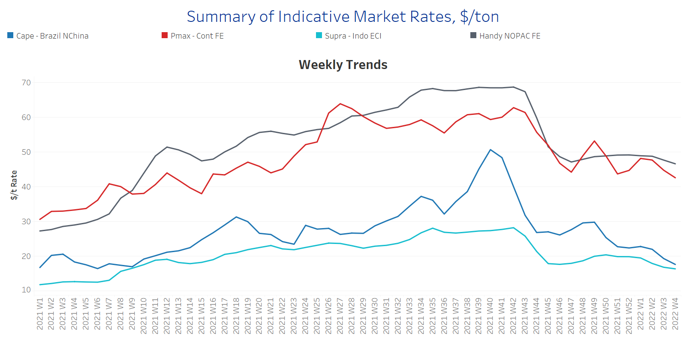
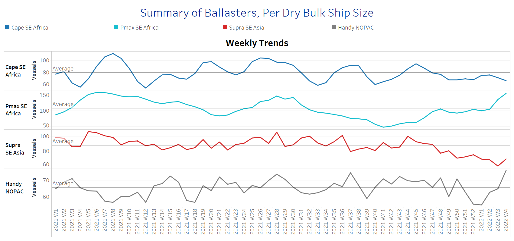
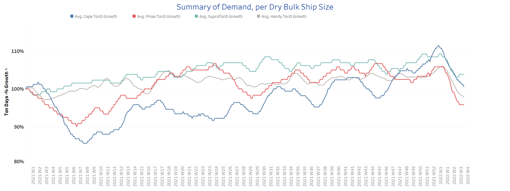
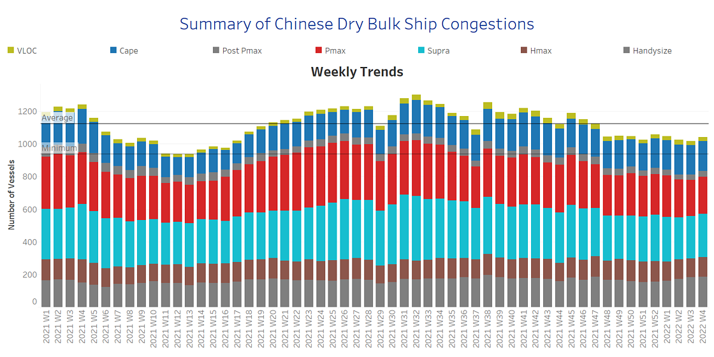

# Signal Dry Bulk Weekly Report

**Date:** January 26, 2022  
**Publisher:** Breakwave Advisors | **Category:** Market Insights  
**Original URL:** [https://www.breakwaveadvisors.com/insights/2022/1/26/signal-dry-bulk-weekly-report](https://www.breakwaveadvisors.com/insights/2022/1/26/signal-dry-bulk-weekly-report)  

---

The weaker momentum of freight rates persists for all the weeks of January with Chinese iron ore prices posting again a downward trend. Last Friday, there were signs for an upward weekly gain in iron ore prices amid hopes for strong Chinese demand followed by the government’s fresh stimulus measures, however, the opening of the week brings a dip in prices. Spot prices of iron ore with 63.5% iron content for delivery to Tianjin traded at $130/t at the end of January after rising as high as $133 last week, the strongest level since September 7th.

The market remains in a fragile state ahead of the Chinese New Year and Winter Olympic games. Traders remain cautious for the potential of a short-term rebound as steel mills' operations are expected to remain curtailed throughout February to improve air quality during the Beijing Games, even though the Spring Festival season in top steel producer China runs from Jan. 31 until Feb. 6. In the long run, there are expectations that China's central bank will be providing more stimulus to support the economy, boosting hopes of a pickup in demand for metals in the coming months.

In the coal segment, there is significant breaking news from the Indonesian export ban rebalancing the negative momentum that comes in the iron ore freight market. Last week, Indonesia's government eased a coal export ban for 139 companies as they met local market sales requirements to avert a supply crunch and power outages. Overall, 75 ships had been allowed to load coal from firms that had met all their DMO requirements, while 12 more had been allowed to proceed having provided a written assurance of compliance and acceptance of penalties.

## Section 1 - Freight -Market Rates ($/T) - Weaker

‘The Big Picture’ - Capesize and Panamax Bulkers and Smaller Ship Sizes

> **Figure 1: Ch1**  
> **Interactive Data & Source:** [Signal Ocean Platform](https://www.thesignalgroup.com/signal-ocean-platform) | [Local Asset](file:///C:/Users/Dell/Github/Shipping/corpus/03-breakwave/insights/2022/assets/2022-01-26_signal-dry-bulk-weekly-report_img_ch1_3eb86dd9ba07.png)

- Capesize Brazil to NChina rates dropped below $18/t (vs ~$30/t Week 49, 2021) and Panamax Continent to Far East rates are now ~$43/t vs $(53/t at Week 49 of last year.

- In the supramax segment, Indo ECI rates keep decreasing trend at the levels of less than $20t, and hover at levels less than $16.5/t for the current week.
- Handysize NOPAC FE rates fell now below $47/t following a pace of steadiness at levels within the range of $48-$49/t in the previous weeks.

## Section 2 - Supply - Ballasters View

## Number of Vessels -Increasing

Supply Trend Lines for Key Load Areas

> **Figure 2: Ch2**  
> **Interactive Data & Source:** [Signal Ocean Platform](https://www.thesignalgroup.com/signal-ocean-platform) | [Local Asset](file:///C:/Users/Dell/Github/Shipping/corpus/03-breakwave/insights/2022/assets/2022-01-26_signal-dry-bulk-weekly-report_img_ch2_3528939b585f.png)

- The number of vessels sailing in ballast status is still evolving above the average trend line for the handysize and Panamax segment, at levels of above 65 for handysize and 100 for Panamax.

- In the Capesize segment, there are some signs of a slight drop this week, with the number moving to less than 70 ballasters, compared to around 80, in the previous three weeks of January.
- In SE Asia, the number of supramax vessels sailing in ballast status is now more than 70 confirming an accelerated increase compared to the levels of last week, when it stood around 60.

## Section 3 - Demand - In Ton Days

## Decreasing

> **Figure 3: Ch3**  
> **Interactive Data & Source:** [Signal Ocean Platform](https://www.thesignalgroup.com/signal-ocean-platform) | [Local Asset](file:///C:/Users/Dell/Github/Shipping/corpus/03-breakwave/insights/2022/assets/2022-01-26_signal-dry-bulk-weekly-report_img_ch3_506678605583.png)

- Looking at the evolution of demand growth, the current fundamentals for the iron market and Chinese economy remain in a silent mode a few days before the Chinese New Year.

- Thus, the Capesize picture has not yet shown any sign for a firm increase and in the Panamax segment, the situation remains critical with the Indonesian gradual relaxation of the coal ban fuelling a sense of optimism.
- It is worth noting that in the supramax segment, the last days of January seem to twist to positive momentum, as the growth of demand is fuelled by stronger signs of coal trading growth in SE Asia.

## Section 4 - Chinese Port Congestions -

## Number of Vessels -Increasing

## Dry Bulk Ships Congested Around Chinese Ports

> **Figure 4: Ch4**  
> **Interactive Data & Source:** [Signal Ocean Platform](https://www.thesignalgroup.com/signal-ocean-platform) | [Local Asset](file:///C:/Users/Dell/Github/Shipping/corpus/03-breakwave/insights/2022/assets/2022-01-26_signal-dry-bulk-weekly-report_img_ch4_40e5c4ca15f3.png)

- The number of congestion remains hovering below the average of ~1120 vessels since Week 46, 2021.

- The last days of January seem to evolve with a soft increasing pace, which is mainly stemming from the handysize and Capesize segment.
- In the handysize, there is still an increasing number of congested vessels ~ 180 vessels compared to ~160 at the first week of this year.
- For Capesize vessels, the last days of January are signalling the number of congestion to surpass the barrier of 190 vessels and we remain cautious whether this movement of increase will remain in the next few days.

Data Source:[Signal Ocean Platform](https://www.thesignalgroup.com/signal-ocean-platform)

---

**Tags:** Shipping, Dry Bulk, Freight, Rates  
