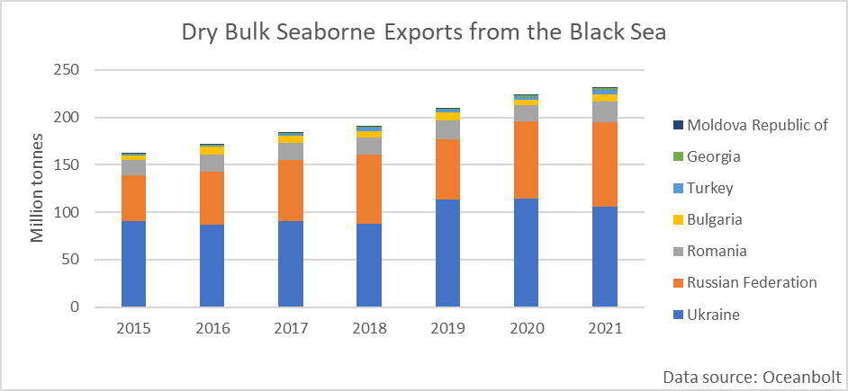
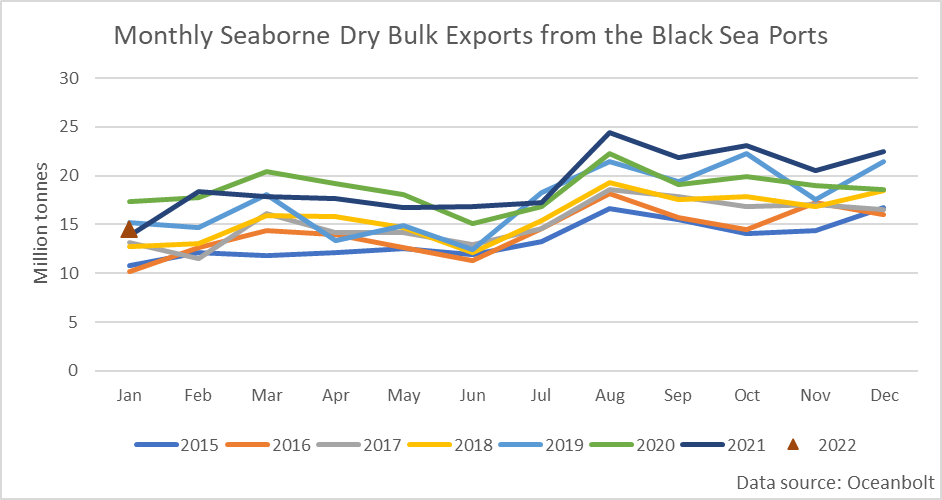
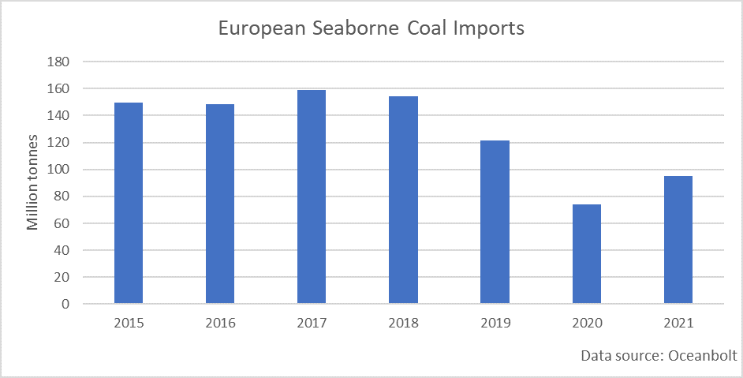
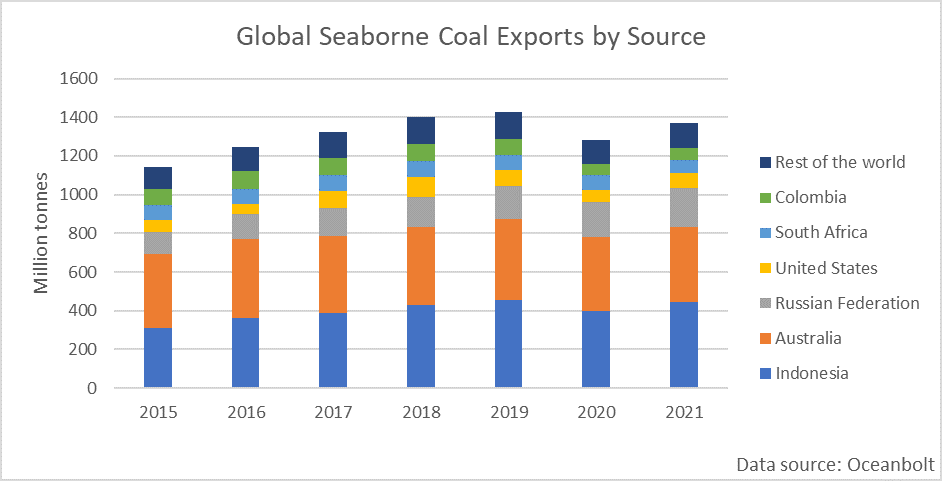

# Rising Tensions in Eastern Europe and Dry Bulk Shipping

**Date:** January 27, 2022  
**Publisher:** Breakwave Advisors | **Category:** Market Insights  
**Original URL:** [https://www.breakwaveadvisors.com/insights/2022/1/27/rising-tensions-in-eastern-europe-and-dry-bulk-shipping](https://www.breakwaveadvisors.com/insights/2022/1/27/rising-tensions-in-eastern-europe-and-dry-bulk-shipping)  

---

*By*[*Ulf Bergman*](https://www.linkedin.com/in/ulf-bergman-81570425/)

Tensions are rapidly rising in Eastern Europe as the war of words between the Russian and Western leaders continues, following the build-up of Russian military forces along Ukraine’s eastern borders. With diplomatic efforts failing to make any material progress in defusing the situation, the probability of Europe facing the most extensive military conflict since the end of the second world war is rising. Should the present situation develop into open hostilities, sanctions and trade disruptions would rapidly follow in its wake. Given the importance of Russian natural gas to many European countries, it is likely that the commodity will be used to exert political pressure in case of a conflict. Hence, much of the focus of the reporting has been on potential implications for the global LNG market.

In addition, as the tensions are primarily focused on the land border between Russia and Ukraine, the repercussions for dry bulk shipping have largely been ignored. While there is the potential for a limited naval angle to the dispute in the northern Black Sea, any escalation is likely to occur over or on land.

Despite the lack of wide-ranging naval ramifications should the state of affairs develop in the wrong direction, global dry bulk shipping could be impacted in several different ways from a conflict. The most apparent effect would be that the Black Sea becomes inaccessible, either entirely or partially, for commercial shipping. Last year, around 231 million tonnes of dry bulk commodities were shipped from ports around the Black Sea, out of which 85 per cent came from Ukraine and Russia. While nine million tonnes of the total is destined for other ports in the Black Sea, 96 per cent passes through the Strait of Bosporus to more distant shores.

> **Figure 1: Ch1.jpg**  
> [Local Asset](file:///C:/Users/Dell/Github/Shipping/corpus/03-breakwave/insights/2022/assets/2022-01-27_rising-tensions-in-eastern-europe-and-dry-bulk-shipping_img_ch1jpg_f3149a6a4b05.png)

Coal, grains and steel dominate the flow of dry bulk cargoes from the Black Sea Region, with China becoming an increasingly important destination. Traditionally, most of the exports head for ports in and around the Mediterranean Sea, but in recent years the Chinese share of the trade has been increasing and reached 22 per cent in 2020. However, last year the Chinese share of exports dropped to sixteen per cent following a fall in grains volumes.

In the past, the smaller tonnage segments dominated the dry bulk trade in the Black Sea, with Handysizes and Supramaxes accounting for around seventy per cent between them. However, there has been a significant change in the last two years, with their aggregate market share dropping to just above fifty per cent. Panamaxes have been the beneficiary of the change, with their market share almost doubling since 2015 to thirty per cent. As the Black Sea trade has grown at the same time, volumes shipped from the region onboard Panamaxes expanded by 40 million tonnes to 67 million tonnes between 2015 and 2021. Capesizes have recovered their market share, following a retreat a few years ago, and carried 39 million tonnes of the region’s exports last year.

The flow of commodities from the Black Sea ports is showing a degree of seasonality, with a minor decline of volumes in the run-up to the new harvest season. The second half of the year typically have more robust monthly quantities following the grain harvest. The current year has also started strongly, with exports month to date suggesting a new monthly record for January. Hence, if a potential conflict starts later rather than sooner, as many pundits expect or drags out, the disruption to the trade and the belligerents’ economies will be more significant.

> **Figure 2: Ch2**  
> [Local Asset](file:///C:/Users/Dell/Github/Shipping/corpus/03-breakwave/insights/2022/assets/2022-01-27_rising-tensions-in-eastern-europe-and-dry-bulk-shipping_img_ch2_b41c0cb67ebb.png)

While it is easy to focus on the potential disruption to the trade from the Black Sea ports, other trade flows can be affected as well. If the flow of natural gas from Russia to Europe gets disrupted due to the evolving conflict, the continents already strained energy situation will take a turn for the worse. While the US administration is developing plans to supply its European allies with seaborne LNG to replace Russian supplies, it remains to be seen if such a move will be sufficient. The initiative is likely to please owners of LNG tankers, but Europe may be forced to seek alternative energy sources as well. The cold winter and insufficient natural gas supplies from Russia have already seen European power plants returning to coal after many years of declining use. Last year saw European seaborne coal imports rising for the first time since 2017. Volumes discharged month-to-date in the continent’s ports also suggest that the imports will be the highest for the month of January since 2019.

> **Figure 3: Ch3**  
> [Local Asset](file:///C:/Users/Dell/Github/Shipping/corpus/03-breakwave/insights/2022/assets/2022-01-27_rising-tensions-in-eastern-europe-and-dry-bulk-shipping_img_ch3_12673513f7ea.png)

If a conflict were to shut down the pipelines from the east and US supplies prove to be insufficient, Europe might find itself boosting its coal imports further to cover the shortfall. European buyers will have to source additional coal supplies from distant shores, as the continent’s nearest coal supplier, Russia, is likely to be either out of favour or under sanctions. The good news is that Australia, the US, South Africa and Colombia shipped less coal last year than before the pandemic. Hence, in theory, they should be able to supply Europe with additional volumes. The current Indonesian ban on coal exports is an added complication should it remain in place if, or when, the situation in Eastern Ukraine deteriorates.

> **Figure 4: Ch4**  
> [Local Asset](file:///C:/Users/Dell/Github/Shipping/corpus/03-breakwave/insights/2022/assets/2022-01-27_rising-tensions-in-eastern-europe-and-dry-bulk-shipping_img_ch4_536880d44727.png)

As often is the case, shipping and freight rates benefit when there are frictions in global trade. If a direct conflict was to break out between Russia and Ukraine, there are several ways that the dry bulk sector may be affected. If the Black Sea becomes out of bounds for commercial vessels, the commodities usually sourced from the region will have to be bought elsewhere. Such substitutions are often likely to involve longer distances with rising tonne-mile demand as a result. Likewise, should Europe need to import additional thermal coal volumes, it will add to the tonnage demand, as it involves a shift in the mode of transport for the energy commodity, from pipelines to seagoing vessels.

---

**Tags:** Shipping, Dry Bulk, Easterneurope, Russia  
