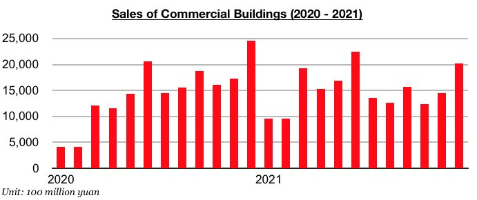
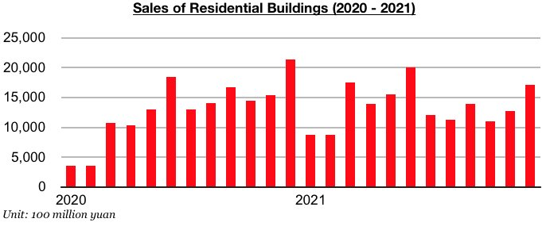

# Building Sales in China Climb to Six-Month High

**Date:** February 03, 2022  
**Publisher:** Breakwave Advisors | **Category:** Market Insights  
**Original URL:** [https://www.breakwaveadvisors.com/insights/2022/2/2/building-sales-in-china-climb-to-six-month-high](https://www.breakwaveadvisors.com/insights/2022/2/2/building-sales-in-china-climb-to-six-month-high)  

---

*By*[*Jeffrey Landsberg*](https://www.linkedin.com/search/results/all/?keywords=jeffrey%20landsberg&origin=RICH_QUERY_SUGGESTION&position=0&searchId=45c796d5-29a6-49bb-80fc-3d2e27f9d85b&sid=eC7)

As we have been highlighting in our Weekly China Reports in recent months, various aspects of the housing sector have been improving recently. Newly released data for December also shows that sales of commercial buildings (the vast majority of which are residential homes in China) have now climbed to a six-month high. Sales of commercial buildings last month totaled 2.026 trillion yuan. This is up month-on-month by 578 billion yuan (40%) and marks the strongest sales seen since June.

> **Figure 1: Chart 1 (17)**  
> [Local Asset](file:///C:/Users/Dell/Github/Shipping/corpus/03-breakwave/insights/2022/assets/2022-02-03_building-sales-in-china-climb-to-six-month-high_img_chart1281729_223a8fad2390.jpg)

Sales of residential buildings (which in 2021 contributed to 89% of all commercial building sales) also climbed to a six-month high last month. Sales totaled 1.713 trillion yuan last month and marked month-on-month growth of 444 billion yuan (35%).

> **Figure 2: Chart 2 (14)**  
> [Local Asset](file:///C:/Users/Dell/Github/Shipping/corpus/03-breakwave/insights/2022/assets/2022-02-03_building-sales-in-china-climb-to-six-month-high_img_chart2281429_e114b0f9ade7.jpg)

Overall, it has certainly been a very positive development that the total number of commercial building sales in China (the vast majority of which are residential homes) have been climbing recently. However, December’s commercial building sales did decline year-on-year by 18% and residential building sales did decline year-on-year by 20%. 2021 in total did still see growth. Commercial building sales last year rose year-on-year by 5% and residential building sales rose year-on-year by 5% (commercial building sales and residential building sales both experienced year-on-year growth during each of the first six month of 2021, before then both declining on a year-on-year basis during each of the final six months of 2021). In comparison, in 2020 commercial building sales increased by 9% and residential building sales increased by 11%.

---

**Tags:** Economy, China, Sales  
