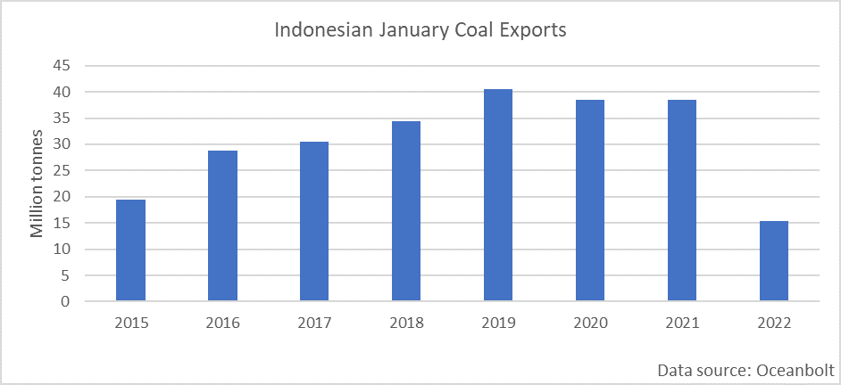
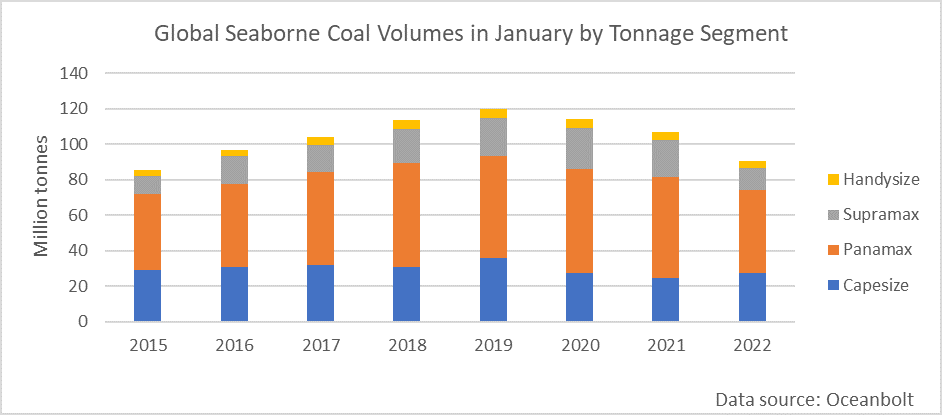

# The End of the Indonesian Ban on Thermal Coal Exports

**Date:** February 03, 2022  
**Publisher:** Breakwave Advisors | **Category:** Market Insights  
**Original URL:** [https://www.breakwaveadvisors.com/insights/2022/2/2/the-end-of-the-indonesian-ban-on-thermal-coal-exports](https://www.breakwaveadvisors.com/insights/2022/2/2/the-end-of-the-indonesian-ban-on-thermal-coal-exports)  

---

*By*[*Ulf Bergman*](https://www.linkedin.com/in/ulf-bergman-81570425/)

As the new month dawns, the Indonesian government has announced an end to last month’s ban on thermal coal exports. The measure aimed to safeguard domestic supplies, as inventories of the energy commodity dwindled at Indonesian power plants. While the ban has not been total and some cargoes of seaborne coal have been allowed to depart the country, the uncertainty surrounding the supplies from recent year’s largest exporter pushed prices higher during the first month of the year. Newcastle coal futures rose by more than a third during the first four weeks and approached 230 dollars per tonne. The readings towards the end of January were the highest since the Chinese authorities imposed a cap on domestic prices in late October. However, following the Indonesian government’s announcement, prices have retreated by almost eight per cent.

During a press conference this week, Indonesia’s Energy and Mineral Resources Ministry stated that the supply situation for the local power plants had improved sufficiently to allow for the export embargo to be lifted. However, the removal of the trade restrictions came with a few caveats. Miners that have not met their domestic market obligations (DMO) and have not paid the related fines will not have their export licences restored. Under the DMO rules, Indonesian coal miners have to reserve at least a quarter of their output for the domestic market and respect a price cap of 70 dollars per tonne.

January’s partial exports ban took a hefty toll on the volumes shipped from the Southeast Asian country. According to cargo tracking data, only fifteen million tonnes of coal were loaded onto dry bulk vessels during the last month, less than half of the average for the preceding seven years. Compared to a year ago, the decline was even more pronounced at sixty per cent. The actual reduction could be even more significant, as a quarter of the cargoes have no recognised port as a destination. The proportion is considerably higher than in previous years, suggesting that many loaded vessels have not yet received permission to depart Indonesian waters.

> **Figure 1: Ch1.jpg**  
> [Local Asset](file:///C:/Users/Dell/Github/Shipping/corpus/03-breakwave/insights/2022/assets/2022-02-03_the-end-of-the-indonesian-ban-on-thermal-coal-exports_img_ch1jpg_2d0d12b0f6be.png)

While Indonesian coal shipments shrank by 23 million tonnes year-on-year in January, global seaborne volumes fared somewhat better with a decrease of seventeen million tonnes. Nevertheless, only Colombia and South Africa increased their shipments among the world’s more prominent exporters of seaborne coal. Both countries increased their exports by around 35 per cent and offset close to three million tonnes of Indonesian reductions between them. However, it was the world’s smaller producers that delivered significant output increases, with seaborne exports from outside the top-seven almost doubling to nine million tonnes.

With shipments to the largest market, China, down by eighty per cent, the dominant vessel segments on the trade, Panamaxes and Supramaxes, lost considerable employment opportunities. As a result, the Panamax segment carried ten million tonnes less globally in January compared to the same month a year ago. Its smaller siblings in the supramax segment shed an even more significant part of its coal trade, with forty per cent less carried globally last month. In contrast, the changes to the global flow of seaborne coal benefited the largest vessels. Following the deteriorating relations between China and Australia, which eventually resulted in a Chinese ban on imports of Australian coal, the Capesizes have seen their share of the trade declining. However, with coal consignments from Colombia and South Africa on the rise, the largest vessels have seen their popularity bounce back, with a twelve per cent increase in volumes.

> **Figure 2: Ch2**  
> [Local Asset](file:///C:/Users/Dell/Github/Shipping/corpus/03-breakwave/insights/2022/assets/2022-02-03_the-end-of-the-indonesian-ban-on-thermal-coal-exports_img_ch2_c4611ffe6f25.png)

With the export ban lifted for the Indonesian miners, a gradual return to more normal conditions in the global coal trade can be expected. As February is a short month, volumes are on average six per cent lower than in January. However, with coal demand remaining high and the Indonesian miners eager to sell their coal at international price levels again, the pattern is likely to be challenged this year. Since 2018, the quantities of coal shipped in February have remained stable at around 105 million tonnes. Assuming that the Indonesian coal miners are not facing any additional obstacles, around twenty million tonnes more will be shipped in the coming month from the country, compared to January. Such a bounce back in Indonesian export activities is likely to benefit the freight rates for the mid-sized tonnage.

---

**Tags:** Coal, Indonesia, Exports  
