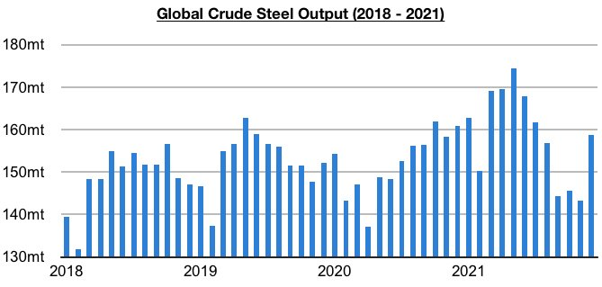
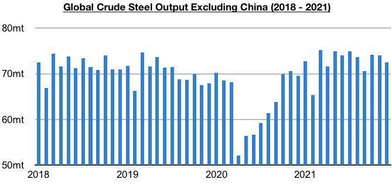
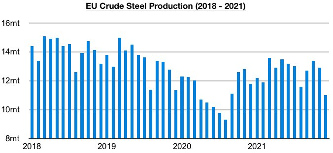
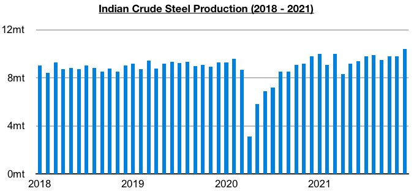

# Steel Output Remains Strong Outside of China

**Date:** February 04, 2022  
**Publisher:** Breakwave Advisors | **Category:** Market Insights  
**Original URL:** [https://www.breakwaveadvisors.com/insights/2022/2/4/steel-output-remains-strong-outside-of-china](https://www.breakwaveadvisors.com/insights/2022/2/4/steel-output-remains-strong-outside-of-china)  

---

*By*[*Jeffrey Landsberg*](https://www.linkedin.com/in/jeffrey-landsberg-70ab957/)

Global crude steel production totaled 158.7 million tons last month. This is up month-on-month by 15.4 million tons (11%) but is 2.2 million tons (-1%) less than was reported last year for December’s 2020’s production. The year-on-year contraction has been mostly entirely due to the contraction in China. Outside of China, steel production has continued to rise on a year-on-year basis.

> **Figure 1: Chart 1 (18)**  
> [Local Asset](file:///C:/Users/Dell/Github/Shipping/corpus/03-breakwave/insights/2022/assets/2022-02-04_steel-output-remains-strong-outside-of-china_img_chart1281829_d9f4118429db.jpg)

Global crude steel production outside of China totaled 72.5 million tons last month. This is down month-on-month by 1.5 million tons (-2%), is 2.9 million tons (4%) more than was reported last year for December 2020’s production, and is still fairly close to the record 75.2 million tons produced in March. Global crude steel production outside of China set an annual record last year as anticipated and grew year-on-year by 14%. In comparison, in 2020 it declined year-on-year by 9%.

> **Figure 2: Chart 2 (15)**  
> [Local Asset](file:///C:/Users/Dell/Github/Shipping/corpus/03-breakwave/insights/2022/assets/2022-02-04_steel-output-remains-strong-outside-of-china_img_chart2281529_f39a961c9588.jpg)

It is encouraging that global steel production outside of China grew year-on-year by 14% last year, but of note is that the 4% growth marked the lowest growth seen since February. Also of note is that steel production in the European Union contracted on a year-on-year basis last month. More positive, though, is that a record was set in India. The European Union produced approximately 11 million tons of crude steel last month. This is 1.9 million tons (-15%) less than was produced in November and is 800,000 tons (-7%) less than was reported last year for December 2020's production.

> **Figure 3: Chart 3 (11)**  
> [Local Asset](file:///C:/Users/Dell/Github/Shipping/corpus/03-breakwave/insights/2022/assets/2022-02-04_steel-output-remains-strong-outside-of-china_img_chart3281129_0599d76ac1a9.jpg)

India produced approximately 10.4 million tons of crude steel last month. This is 600,000 tons (6%) more than was produced in November and is 600,000 tons (6%) more than was reported last year for December 2020's production.

> **Figure 4: Chart 4 (6)**  
> [Local Asset](file:///C:/Users/Dell/Github/Shipping/corpus/03-breakwave/insights/2022/assets/2022-02-04_steel-output-remains-strong-outside-of-china_img_chart428629_26ac24f9729c.jpg)

---

**Tags:** Economy, Steel, China  
