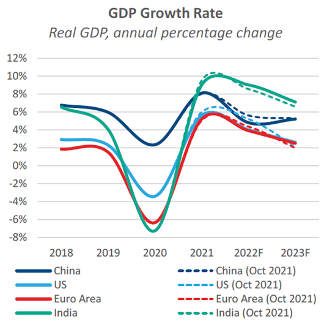
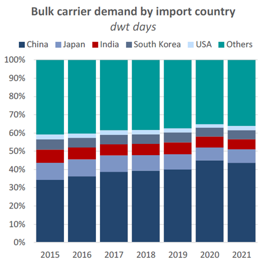
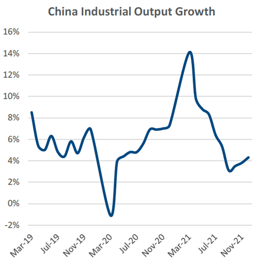
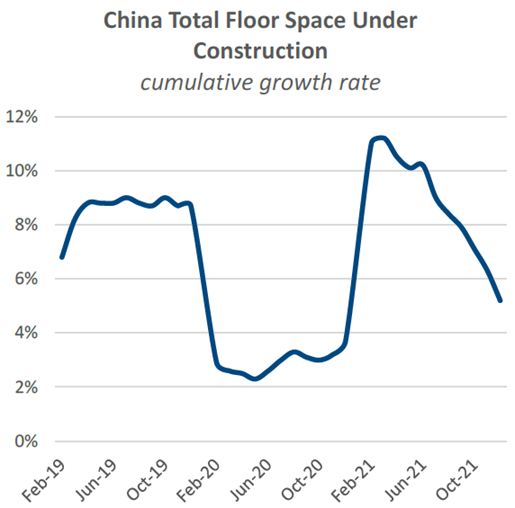

# The Big Picture: Global economic outlook

**Date:** February 06, 2022  
**Publisher:** Breakwave Advisors | **Category:** Market Insights  
**Original URL:** [https://www.breakwaveadvisors.com/insights/2022/2/6/the-big-picture-global-economic-outlook](https://www.breakwaveadvisors.com/insights/2022/2/6/the-big-picture-global-economic-outlook)  

---

*By*[*Abhinav Gupta*](https://www.linkedin.com/in/abhinav1501/)

*The IMF recently published its latest World Economic Outlook with updated macroeconomic and global output growth projections. Since the Fund’s last report in October, global economic growth forecasts have been marked down due to several headwinds among both developed and developing economies.*

### Easing Momentum

Since the IMF’s previous World Economic Outlook (WEO) in October 2021, the global economy seems to be in a more fragile state than previously expected. The global economy is now expected to have an annual growth rate of 4.4% in 2022, half a percentage point lower than the forecast prior in October, and sharply lower from the 5.9% growth realised in 2021.

The IMF has cited several key reasons behind the downward revision. Firstly, the new COVID-19 variant, Omicron, that started spreading around the world like wildfire from late last year, has led to the reintroduction of mobility restrictions and consequentially, lower economic activity. This has coincided with a period of high energy prices and continued supply chain disruptions, resulting in higher inflation than previously expected. Lastly, the depressed Chinese real estate sector and slower recovery of private consumption in the country have capped growth prospects.

> **Figure 1: Ch1**  
> [Local Asset](file:///C:/Users/Dell/Github/Shipping/corpus/03-breakwave/insights/2022/assets/2022-02-06_the-big-picture-global-economic-outlook_img_ch1_49b436fcfac7.png)

### Regional Review

There have been some significant adjustments on a regional level. Among the developed economies, the world’s largest economy, the US, is now projected to grow by 4.0% in 2022, down from 5.2% projected in the IMF’s October outlook. Meanwhile, the Euro Area’s growth rate in 2022 is now pegged at 3.9%, a correction of 0.4 percentage points. The projections indicate a tapering off after a sharp rebound in 2021, but overall, these growth rates are still higher than pre-pandemic levels. For example, in the October 2019 outlook, the IMF expected the US economy to grow by just 1.6% in 2022.

China and India, the world’s largest developing economies, have also seen a sharp correction in growth expectations. The Chinese economy is now expected to grow at 4.8% in 2022, down from 5.6% in the preceding forecast. This will be the country’s lowest growth rate in over two decades, with the previous low being 3.9% in 1990. India’s economy is projected to grow at 9.0% in 2022, the highest among all countries forecasted and even higher than the 8.5% growth published in the last forecast, as a result of higher investment and consumption expectations.

Japan has had a slight upward correction of 0.1 percentage points, with its economy now expected to grow by 3.3% in 2022. Meanwhile, the outlook for the ASEAN-5 economies has been downgraded by 0.2 percentage points to 5.6% in 2022.

### China Landscape

China accounted for about 44% of all bulk carrier demand in 2021 (in dwt days). The next four large importers – Japan, India, Korea, and the US – accounted for a combined 20% of demand last year.

> **Figure 2: Ch2**  
> [Local Asset](file:///C:/Users/Dell/Github/Shipping/corpus/03-breakwave/insights/2022/assets/2022-02-06_the-big-picture-global-economic-outlook_img_ch2_21a273589b47.png)

As mentioned, the Chinese economy is now projected to grow at a slower pace than what was previously expected, due to several factors culminating over 2H 2021.

Firstly, the country’s zero-Covid policy has led to reduced private consumption, disruptions in mobility and labour availability. Secondly, disruptions to factory activity from power shortage/outages, and high raw material and energy prices has challenged business confidence. Lastly, China’s real estate sector is undergoing heavy financial stress, with the Evergrande crisis being an infamous example.

Chinese industrial output data shows the economy started losing steam in 2H 2021 after a boom in the early part of the year. The country’s official metric of YoY industrial output growth stood at 4.3% in December, improving from a 3-year low of 3.1% in September (excluding March 2020 during the peak of the pandemic).

> **Figure 3: Ch3**  
> [Local Asset](file:///C:/Users/Dell/Github/Shipping/corpus/03-breakwave/insights/2022/assets/2022-02-06_the-big-picture-global-economic-outlook_img_ch3_89ec3ef07074.png)

On the real estate front, the growth rate for total floor space under construction has been in a steep decline since Q1 2021, as the sector faces financial and demand challenges.

> **Figure 4: Ch4**  
> [Local Asset](file:///C:/Users/Dell/Github/Shipping/corpus/03-breakwave/insights/2022/assets/2022-02-06_the-big-picture-global-economic-outlook_img_ch4_e606b818f7fd.png)

The slowing momentum, coupled with the Chinese New Year holidays and the Winter Olympics in the country has impacted dry bulk freight rates for all sectors over the last few weeks. While expectations of lower economic growth will have a dampening effect on shipping demand, the market continues to find support from inefficiencies such as port congestion, 14-day quarantine requirements, pilot/stevedore shortages, among others.

---

**Tags:** Global, Economy, Imf, Review  
