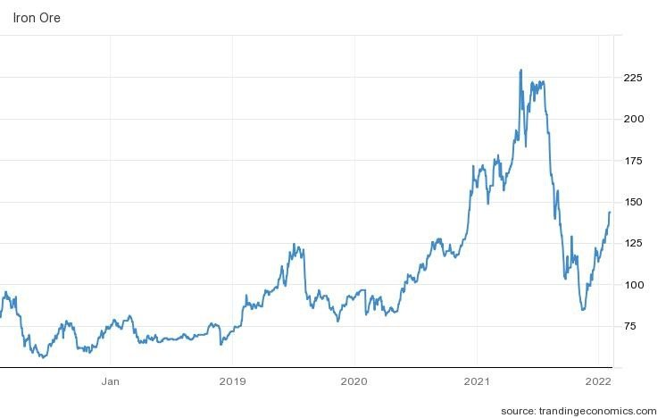
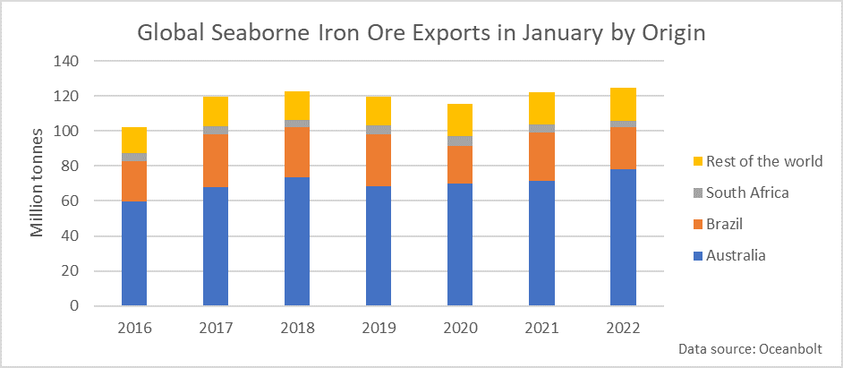
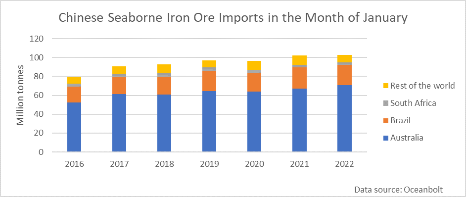
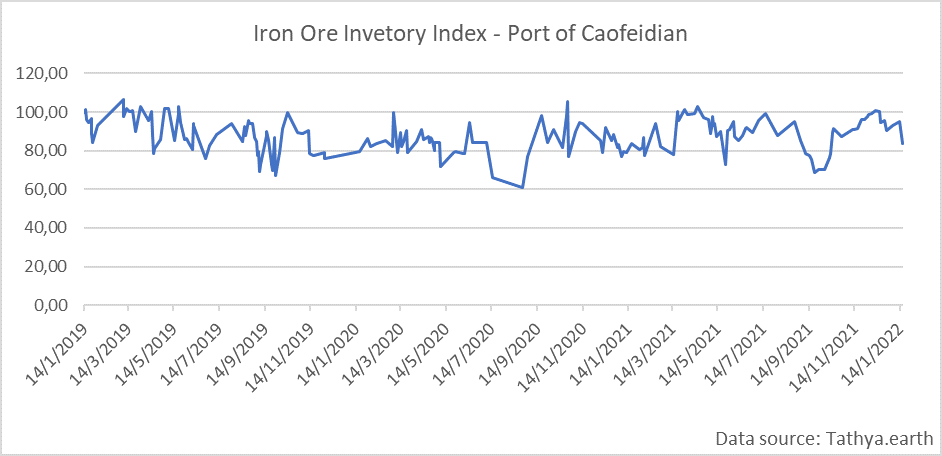

# Iron Ore: Prices and Seaborne Volumes on the Rise

**Date:** February 08, 2022  
**Publisher:** Breakwave Advisors | **Category:** Market Insights  
**Original URL:** [https://www.breakwaveadvisors.com/insights/2022/2/4/iron-ore-prices-and-seaborne-volumes-on-the-rise](https://www.breakwaveadvisors.com/insights/2022/2/4/iron-ore-prices-and-seaborne-volumes-on-the-rise)  

---

*By*[*Ulf Bergman*](https://www.linkedin.com/in/ulf-bergman-81570425/)

The strong run continues for iron ore, with prices reaching their highest level since early September last year. Since the eighteen-month low recorded in the middle of November, prices have surged by almost seventy per cent. Renewed optimism that the Chinese authorities will introduce new fiscal stimulus measures to support flagging growth rates after the Lunar New Year and the Winter Olympics have pushed iron ore prices beyond 140 dollars per tonne. In addition to an expectation of a pick up in Chinese demand deriving from rising investment in property and infrastructure sectors, concerns over supplies from the world’s largest supplier, Australia, in the wake of adverse weather conditions and labour shortages, have contributed to the recent surge.

### Iron Ore 63.5% Fe – Usd per Tonne (2017-2022)

> **Figure 1: Ch1**  
> [Local Asset](file:///C:/Users/Dell/Github/Shipping/corpus/03-breakwave/insights/2022/assets/2022-02-08_iron-ore-prices-and-seaborne-volumes-on-the-rise_img_ch1_5c127f0a3335.jpg)

It is not only prices for iron ore that had a solid start to the year. Global seaborne export volumes of the commodity also rose during January to a new record for the month. A two per cent year-on-year increase saw total quantities shipped reaching 124.5 million tonnes. However, the rising headline number obscured the diverging fortunes for the world’s two leading suppliers. Heavy rains and flooding disrupted mining operations in some of Brazil’s major mining areas, with exports suffering as a result. The 24 million tonnes shipped last month fell almost three million tonnes short of the average of the preceding six years and was more than six million tonnes below the record for the month, set in 2017.

If Brazilian iron ore exports faced a challenging start of the year, Australian exports rose sharply and reached a new all-time high for the month. The world’s largest producer sent nine per cent more iron ore to foreign shores during last month, compared to a year ago. The 78 million tonnes dispatched from Australian ports topped the previous record, set in 2018, by more than four million
tonnes.

> **Figure 2: Ch2**  
> [Local Asset](file:///C:/Users/Dell/Github/Shipping/corpus/03-breakwave/insights/2022/assets/2022-02-08_iron-ore-prices-and-seaborne-volumes-on-the-rise_img_ch2_67559f637aa8.png)

Perhaps somewhat surprising, in light of recent gloomy newsflow and curbs on steel production to control pollution levels ahead of the Olympics, Chinese iron ore imports rose marginally in January compared to the same month last year. Despite the ongoing diplomatic tensions between Beijing and Canberra, the Australian market share rose to 69 per cent at the expense of the world’s smaller producers.

> **Figure 3: Ch3**  
> [Local Asset](file:///C:/Users/Dell/Github/Shipping/corpus/03-breakwave/insights/2022/assets/2022-02-08_iron-ore-prices-and-seaborne-volumes-on-the-rise_img_ch3_17f00c85668c.png)

Beyond the world’s leading importer of the commodity, South Korea, the third-largest destination for seaborne iron ore, saw a twelve per cent rise in received cargoes. On the other hand, Japan imported two per cent less of the steel-making commodity compared to a year ago. Shipments to the importers outside the top three rose by almost a million tonnes compared to twelve months ago, representing a growth of four per cent. However, as China accounts for more than seventy per cent of the global market for seaborne iron ore imports, any changes to volumes elsewhere will have only marginal effects.

The rising global exports during January suggest there is the potential for a new monthly import record during the coming month in China. Due to the Chinese New Year, volumes are typically twenty per cent lower in February than in January. Given the strong start to the year, February could be in line for yet another Chinese monthly import record if that relationship holds. The relatively early Chinese New Year could also contribute to higher imports in February than in previous years.

In recent weeks, iron ore inventories have been declining in many Chinese ports despite the robust import volumes. According to satellite data from Tathya, there is a trend of declining stockpiles across most of the major iron ore ports. In the largest port, Caofeidian, inventories have been declining since the middle of December after a period of build-up that coincided with Beijing’s clampdown on steel production and the travails of the Chinese property sector. However, the growing expectation of Chinese authorities returning to a pro-cyclical stance has fuelled restocking activities among the Chinese steel mills. The shrinking portside stocks should also signal rising iron ore imports in the coming weeks and months.

> **Figure 4: Ch4**  
> [Local Asset](file:///C:/Users/Dell/Github/Shipping/corpus/03-breakwave/insights/2022/assets/2022-02-08_iron-ore-prices-and-seaborne-volumes-on-the-rise_img_ch4_ff25228de055.png)

Global iron ore shipments will likely see continued strength if the expected Chinese stimulus programmes materialise after the New Year holidays and the Olympics. While there are some concerns over disruptions around the Australian mining operations, Brazilian miner Vale has stated that its annual output guidance remains unchanged. Hence, iron ore shipments from the country can be expected to recover in the near future.

---

**Tags:** Iron Ore, Economy, Price, Global  
