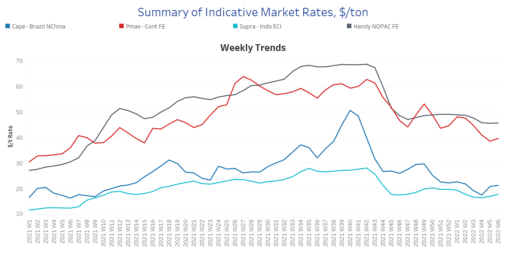
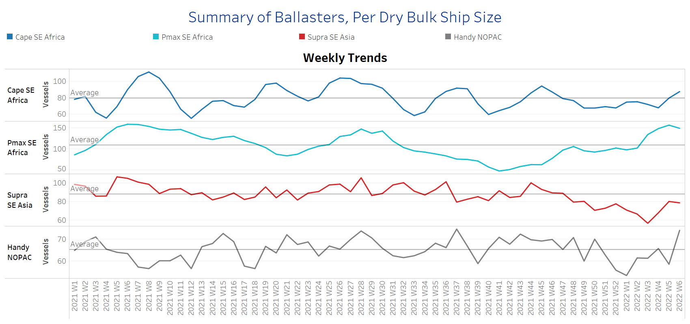
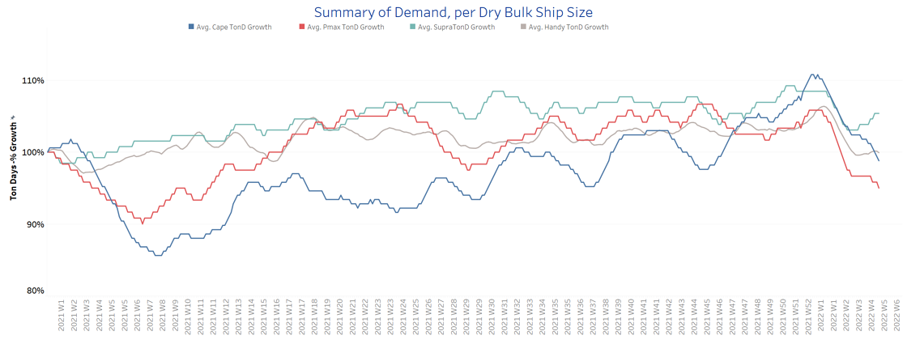
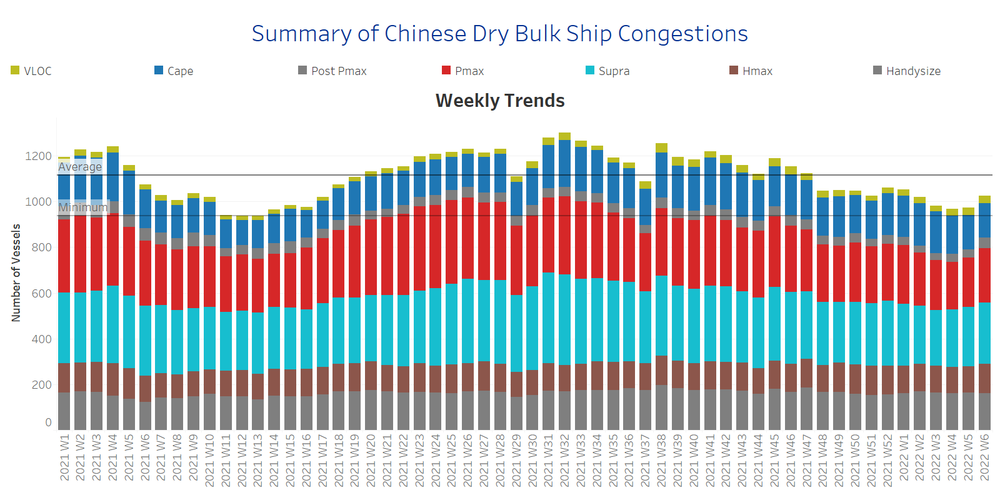

# Signal Dry Bulk Weekly Report

**Date:** February 09, 2022  
**Publisher:** Breakwave Advisors | **Category:** Market Insights  
**Original URL:** [https://www.breakwaveadvisors.com/insights/2022/2/9/signal-dry-bulk-weekly-report](https://www.breakwaveadvisors.com/insights/2022/2/9/signal-dry-bulk-weekly-report)  

---

The freight market for Capesize has started gradually recovering from Asian Festivities with the Chinese economy taking effective measures to boost the steel industry and control the increase in iron ore prices. The National Development and Reform Commission (NDRC) vowed measures that will strengthen regulation and supervision of iron ore prices. In addition, the world’s second-largest economy expressed its aim for a significant increase in mines' iron ore production and to boost the utilization of steel scrap, as part of a plan to develop a higher quality, greener ferrous industry.

In the coal segment, Australia’s Gladstone’s queue remains at high levels as shipments in January suffered due to heavy rainfalls associated with the La Nina weather causing mining disruptions, in addition to increased workforce absence associated with rising Covid cases. In the grain market, Russia can ship wheat and barley to China again, after restrictions of Russian shipments due to phytosanitary issues have been eased.

The January - February period remains crucial for the evolution of freight rates with the demand growth still weak, while ballasters’ increase continued as it has over the last three weeks with Panamax and handysize vessels posting a higher volume of ships sailing without cargo. The volume of Chinese port congestion is again rising and this may push rates up especially in the Panamax segment when combined with the congestion at Gladstone.

## Section 1 - Freight -Market Rates ($/T) - Firmer

‘The Big Picture’ - Capesize and Panamax Bulkers and Smaller Ship Sizes

> **Figure 1: Market Chart 1**  
> **Interactive Data & Source:** [Signal Ocean Platform](https://www.thesignalgroup.com/signal-ocean-platform) | [Local Asset](file:///C:/Users/Dell/Github/Shipping/corpus/03-breakwave/insights/2022/assets/2022-02-09_signal-dry-bulk-weekly-report_img_unnamed28429_44e4ea11193e.png)

- Capesize Brazil to NChina rates remain above $20/t, since the ending of January and despite Asian festivities posted an increase earlier than expected. The demand growth, however, is not yet there to boost the sentiment back to the strong levels of Week 49, 2021 ~$30/t.

- Panamax Continent to Far East rates emerged stronger this week at levels nearing to fetch $40/t following the relaxing of Indonesian coal ban and the ship queue at Australian coal port, Gladstone. However, rates are still weak compared to the last high of $53/t-Week 49, 2021. however.
- In the supramax segment, Indo ECI rates remain steady at levels above $17/ during the last days without imminent signs of spikes.
- Handysize NOPAC FE rates have not shown any signs of firmness and hover below $46/t for the last three weeks.

## Section 2 - Supply - Ballasters View

## Number of Vessels -Increasing

> **Figure 2: Supply Trend Lines for Key Load Areas**  
> **Interactive Data & Source:** [Signal Ocean Platform](https://www.thesignalgroup.com/signal-ocean-platform) | [Local Asset](file:///C:/Users/Dell/Github/Shipping/corpus/03-breakwave/insights/2022/assets/2022-02-09_signal-dry-bulk-weekly-report_img_unnamed28529_6960c2edb34e.png)

- The number of vessels sailing in ballast status is now evolving above the average trend line for the Panamax and handysize segments.

- In the Capesize segment, there were some signs of a slight drop in the previous week, with the number moving to less than 70 ballasters. However, for the first time since Week 46. 2021, the end of the week saw the trend reverse and ballasters rise above 80.
- In SE Asia, the number of supramax vessels sailing in ballast status fell this week below the average trend of 80 vessels, defying last week’s trend for an accelerated pace. The number of ballasters is still above the record low of Week 3 ~ 58 vessels.

## Section 3 - Demand - In Ton Days

## Decreasing

> **Figure 3: Decreasing**  
> **Interactive Data & Source:** [Signal Ocean Platform](https://www.thesignalgroup.com/signal-ocean-platform) | [Local Asset](file:///C:/Users/Dell/Github/Shipping/corpus/03-breakwave/insights/2022/assets/2022-02-09_signal-dry-bulk-weekly-report_img_unnamed28629_e6530d43a4f3.png)

- The dry bulk demand evolution has not yet shown any different picture of what we have seen since the beginning of the year. The downward trend is still steep for the large vessel sizes with the demand in the Panamax size floating at the lower levels among others.

- The Indonesian coal ban’s expiry seems that fuelled the dry bulk demand in smaller ship sizes, while the Russian-Ukraine tensions continue to lead the growth for supramax vessels. In the handysize segment, demand ton miles growth is still nearly above the Capesize’s weekly change.
- There are concerns about the Capesize demand evolution following Asian festivities. The latest announcements of Chinese governments on the support of steel output and control of prices trigger positive expectations for a potential rebound in the next few days of February.

## Section 4 - Chinese Port Congestions -

## Number of Vessels - Increasing

> **Figure 4: Dry Bulk Ships Congested Around Chinese Ports**  
> **Interactive Data & Source:** [Signal Ocean Platform](https://www.thesignalgroup.com/signal-ocean-platform) | [Local Asset](file:///C:/Users/Dell/Github/Shipping/corpus/03-breakwave/insights/2022/assets/2022-02-09_signal-dry-bulk-weekly-report_img_unnamed28729_9adb35953600.png)

- The first days of February saw congestion increase, which was mainly stemming from the Panamax segment. There is still an increasing number of congested vessels in the handysize segment.

- For Capesize vessels, the number of congestion has still not surpassed the barrier of 160 vessels. In the Panamax segment, we see now more than 200 vessel congestion around Chinese ports and we are waiting whether this will match the highs of Week 1 ~256.

Data Source:[Signal Ocean Platform](https://www.thesignalgroup.com/signal-ocean-platform)

---

**Tags:** Shipping, Dry Bulk, Freight, Rates  
