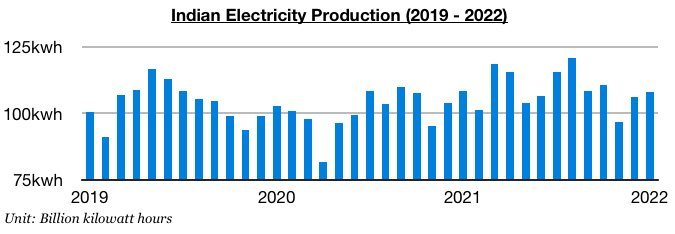
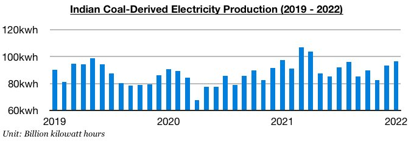
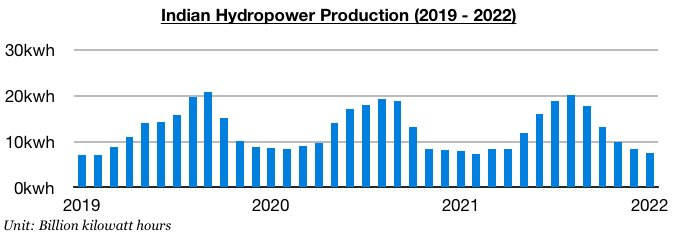
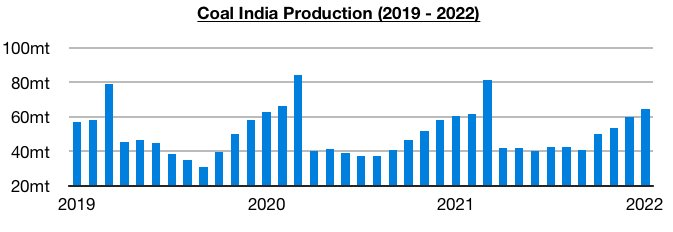
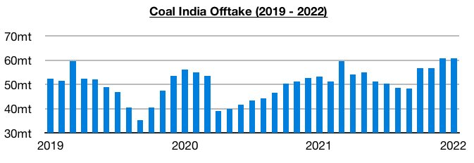

# Relative Weakness in Indian Electricity Production, Strength in Coal Production

**Date:** February 11, 2022  
**Publisher:** Breakwave Advisors | **Category:** Market Insights  
**Original URL:** [https://www.breakwaveadvisors.com/insights/2022/2/11/relative-weakness-in-indian-electricity-production-strength-in-coal-production](https://www.breakwaveadvisors.com/insights/2022/2/11/relative-weakness-in-indian-electricity-production-strength-in-coal-production)  

---

*By*[*Jeffrey Landsberg*](https://www.linkedin.com/in/jeffrey-landsberg-70ab957/)

India’s overall electricity production and coal-derived electricity generation each managed to contract on a year-on-year basis again last month, while Coal India’s production and offtake found even greater strength. As a result, India's power plant coal stockpiles have continued to climb and are now at the highest levels since June. India produced approximately 108.1 billion kilowatt hours of electricity last month, which is up month-on-month by 1.8 billion kilowatt hours (2%) but down year-on-year by 300 million kilowatt hours.

> **Figure 1: Chart 1 (19)**  
> [Local Asset](file:///C:/Users/Dell/Github/Shipping/corpus/03-breakwave/insights/2022/assets/2022-02-11_relative-weakness-in-indian-electricity-production-strength-in-coal-production_img_chart1281929_153443d63c72.jpg)

India’s coal-derived electricity generation totaled approximately 96.5 billion kilowatt hours of electricity last month. This has marked a month-on-month increase of 3.1 billion kilowatt hours (3%) but is down year-on-year by 700 million kilowatt hours (-1%). India’s coal-derived electricity generation has now contracted on a year-on-year basis during three of the last five months.

> **Figure 2: Chart 2 (16)**  
> [Local Asset](file:///C:/Users/Dell/Github/Shipping/corpus/03-breakwave/insights/2022/assets/2022-02-11_relative-weakness-in-indian-electricity-production-strength-in-coal-production_img_chart2281629_ca3f02b30c09.jpg)

India’s hydropower production totaled approximately 7.6 billion kilowatt hours last month. This has marked a month-on-month decline of 800 million kilowatt hours (-10%) and is down year-on-year by 300 million kilowatt hours (-4%). Previously, India's hydropower production had increased on a year-on-year basis for three straight months.

> **Figure 3: Chart 3 (12)**  
> [Local Asset](file:///C:/Users/Dell/Github/Shipping/corpus/03-breakwave/insights/2022/assets/2022-02-11_relative-weakness-in-indian-electricity-production-strength-in-coal-production_img_chart3281229_a0fba5966a26.jpg)

Coal India produced approximately 64.5 million tons of coal last month, which marks a month-on-month increase of 4.3 million tons (7%) and a year-on-year increase of 4 million tons (7%). Coal India’s production has continued to climb dramatically since September and has continued to lead to a rise in the nation’s power plant stockpiles.

> **Figure 4: Chart 4 (7)**  
> [Local Asset](file:///C:/Users/Dell/Github/Shipping/corpus/03-breakwave/insights/2022/assets/2022-02-11_relative-weakness-in-indian-electricity-production-strength-in-coal-production_img_chart428729_349851ae7e46.jpg)

Offtake totaled 60.8 million tons last month, which marks a month-on-month increase of 100,000 tons and a year-on-year increase of 7.5 million tons (14%). Offtake has now increased on a year-on-year basis for eleven consecutive months, with last month’s volume again setting an all-time high.

> **Figure 5: Chart 5 (2)**  
> [Local Asset](file:///C:/Users/Dell/Github/Shipping/corpus/03-breakwave/insights/2022/assets/2022-02-11_relative-weakness-in-indian-electricity-production-strength-in-coal-production_img_chart528229_ac1aa04dd5ea.jpg)

---

**Tags:** India, Coal, Electricity, Energycrisis  
