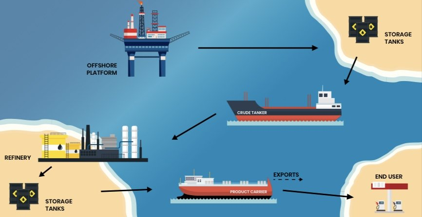
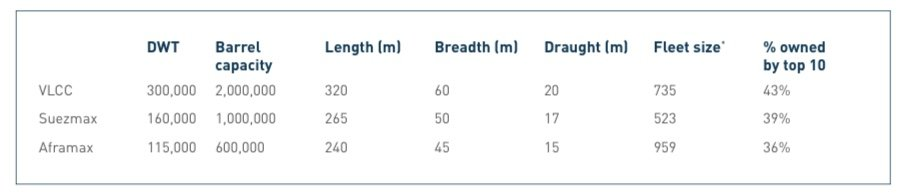
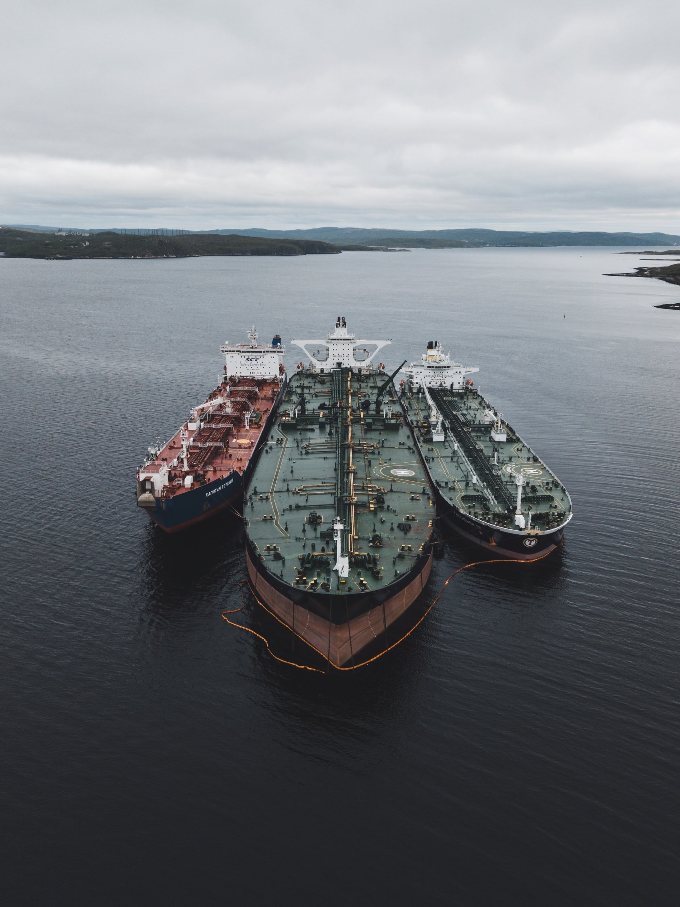
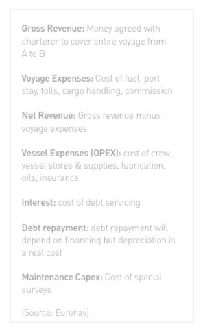
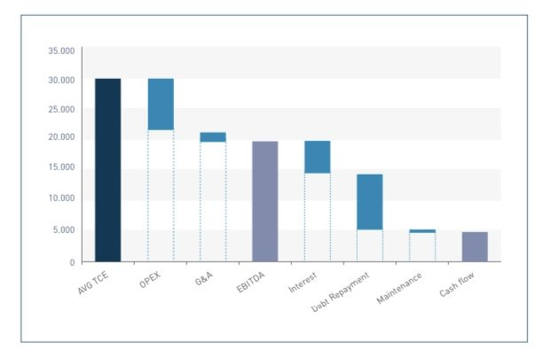
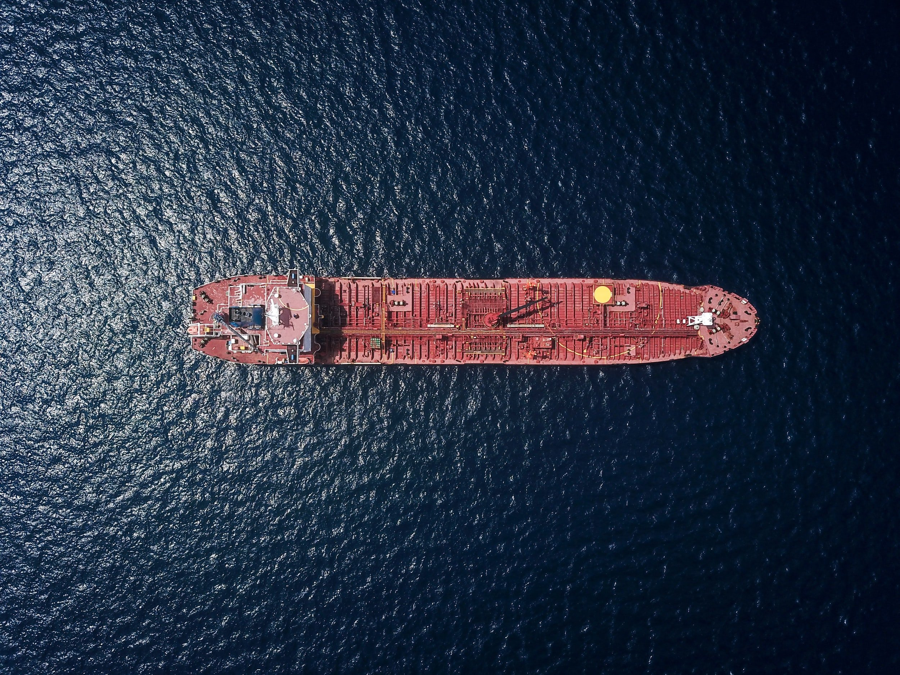
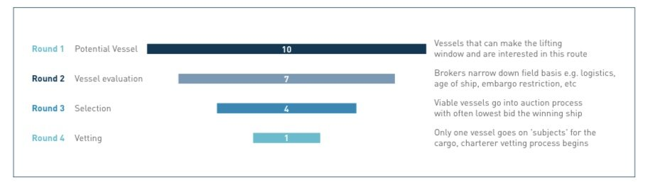

# Tanker Shipping Market 1.0 Part 1/2

**Date:** February 13, 2022  
**Publisher:** Breakwave Advisors | **Category:** Market Insights  
**Original URL:** [https://www.breakwaveadvisors.com/insights/2022/2/11/tanker-shipping-market-10-noaMZ](https://www.breakwaveadvisors.com/insights/2022/2/11/tanker-shipping-market-10-noaMZ)  

---

*One of the great things about living and working in Athens is that you often get warm, sunny days in the winter. At these days, the best thing you can do, if you can, is to get your laptop and go and work somewhere by the sea. That’s where I found myself on Friday morning with a cap of cappuccino in one hand and a few tanker shipping reports on the other :-) Here, I will share with you some interesting basics on the Tanker Shipping Market using mainly an older Euronav special report as a source.*

*As a soundtrack, what is coming out from the beach café loudspeakers is my favorite René Aubry’s “Après la pluie”. Sit back and enjoy!*

*By*[*Thanos Sofios*](https://www.linkedin.com/in/thanos-sofios/)

### Where Do Crude Tankers Sit Within the Value Chain?

Crude oil tankers have a vital role to play within the energy value chain. Their main role is to transport crude oil from production to refining, although they are also sometimes used for storing crude oil post production. Crude tankers can also be used for carrying oil products such as fuel oil. Any clean products that come out of the refinery are carried on 'clean' or 'product' tankers, which are smaller in size due to the smaller parcel sizes in which these products are traded.

> **Figure 1: A2**  
> **Interactive Data & Source:** [Euronav](https://www.euronav.com) | [Local Asset](file:///C:/Users/Dell/Github/Shipping/corpus/03-breakwave/insights/2022/assets/2022-02-13_tanker-shipping-market-10-noamz_img_a2_3c03b551138f.jpg)

### The Asset

Crude oil tankers come in various sizes, the biggest standard size being a Very Large Crude Carrier – or 'VLCC'. These tankers take up to 2 million barrels of crude oil per shipment, while the second largest size is the 'Suezmax' which takes around half of that amount and is the largest size ship that can sail through the Suez Canal fully laden. The smallest size of dedicated crude oil tankers is an 'Aframax' which can carry around 600,000 barrels of oil. There are smaller tankers in the market, but these tend to carry refined oil products and fuel oil, not crude oil.

> **Figure 2: January 1**  
> ** January 1, 2018 (Source: Clarksons SIN Excludes shuttle tankers)*  
> **Interactive Data & Source:** [Euronav](https://www.euronav.com) | [Local Asset](file:///C:/Users/Dell/Github/Shipping/corpus/03-breakwave/insights/2022/assets/2022-02-13_tanker-shipping-market-10-noamz_img_a3_bb53bd05963d.jpg)

Construction of crude oil tankers takes 9 to 15 months from the time the keel is first laid. This means that it will take at least two years from the time of newbuilding contract signature until the vessel is delivered because many critical parts are long-lead items that needs to be ordered and produced before the construction of the ship can commence.

Their sheer size dictates that there is a limited number of sites capable of building them and these are concentrated in Asia, more specifically in South Korea, China, and Japan.

The price for contracting a tanker newbuilding is influenced by a number of factors such as the underlying price of energy, steel, labor costs and available construction finance. The relative demand for contracting new tonnage also plays a role and may lengthen or shorten waiting time to delivery and affect price.

Over the last ten years the cost of a new VLCC has ranged from around USD 80 million to USD 160 million. The payment profile on the ships tends to be very back loaded, typically with a 10% deposit on signing the contract, 20% to 40% in milestone payments and finally 50% to 70% on delivery.

The economic lifespan of an oil tanker has historically been 25 years, although more recently this has dropped closer to 20 years. Different tanker companies operate with their own asset depreciation policies, ranging from 18 to 25 years.

> **Figure 3: Unsplash Image 983knf8azec**  
> **Interactive Data & Source:** [Euronav](https://www.euronav.com) | [Local Asset](file:///C:/Users/Dell/Github/Shipping/corpus/03-breakwave/insights/2022/assets/2022-02-13_tanker-shipping-market-10-noamz_img_unsplash-image-983knf8azec_a8c28c128365.jpg)

### The Cost Structure

> **Figure 4: A4**  
> **Interactive Data & Source:** [Euronav](https://www.euronav.com) | [Local Asset](file:///C:/Users/Dell/Github/Shipping/corpus/03-breakwave/insights/2022/assets/2022-02-13_tanker-shipping-market-10-noamz_img_a4_61a1a190f4d5.jpg)

A ship owner chartering his vessel to a customer is paid 'freight'; this is the gross revenue agreed with the charterer to cover the entire voyage from port of loading to port of discharge. This revenue is used to cover the cost for the owner to undertake the voyage, the cost of operating the vessel, any interest payments to loan providers and other costs associated with owning a ship. Certain fixed costs vary between shipping companies, most important the purchase price, and each will therefore have their individual breakeven cost at which it becomes profitable to run the vessels. However, once these fixed costs are covered, all additional revenue results in profit.

Earnings are reported by companies and market watchers in terms of 'dollars per day' also known as the Time Charter Equivalent (TCE). The cash breakeven TCE for a VLCC is between USD 20,000 per day to USD 35,000 per day depending for example on the level of loan interest, fixed operating costs depreciation (or amortization) and G&A expenses.

> **Figure 5: A5**  
> **Interactive Data & Source:** [Euronav](https://www.euronav.com) | [Local Asset](file:///C:/Users/Dell/Github/Shipping/corpus/03-breakwave/insights/2022/assets/2022-02-13_tanker-shipping-market-10-noamz_img_a5_5265c5c5844e.jpg)

### Tanker Customers

Tanker shipping is a business-to-business environment with a number of key customers who regard the shipping element as an integral part of their logistical chain. These key customers are the oil majors – both National Oil Companies (e.g. Unipec, Saudi Aramco, Petrobras) and International Oil Companies (e.g. Total, Shell and Chevron) – and there are trading houses such as Trafigura and Glencore, and large refiners.

The oil majors generally require ships to take oil or to deliver to or from third party refineries oil to their customers. This type of business depends on physical oil flows, which refineries require what type of crude oil at any given time.

The trading houses are often more opportunistic in their trading of oil and therefore also more unpredictable in terms of when and where they may need a ship.

Most counterparties in the large crude tanker space are large multinational companies with strong credit ratings. The customer is often referred to as the 'charterer' of the vessel.

When a charterer requires a tanker to move oil from A to B they will typically get in touch with a ship broker, who will in turn contact a number of vessel owners and act as a middle man in negotiating price, terms and conditions for carrying the cargo. The charterer can go directly to the ship owner himself, although this happens less often.

> **Figure 6: Unsplash Image Subrryxv8a**  
> **Interactive Data & Source:** [Euronav](https://www.euronav.com) | [Local Asset](file:///C:/Users/Dell/Github/Shipping/corpus/03-breakwave/insights/2022/assets/2022-02-13_tanker-shipping-market-10-noamz_img_unsplash-image-subrryxv8a_026143df9ea7.jpg)

### How the Price of Freight Is Set

The following chart gives a broad worked example on how the price of freight is set. A number of vessels will be eligible to take a cargo and the broker (who has been mandated by the cargo owner to find a vessel to carry the cargo) will over the course of several rounds bring down the number of potential ships. This process will also be driven by the ship owners themselves as some will voluntarily drop out of any potential bidding for a range of reasons (logistics, price, other cargo to bid on etc.).

> **Figure 7: This Is the End of Part 1**  
> *This is the end of part 1. Next Sunday, the final part 2.*  
> **Interactive Data & Source:** [Euronav](https://www.euronav.com) | [Local Asset](file:///C:/Users/Dell/Github/Shipping/corpus/03-breakwave/insights/2022/assets/2022-02-13_tanker-shipping-market-10-noamz_img_a6_c56a4a286914.jpg)

Quite simply the higher the number of potential ships, the lower the eventual freight rate will likely be as more qualifying bidders logically should mean more pressure on the price. However, it is important to understand only one ship will be selected to go through a final vetting process whereby the cargo owner will assess the vessel’s seaworthiness and suitability for the trade via previous survey results and inspections. Ship owners competing with each other drive pricing down sometimes below fixed costs.

*Now the music plays Scarlet Pleasure’s “What a Life”*

*Enjoy the weekend!*

> **Figure 8: Data Source:euronav**  
> *Data Source:Euronav*  
> **Interactive Data & Source:** [Euronav](https://www.euronav.com) | [Local Asset](file:///C:/Users/Dell/Github/Shipping/corpus/03-breakwave/insights/2022/assets/2022-02-13_tanker-shipping-market-10-noamz_img_a1_8e20eea7091e.jpg)

---

**Tags:** Tankers, Shipping, Rates  
