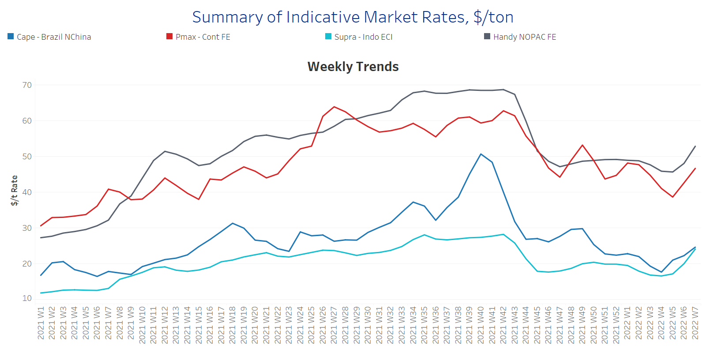
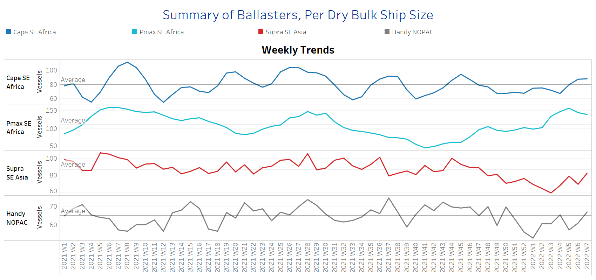
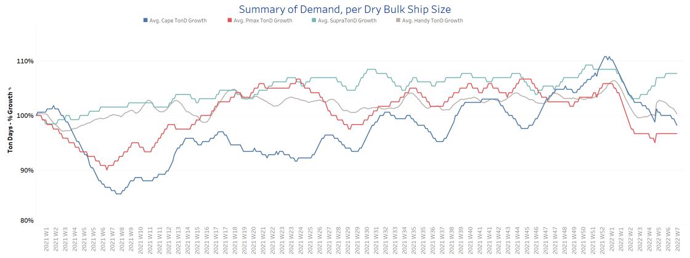
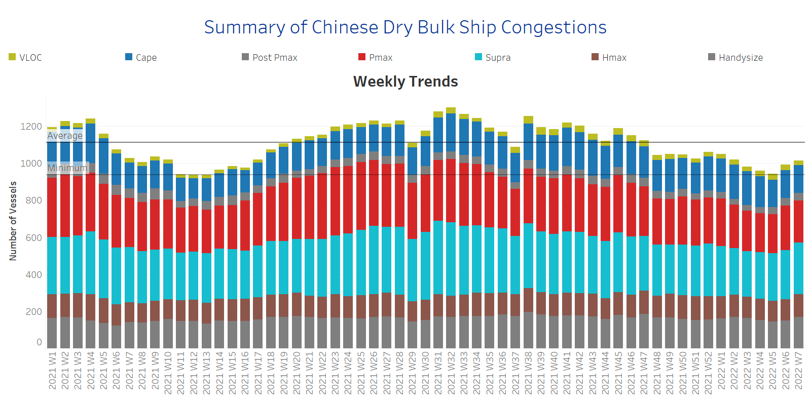

# Signal Dry Bulk Weekly Report

**Date:** February 16, 2022  
**Publisher:** Breakwave Advisors | **Category:** Market Insights  
**Original URL:** [https://www.breakwaveadvisors.com/insights/2022/2/16/signal-dry-bulk-weekly-report](https://www.breakwaveadvisors.com/insights/2022/2/16/signal-dry-bulk-weekly-report)  

---

The freight market has started to see a revival for all sizes with the smaller categories, supramax and handysize presenting a surprising upturn. The recent rebound comes following the quiet period of Asian festivities with the gradual rebound on Chinese demand, but there are still ongoing significant risks lingering at the major commodities’ trends and China’s GDP forecasts. The first quarter of the year is a seasonally weak period in the dry market and combined with the Winter Olympics stimulated a sharp drop that seems to be behind us. However, the property sector will continue to be a main issue for the strong performance of the Chinese economy, pushing downwards the demand for raw materials and the levels of Chinese dry bulk imports.

In the iron ore market, Chinese authorities (China’s National Development & Reform Commission (NDRC) and State Administration for Market Regulation) in an effort to control the accelerated increase of prices issued warnings against false iron ore price information and speculations. Seaborne iron ore prices dropped more than 8% on Friday following the announcement, and the sentiment weakened further on Monday due to weak demand of steel mills from previous high stock levels and ongoing production cuts in north China.

As January ended with a continuous downward trend of rates, one additional crucial trend under consideration for the future performance of rates is the ongoing tension between Australia and China. Trade relationship animosities between these two countries remain high and iron ore shippers at Western Australia’s Port Hedland have started to diversify their customers’ base to avoid any potential shipment losses.

In the grain market, Argentina’s dry weather during December and early January stimulated concerns for the farmer’s harvest season. The current forecast, which had already been cut sharply, stands at 40.5 mil tons. The last time Argentina saw similar levels of drought was in 2018, when the harvest fell below 38 mil tons.

## Section 1 - Freight -Market Rates ($/T) - Firmer

‘The Big Picture’ - Capesize and Panamax Bulkers and Smaller Ship Sizes

> **Figure 1: Ch1**  
> [Local Asset](file:///C:/Users/Dell/Github/Shipping/corpus/03-breakwave/insights/2022/assets/2022-02-16_signal-dry-bulk-weekly-report_img_ch1_3c6b1964cdae.png)

- Capesize Brazil to NChina rates are nearing $25/t and keep rising following the ending of Asian festivities. The recent upturn of the market will be questioned in the next few days by the iron ore price fundamentals and Chinese demand for raw materials. The performance of rates is still below the peak of Week 49, 2021 ~$30/t.

- Panamax Continent to Far East rates surpassed the barrier of $40/t with a spike at $46.5/t and continuous upward momentum for the next few days. We remain cautiously optimistic for the continued upward trend of rates, but it seems unlikely they fetch the last high of $53/t-at Week 49, 2021.
- In the supramax segment, Indo ECI rates rose to more than $20/t compared to $17/t during the last week although last week there were no imminent signs for the recent increase.
- Handysize NOPAC FE rates jumped to 52/t, following continuous weakness since the ending of last year. The last peak was at Week 42.2021~$68.7/t.

## Section 2 - Supply - Ballasters View

## Number of Vessels -Increasing

Supply Trend Lines for Key Load Areas

> **Figure 2: Ch2**  
> [Local Asset](file:///C:/Users/Dell/Github/Shipping/corpus/03-breakwave/insights/2022/assets/2022-02-16_signal-dry-bulk-weekly-report_img_ch2_733f5c31956c.png)

- The ballasters’ view has started to signal a slight downward correction for the large vessel size categories, while, in the smaller sizes, supramax and handysize, there is still an increase that will shake the recent rates recovery seen.

- In the handysize segment, the number of vessels sailing in ballast status remains enormously higher than the average trend line of 65 vessels in the handysize segment, with a constant pace of increase since the lows of Week 5.
- In the Capesize segment, the number of vessels sailing in ballast status has kept almost the same momentum as last week, while in the Panamax, there is a clear drop compared to the highs of Week 5.
- In SE Asia, the number of supramax vessels sailing in ballast status increased again above the average trend of 80 vessels (compared to the record low of Week 3~58 vessels). There is an ongoing risk of a further increase due to the ongoing tensions between Russia and Ukraine with a negative impact on the dry volume of shipments.

## Section 3 - Demand - In Ton Days

## Decreasing

> **Figure 3: Ch3**  
> [Local Asset](file:///C:/Users/Dell/Github/Shipping/corpus/03-breakwave/insights/2022/assets/2022-02-16_signal-dry-bulk-weekly-report_img_ch3_d7ba2b1534eb.png)

- The dry bulk demand evolution is still in a downward trend for the large vessel sizes, however, the increased Russian-Ukraine tensions trigger higher demand in the supramax segment fuelling the upturn of rates.

- The demand for Capesize and Panamax has not yet found a pace of growth for the second half of February, and the current trend and the current trend indicates a weak picture for the first quarter.

## Section 4 - Chinese Port Congestions -

## Number of Vessels - Increasing

## Dry Bulk Ships Congested Around Chinese Ports

> **Figure 4: Ch4**  
> [Local Asset](file:///C:/Users/Dell/Github/Shipping/corpus/03-breakwave/insights/2022/assets/2022-02-16_signal-dry-bulk-weekly-report_img_ch4_0138b51ccc07.png)

- The second week of February continues the accelerated pace of the first days of February with a congestion increase, stemming mainly this week from the supramax, instead of Panamax, and handysize. Handysize congestion has not yet shown any signs of decrease since the beginning of this year.

- In the last two weeks, the overall number of ship congestion has again surpassed the one year-minimum trend of around 937 vessels, but keeps moving below the historical high levels seen last year.

---

**Tags:** Shipping, Dry Bulk, Freight, Rates  
