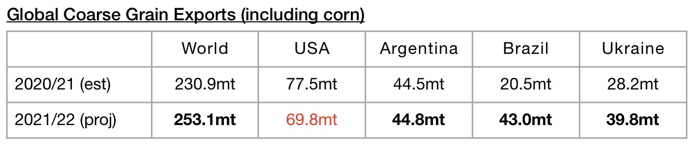
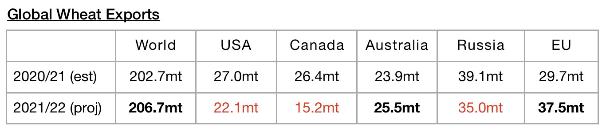
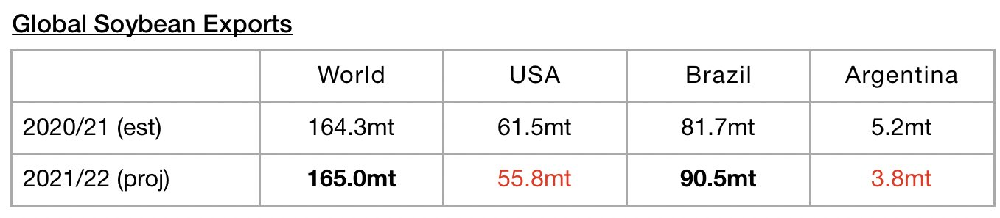
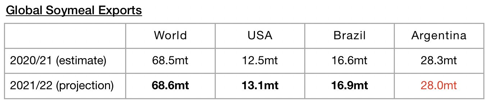

# Global Grain Trade Prospects Remain Promising

**Date:** February 17, 2022  
**Publisher:** Breakwave Advisors | **Category:** Market Insights  
**Original URL:** [https://www.breakwaveadvisors.com/insights/2022/2/17/global-grain-trade-prospects-remain-promising](https://www.breakwaveadvisors.com/insights/2022/2/17/global-grain-trade-prospects-remain-promising)  

---

*By*[*Jeffrey Landsberg*](https://www.linkedin.com/in/jeffrey-landsberg-70ab957/)

Dry bulk spot chartering activity has been enjoying a normal post Lunar New Year rebound, and more seasonal improvement in cargo volume (including iron ore cargo volume) remains likely for the near term. As we have continued to stress in our Weekly Dry Bulk Reports, we expect global iron ore trade and coal trade will each increase this year, but it remains only for grain trade where we have complete conviction in there being growth. Of note in the grain market is that an even larger amount of coarse grain and wheat exports are now expected. Expectations for soybean exports have been lowered again, but year-on-year growth is at least still expected. The market can only imagine just how strong rates could have been if soybean harvests were coming in at levels as robust as expected just a few months ago.

The United States Department of Agriculture has released their latest forecast for 2021/22 and is now forecasting global grain exports will total 510.6 million tons. This is 3.1 million tons (1%) more than was forecast a month ago and would mark a year-on-year increase of 26.4 million tons (5%). Expectations for global seaborne coarse grain exports remain particularly robust. Global coarse grain exports in 2021/22 are now expected to total 253.1 million tons. This is just 100,000 tons less than was forecast a month ago and would mark a year-on-year increase of 22.2 million tons (10%).

> **Figure 1: Chart 1 (20)**  
> [Local Asset](file:///C:/Users/Dell/Github/Shipping/corpus/03-breakwave/insights/2022/assets/2022-02-17_global-grain-trade-prospects-remain-promising_img_chart1282029_b4d5d3c60145.jpg)

Global wheat exports are expected to total 206.7 million tons. This is 2.3 million tons (1%) more than was forecast a month ago and would mark a year-on-year increase of 4 million tons (2%).

> **Figure 2: Chart 2 (17)**  
> [Local Asset](file:///C:/Users/Dell/Github/Shipping/corpus/03-breakwave/insights/2022/assets/2022-02-17_global-grain-trade-prospects-remain-promising_img_chart2281729_6a79d353f9d3.jpg)

In addition, global soybean exports (soybeans are not technically classified as a grain) are expected to total 165 million tons. This is 5.7 million tons (-3%) less than was forecast a month ago but would mark a year-on-year increase of 700,000 tons.

> **Figure 3: Chart 3 (13)**  
> [Local Asset](file:///C:/Users/Dell/Github/Shipping/corpus/03-breakwave/insights/2022/assets/2022-02-17_global-grain-trade-prospects-remain-promising_img_chart3281329_b3b864b561a9.jpg)

Global soymeal exports are expected to total 68.6 million tons. This is 1.3 million tons (-2%) less than was forecast a month ago but would mark a year-on-year increase of 100,000 tons.

> **Figure 4: Chart 4 (8)**  
> [Local Asset](file:///C:/Users/Dell/Github/Shipping/corpus/03-breakwave/insights/2022/assets/2022-02-17_global-grain-trade-prospects-remain-promising_img_chart428829_c4e4b4344f5b.jpg)

---

**Tags:** Global, Economy, Grains, Trade  
