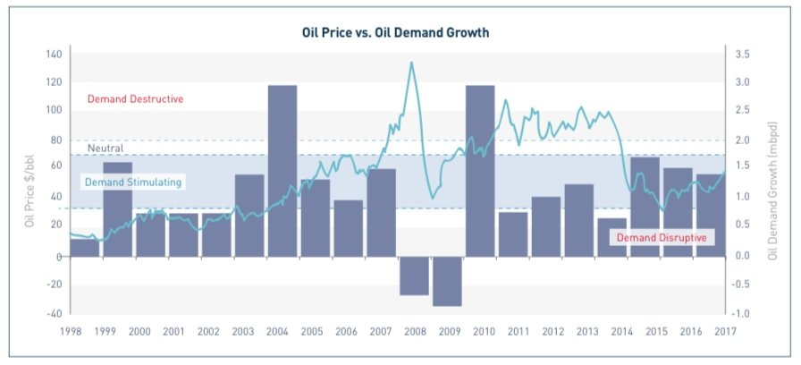
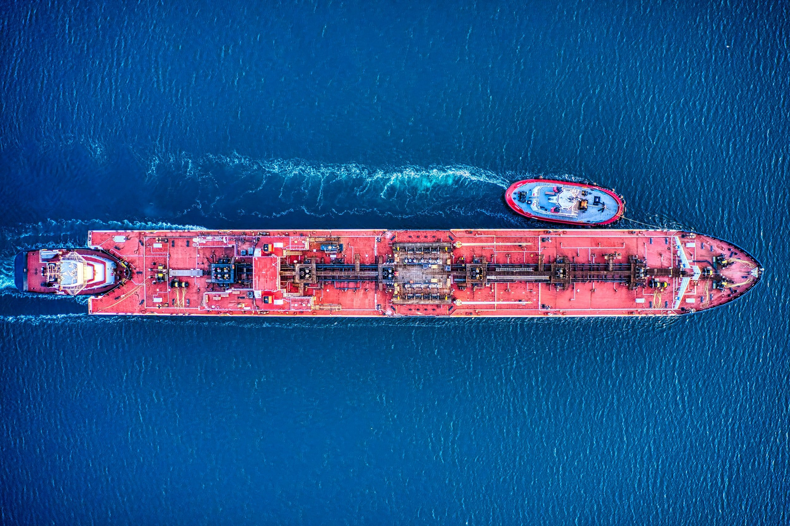
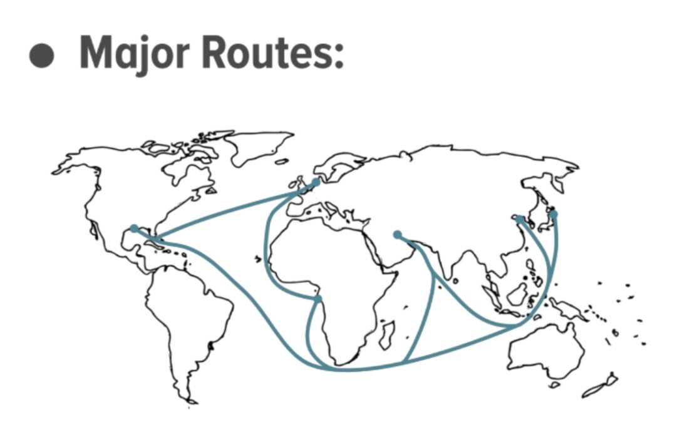
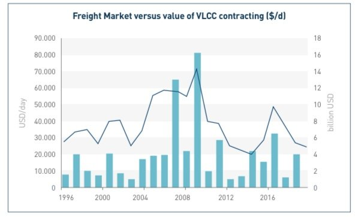
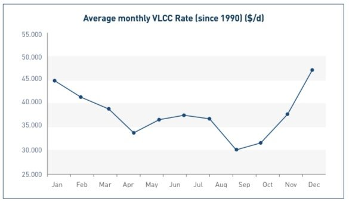

# Tanker Shipping Market 1.0 Part 2/2

**Date:** February 20, 2022  
**Publisher:** Breakwave Advisors | **Category:** Market Insights  
**Original URL:** [https://www.breakwaveadvisors.com/insights/2022/2/13/kua3k88k79juy18fv2ys805mbfsxli](https://www.breakwaveadvisors.com/insights/2022/2/13/kua3k88k79juy18fv2ys805mbfsxli)  

---

*Meanwhile, back at the same beach, part 2.*[*Here*](https://www.breakwaveadvisors.com/insights/2022/2/11/tanker-shipping-market-10-noaMZ)*you can read part 1, if you missed it.*

*What is coming out now from the beach café loudspeakers is Sam Smith’s “Like I Can”. Sit back and enjoy!*

*By*[*Thanos Sofios*](https://www.linkedin.com/in/thanos-sofios/)

### Price of Oil – Impact on Tankers

Like any commodity, the greater the demand for it, the more demand for its transportation. Crude is no different and the sharp reduction in the price of oil the market experienced from the fourth quarter of 2014 prompted a boost in demand in both the U.S. and Europe where oil demand is highly price sensitive. With improved demand for oil products, more crude oil was needed by refineries worldwide. These refineries are rarely located close to the sources of crude oil, so more oil tankers were needed to transport the crude from oil field to refinery.

Generally speaking the lower the oil price the stronger demand for it. However the relationship is not linear.

> **Figure 1: Bar: Oil Demand Growth**  
> *Bar: Oil Demand Growth, Line: Oil Price. Source: Euronav, Bloomberg, IEA*  
> **Interactive Data & Source:** [Breakwave Advisors Market Insights](https://www.breakwaveadvisors.com/insights/2022/1/21/2022-the-freight-forecast) | [Local Asset](file:///C:/Users/Dell/Github/Shipping/corpus/03-breakwave/insights/2022/assets/2022-02-20_kua3k88k79juy18fv2ys805mbfsxli_img_a8_9e3218881986.jpg)

### Key Market Drivers – Demand for Oil

The demand for oil is an obvious driver of crude tanker demand; the more oil that is needed around the world, the bigger the demand for moving this oil from production to refinery.

### Key Market Drivers – Supply of Oil

Clearly for any oil transportation business the supply of oil is critical to the status of its markets. Oil supply dynamics have undergone a transformation in the past decade, away from being very Middle East focused to having a more diverse supply base, in particular with the development of U.S. shale oil. This quick-to-production process of shale oil (less than six months) has made global oil production far more responsive to short-term changes in demand.

### Key Market Drivers – Vessel Supply

Perhaps the key driver of tanker markets is vessel supply. This is the ultimate driver of market fluctuation; when the market is in short supply of ships, the cost of chartering a ship – the freight – goes up but of course down if there are too many ships available.

This over- or undersupply of vessels can be viewed on a macro level with the total global supply of ships, which will drive more long-term trends in freight levels, but it can also be viewed on a more regional level where the number of ships available in a specific load area can drive short-term freight fluctuations, which may vary in different load areas.

> **Figure 2: Unsplash Image Asmavys4azm**  
> **Interactive Data & Source:** [Breakwave Advisors Market Insights](https://www.breakwaveadvisors.com/insights/2022/1/21/2022-the-freight-forecast) | [Local Asset](file:///C:/Users/Dell/Github/Shipping/corpus/03-breakwave/insights/2022/assets/2022-02-20_kua3k88k79juy18fv2ys805mbfsxli_img_unsplash-image-asmavys4azm_49d149699ab4.jpg)

### Trade Routes & Dynamic Market

The different sizes of ships cater for different trade routes. We have already discussed how smaller ships carry oil products, but within the crude tanker segment we also see a divergence. Economies of scale dictate that.

The size of a VLCC makes them more cost efficient for longer international trade routes between large ports that can physically accommodate their larger size. The smaller the vessel size, the more regional the trade routes become.

However, there is cross elasticity between vessel sizes when the price of utilizing a VLCC becomes too expensive it may become more price efficient for a customer to use two Suezmax vessels to transport the same amount of oil instead. So we do sometimes see Suezmaxes compete for the long haul international routes that are dominated by VLCCs and vice versa. The same applies for smaller vessel segments.

It is important to keep in mind that trade routes are not static; these routes are highly dependent on oil flows. For example, when we began to see crude oil exports from the U.S. destined for the Far East, the market developed a need for large crude tankers to load in the U.S. Gulf, something not seen before.

> **Figure 3: A11**  
> **Interactive Data & Source:** [Breakwave Advisors Market Insights](https://www.breakwaveadvisors.com/insights/2022/1/21/2022-the-freight-forecast) | [Local Asset](file:///C:/Users/Dell/Github/Shipping/corpus/03-breakwave/insights/2022/assets/2022-02-20_kua3k88k79juy18fv2ys805mbfsxli_img_a11_597e5f217b14.jpg)

### Seasonality and Cyclicality

Historically, there has been a visible degree of seasonality in the tanker market as freight rates have tended to perform better during the first quarter and the fourth quarter of a calendar year. With 90% of the global population living in the northern hemisphere, more oil is required during the northern hemisphere winter hence more oil is consumed during these quarters.

Below chart shows the seasonality differential in average VLCC rates since 1990. However, this marked contrast in seasonality has been less evident in recent years. This can be explained by most demand growth now originating from Asia, where oil demand is less affected by seasonal consumption patterns.

Tanker shipping is a highly cyclical business with freight rates driven by numerous factors, but in the medium to long-term vessel supply and demand are the main drivers.

Vessel supply is the one factor controlled by the shipping industry and the supply of vessels is impacted largely by capital flows into and out of the sector, but also availability of financing from banks and other investors.

A tanker market cycle generally begins with an oversupplied market where too many ships depress any earnings and therefore the capital flows out of the sector. This will cause some owners to get rid of their older ships as these become uneconomical to run. As vessels are removed from the fleet, the market will become rebalanced, owners will start earning more profits and more capital flows into the sector. This encourages owners to start ordering new tonnage, although the lead time on delivery is at least two years. Once these newly contracted vessels start delivering to the market it will slowly, once again, become oversupplied and earnings will hit another trough – we are back where the cycle started.

These cycles are of varying duration but generally take five to ten years to complete but like seasonality do appear to be more variable in length.

> **Figure 4: Line: 1 Year Time Charter Rate**  
> *Line: 1 year Time Charter Rate, Bar: VLCC Contracting Value. Source: Clarksons SIN*  
> **Interactive Data & Source:** [Breakwave Advisors Market Insights](https://www.breakwaveadvisors.com/insights/2022/1/21/2022-the-freight-forecast) | [Local Asset](file:///C:/Users/Dell/Github/Shipping/corpus/03-breakwave/insights/2022/assets/2022-02-20_kua3k88k79juy18fv2ys805mbfsxli_img_a9_08b8c4de4091.jpg)

> **Figure 5: Source: Clarksons Sin**  
> *Source: Clarksons SIN*  
> **Interactive Data & Source:** [Breakwave Advisors Market Insights](https://www.breakwaveadvisors.com/insights/2022/1/21/2022-the-freight-forecast) | [Local Asset](file:///C:/Users/Dell/Github/Shipping/corpus/03-breakwave/insights/2022/assets/2022-02-20_kua3k88k79juy18fv2ys805mbfsxli_img_a10_a6f06bbadd68.jpg)

### Great! Now What?

Our friend Arthur Richier, in his Tanker’s Freight Forecast[here](https://www.breakwaveadvisors.com/insights/2022/1/21/2022-the-freight-forecast), views that H1 2022 will remain challenging for tanker markets, maybe more so for crude than clean segments. He does however believe there is light at the end of the tunnel and predicts a recovery in freight rates and a more balanced market by H2 2022.

*Ok, that’s it. Now the music plays Pink Martini’s “Je ne veux pas travailler”. I think I m in for a walk at the beach.. Enjoy the weekend!*

> **Figure 6: A1**  
> **Interactive Data & Source:** [Euronav](https://www.euronav.com) | [Local Asset](file:///C:/Users/Dell/Github/Shipping/corpus/03-breakwave/insights/2022/assets/2022-02-20_kua3k88k79juy18fv2ys805mbfsxli_img_a1_8e20eea7091e.jpg)

Data Source:[Euronav](https://www.euronav.com)
