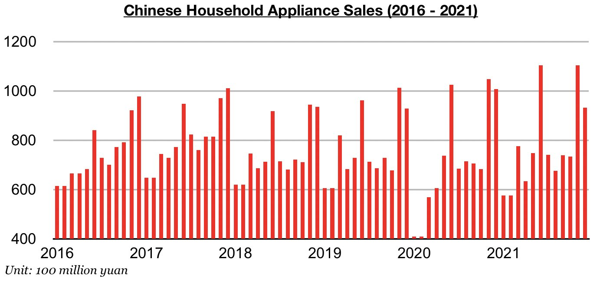
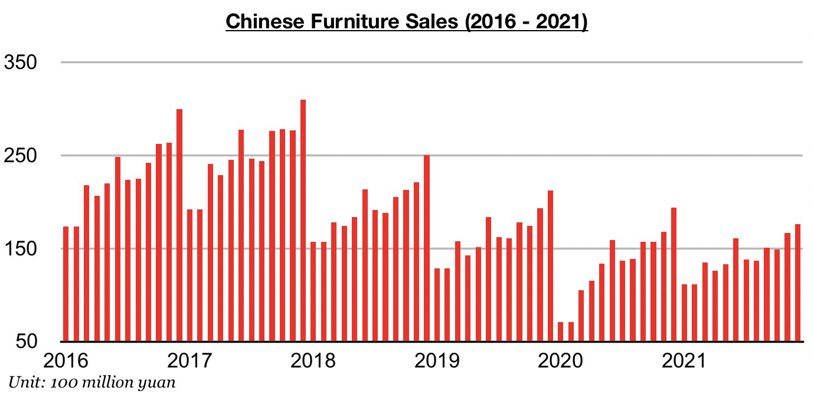
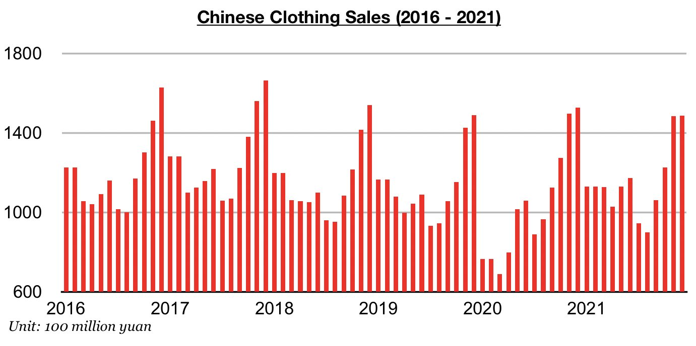

# Recent Weakness in Chinese Consumer Spending

**Date:** February 22, 2022  
**Publisher:** Breakwave Advisors | **Category:** Market Insights  
**Original URL:** [https://www.breakwaveadvisors.com/insights/2022/2/22/recent-weakness-in-chinese-consumer-spending](https://www.breakwaveadvisors.com/insights/2022/2/22/recent-weakness-in-chinese-consumer-spending)  

---

*By*[*Jeffrey Landsberg*](https://www.linkedin.com/in/jeffrey-landsberg-70ab957/)

An examination of China’s most recently released domestic retail sales data (December’s data) shows that domestic appliance sales, furniture sales, and clothing sales all experienced larger year-on-year contractions that had been previously seen in earlier months. This weakness occurred due in part to new coronavirus restrictions that began to be placed in many cities starting in late December. Appliance sales (which includes consumer electronics) in China totaled approximately 93.3 billion yuan in December, which has marked a year-on-year contraction of 8%. Previously, appliance sales had increased on a year-on-year basis for three consecutive months.

> **Figure 1: Chart 1 (21)**  
> [Local Asset](file:///C:/Users/Dell/Github/Shipping/corpus/03-breakwave/insights/2022/assets/2022-02-22_recent-weakness-in-chinese-consumer-spending_img_chart1282129_c176ce8d9627.jpg)

As we also discussed in earlier Weekly China Reports, appliance sales in China had previously come in at a record level during both November and June. Appliance sales in China often set a record in December, but this time around sales fell on both a month-on-month and year-on-year basis due in part to the new coronavirus restrictions. Furniture sales in China totaled approximately 17.6 billion yuan in December, which has marked a year-on-year contraction of 9%. Furniture sales in China had previously contracted on a year-on-year basis for four consecutive months but only by 1% in November, 5% in October, 4% in September, and 1% in August. December’s 9% contraction marked the largest contraction seen all year.

> **Figure 2: Chart 2 (18)**  
> [Local Asset](file:///C:/Users/Dell/Github/Shipping/corpus/03-breakwave/insights/2022/assets/2022-02-22_recent-weakness-in-chinese-consumer-spending_img_chart2281829_b212525a86db.jpg)

Clothing sales in China (which includes garments, footwear, hats, and knitwear) totaled approximately 148.7 billion yuan, which has marked a year-on-year contraction of 3%. Previously, clothing sales in China had contracted on a year-on-year basis for four consecutive months, with sales most recently in November contracting on a year-on-year basis by only 1%.

> **Figure 3: Chart 3 (14)**  
> [Local Asset](file:///C:/Users/Dell/Github/Shipping/corpus/03-breakwave/insights/2022/assets/2022-02-22_recent-weakness-in-chinese-consumer-spending_img_chart3281429_30a680b45f0d.jpg)

---

**Tags:** China, Sales, Economy  
