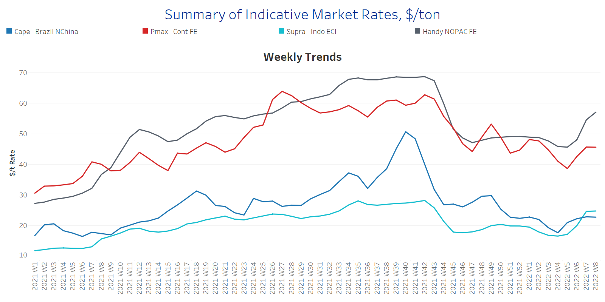
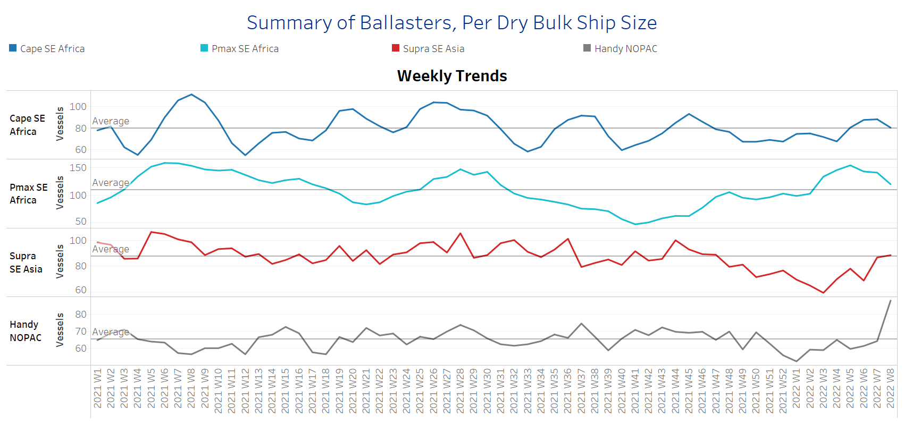
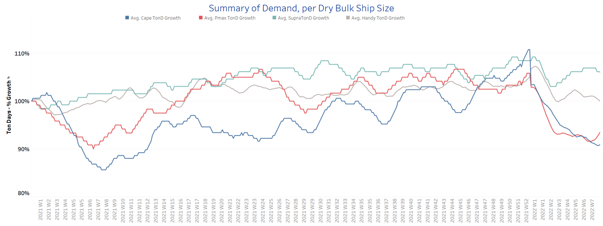
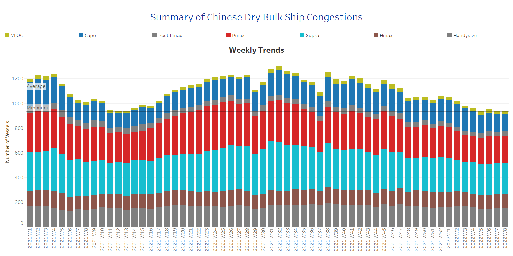

# Signal Dry Bulk Weekly Report

**Date:** February 23, 2022  
**Publisher:** Breakwave Advisors | **Category:** Market Insights  
**Original URL:** [https://www.breakwaveadvisors.com/insights/2022/2/23/signal-dry-bulk-weekly-report](https://www.breakwaveadvisors.com/insights/2022/2/23/signal-dry-bulk-weekly-report)  

---

The freight market continues to gain momentum with a recovery seen in all main dry sizes and ballasters’ view, with larger vessels driving the recent euphoria seen.

In the iron ore market, the Chinese sticking to their strategy for control of iron ore prices as they have started now to plot a new plan for the creation of a single state-backed platform. The aim is all iron ore purchases to be completed through the platform in order to stabilize the increase of prices.

In the coal segment, an interesting development was the news of Russia working with China on an inter-governmental agreement for the supply of 100 million tons of coal. In October of last year, Russia cooperated with India for the provision of 40 million tons of coal during the Russian Energy Week.

Lastly, for this week, we need to highlight the threat of Russian-Ukraine tensions affecting the wheat market and the supply of grains, with a significant impact on the volume of dry bulk shipments. During February, a significant drop is already visible compared to last month and an even larger drop compared to the last couple of years. While a lot can be said in this respect, only time will tell how much the wheat supply will end up being affected, and the respective percentage of downward correction in the volume of shipments.

It is understandable that a Russian invasion of Ukraine will have an extremely negative effect on the grain market and prices, as these two countries' wheat exports account for almost 30% of the world's grain exports. The recent signing of a decree recognizing two Russia-backed regions in eastern Ukraine by Russian President Vladimir Putin, has pushed the wheat price to over $271 per ton in the US future index, from around $264 last Friday.

## Section 1 - Freight -Market Rates ($/T) - Firmer

‘The Big Picture’ - Capesize and Panamax Bulkers and Smaller Ship Sizes

> **Figure 1: Ch1**  
> **Interactive Data & Source:** [Signal Ocean Platform](https://www.thesignalgroup.com/signal-ocean-platform) | [Local Asset](file:///C:/Users/Dell/Github/Shipping/corpus/03-breakwave/insights/2022/assets/2022-02-23_signal-dry-bulk-weekly-report_img_ch1_11a0311e7e52.png)

- Capesize Brazil to NChina rates are on increase but still hover below $25/t. Panamax Continent to Far East rates that surpassed the barrier of $40/t with a spike at $46.5/t last week are now at soft lower levels of $45.6/t.

- In the Supramax segment, Indo ECI rates have shown a steady momentum in the last two weeks at around $25/t.
- Handysize NOPAC FE rates surprised last week with the jump to 52/t, and this continues with higher levels at the opening of this week at levels $57/t.

## Section 2 - Supply - Ballasters View

## Number of Vessels -Decreasing

Supply Trend Lines for Key Load Areas

> **Figure 2: Ch2**  
> **Interactive Data & Source:** [Signal Ocean Platform](https://www.thesignalgroup.com/signal-ocean-platform) | [Local Asset](file:///C:/Users/Dell/Github/Shipping/corpus/03-breakwave/insights/2022/assets/2022-02-23_signal-dry-bulk-weekly-report_img_ch2_4b7b16598e6d.png)

- The ballasters’ view has now confirmed the downward correction that was signaled since last week in the Capesize and Panamax sectors.

- In the Capesize segment, the number of vessels sailing in ballast status has now started to drop below the one-year average of 80 vessels, while in the Panamax, the trend is moving near to the average of 100 vessels.
- In SE Asia, the number of Supramax vessels sailing in ballast status seems to have paused the accelerated increase, while in the handysize, the number remains enormously higher than the average trend line of 65 vessels.

## Section 3 - Demand - In Ton Days

## Increasing

> **Figure 3: Ch3**  
> **Interactive Data & Source:** [Signal Ocean Platform](https://www.thesignalgroup.com/signal-ocean-platform) | [Local Asset](file:///C:/Users/Dell/Github/Shipping/corpus/03-breakwave/insights/2022/assets/2022-02-23_signal-dry-bulk-weekly-report_img_ch3_baee3b3c9369.png)

- The dry bulk demand evolution eventually started to increase for the large vessel sizes, while the ongoing threat on the wheat supply market stemming from Russian-Ukraine tensions is paving the way for higher Supramax tondays growth.

- In the Handysize segment, it seems that the demand is growing at a slower mode following the high recorded at Week 4, however, it is still firmer than the extreme lows at the start of the year.

## Section 4 - Chinese Port Congestions -

## Number of Vessels - Decreasing

## Dry Bulk Ships Congested Around Chinese Ports

> **Figure 4: Ch4**  
> **Interactive Data & Source:** [Signal Ocean Platform](https://www.thesignalgroup.com/signal-ocean-platform) | [Local Asset](file:///C:/Users/Dell/Github/Shipping/corpus/03-breakwave/insights/2022/assets/2022-02-23_signal-dry-bulk-weekly-report_img_ch4_7d8d82877cf5.png)

- The last days of February reversed the sudden increase that was recorded in the previous week and we see now a decrease with levels , almost to below the threshold of 1,000 vessels.

- The overall number of ship congestion is now around 930 vessels, with the handysize segment holding its high levels of congestion~150 vessels, while in the supramax, we see a trend of decreasing below 250 vessels.

Data Source:[Signal Ocean Platform](https://www.thesignalgroup.com/signal-ocean-platform)

---

**Tags:** Shipping, Dry Bulk, Freight, Rates  
