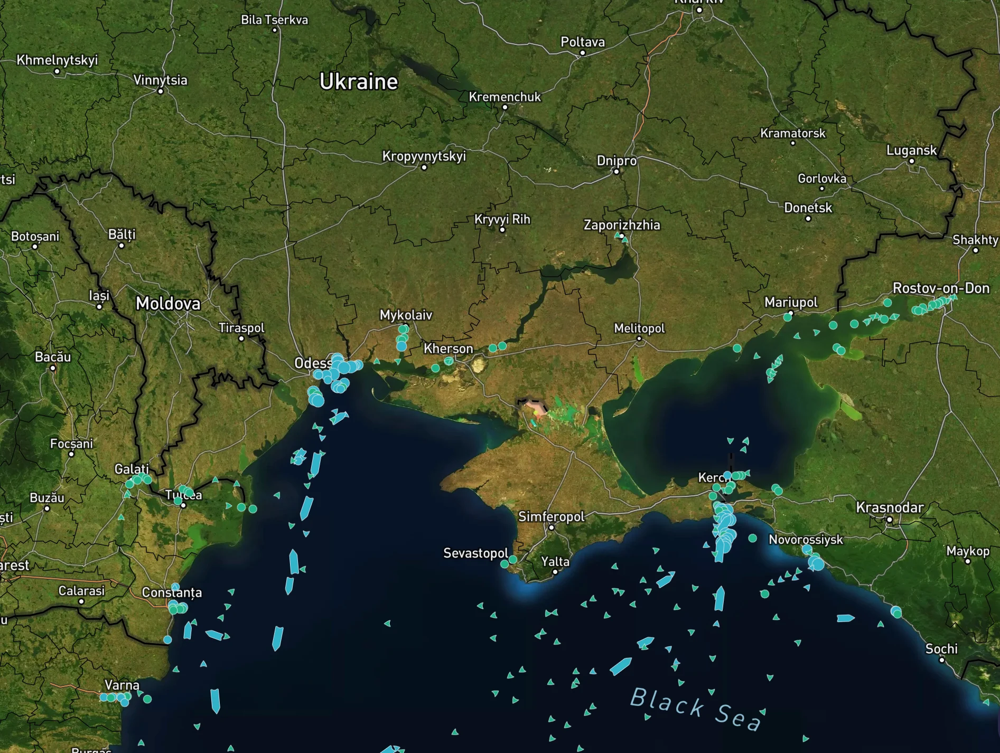

# Invasion and Inflation

**Date:** February 24, 2022  
**Publisher:** Breakwave Advisors | **Category:** Market Insights  
**Original URL:** [https://www.breakwaveadvisors.com/insights/2022/2/24/ixqz9uvwkupxn407e2ogo9daigi0x0](https://www.breakwaveadvisors.com/insights/2022/2/24/ixqz9uvwkupxn407e2ogo9daigi0x0)  

---

*By*[*Ulf Bergman*](https://www.linkedin.com/in/ulf-bergman-81570425/)

Two topics, invasion and inflation, have dominated the global news flow for quite some time, with no signs of disappearing. Monday’s move by the Russian leader to formally recognise the breakaway regions in Eastern Ukraine, and the subsequent deployment of Russian troops to the areas for “peacekeeping”, has raised the probability of hostilities between the belligerents to commence in earnest. This development followed a barrage of contradictory reports on diplomatic efforts, which saw risk aversion going in and out of fashion daily or even hourly. As a result, commodities, like the financial markets in general, have seen increasing levels of volatility.

The most recent escalation has sent commodity prices higher, with oil, gas, nickel and aluminium leading the way as traders weighed the risk of supply disruptions from potential Western sanctions. The Nord Stream 2 gas pipeline became one of the first casualties, with the German government halting the approval process required for the link to become operational. The UK government followed suit with five banks and three individuals targeted. However, the Russian move is still seen to fall short of the threshold for the harshest of prepared sanctions.

While the maritime angle of an open conflict is somewhat limited in a global context, the potential implications for the global flow of commodities are nevertheless considerable. Assuming that sanctions are as comprehensive as expected, Russian seaborne exports of commodities are likely to be severely affected, not just from Black Sea Ports, should the situation deteriorate further. Secondary effects on the trade flows will be substantial in the event of extensive sanctions, with substitutes for Russian goods needing to be imported from alternative, and often more distant, sources. Europe could be hit by a double whammy, with dwindling gas deliveries from the East forcing increased reliance on thermal coal for energy production. Still, with traditional Russian supplies likely to be out of bounds, sourcing from more distant shores, such as Australia and South Africa, will be required.

Despite the rising tensions, the trade flow from ports in the Black Sea remains robust.**According to Shipfix’s trade flow data, dry bulk shipments in the region during the current month are already higher than for the whole of February last year**.[**Our****order data**](https://support.shipfix.com/knowledge/how-is-shipfix-data-displayed)**also confirms the absence of disruptions to commercial shipping in the area**. The Ukrainian ministry of agriculture also reported on Monday that the country’s grain exports so far in the 2021/22 year are 37 per cent higher than during the same period in the previous year. However, the positive momentum may change rapidly if the situation deteriorates further and causes rising insurance rates.

> **Figure 1: Uk**  
> [Local Asset](file:///C:/Users/Dell/Github/Shipping/corpus/03-breakwave/insights/2022/assets/2022-02-24_ixqz9uvwkupxn407e2ogo9daigi0x0_img_uk_a5f89f2d16c0.png)

How disruptive any sanctions may become is also a function of the Chinese reaction. A continued, or even increased, flow of Russian exports to China would blunt some of the effects of the trade sanctions. However, if China is seen to help Russia circumvent any sanctions, it could face its own trade restrictions. Given the economic headwinds the country is currently facing and its dependence on uninterrupted imports and exports, overt support may be one step too far for the leadership in Beijing. For China, recognition of the breakaway regions may also prove problematic, as it would complicate its policy towards Taiwan and embolden its adversaries.

The conflict in Eastern Europe is also threatening to fuel yet higher inflation rates across the globe, as commodity prices are gaining further ground. The already elevated raw material prices and supply chain woes are among the factors that have been pushing global inflation rates higher, as the global economy has recovered from the worst effects of the pandemic. The US is currently facing the most rapid price increases since 1982, with any notions of the inflation pressures being transitory fading rapidly. In the wake of the rising inflation, the language from Federal Reserve officials is becoming increasingly hawkish. A rapid increase in US interest rates is likely to appreciate the dollar and make dollar-denominated commodities more expensive elsewhere. Hence, there is the possibility of the US exporting its inflation.

On the other side of the Pacific, inflation remains an issue as well, with the Chinese authorities attempting to control rising commodity prices. Like last year, iron ore has become the focal point of the efforts. The country aims to launch a centralised platform through which global suppliers negotiate sales with Chinese counterparts. The initiative should be seen against a background of renewed efforts to stimulate flagging growth rates through investments in infrastructure projects, which will fuel rising Chinese demand for steel and iron ore.

---

**Tags:** Ukraine, Inflation, Commodities, Economy  
