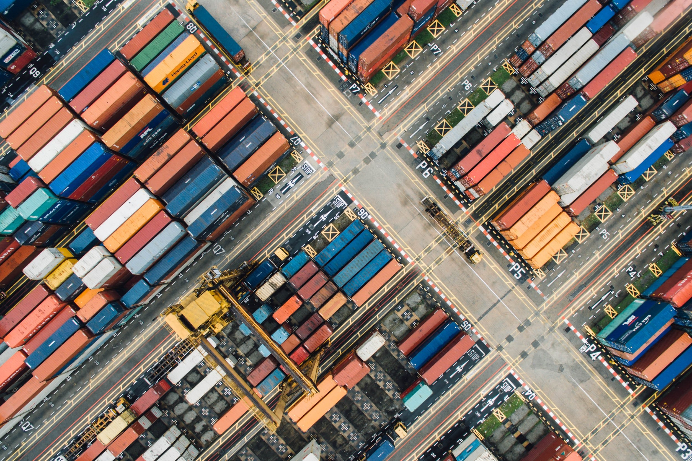
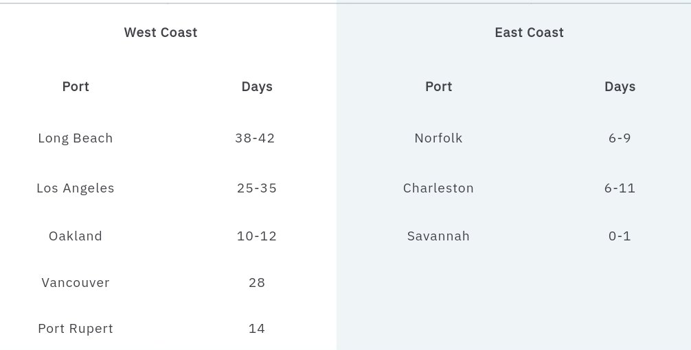

# Box Rates and the Supply Chain: Will the Boom Continue?

**Date:** February 26, 2022  
**Publisher:** Breakwave Advisors | **Category:** Market Insights  
**Original URL:** [https://www.breakwaveadvisors.com/insights/2022/2/24/box-rates-and-the-supply-chain-will-the-boom-continue](https://www.breakwaveadvisors.com/insights/2022/2/24/box-rates-and-the-supply-chain-will-the-boom-continue)  

---

*By*[*Patrik Berglund*](https://www.linkedin.com/in/patrikolstad/)

For a world suffering two years from Covid, world trade is remarkably robust. According to the U.S. Bureau of Economic Analysis, the Q3 2021 American balance of payments (imports vs. exports) showed the U.S. current account deficit (imports) increased by 8.3 % from Q2 2021.

While in December, the Port of Rotterdam announced they’d handled 15 million TEU’s, becoming the first European port and the first port outside Asia to reach that level. When coupled with the record profits reported by the box carriers, clearly both the volume and profitability of moving boxes are at record levels. Hence, the obvious question here is: Will the boom continue? And more importantly, what will happen to box rates?

Last week, Loadstar reported that due to demand from box carriers, BCO’s, NVOCC’s, and other logistical operators, the global container equipment fleet grew from 14% in 2021 to 50.5 million TEU’s.

On paper, 50.5 million TEU’s is an impressive number, but they point out that containers now took an average of 30% longer to complete their transport cycles last year due to port, landside and haulage delays.

In addition to contributing to the container shortages affecting exports in such export-dependent markets as India and Bangladesh, Loadstar used Japanese carrier ONE as an example of how dislocated and confused box shipping is currently.

Although ONE has ordered additional containers, they also needed to charter multiple smaller box ships as sweepers to reposition boxes to high-demand regions.

> **Figure 1: Unsplash Image 9cces9sg6nu**  
> **Interactive Data & Source:** [Xeneta](http://xeneta.com/) | [Local Asset](file:///C:/Users/Dell/Github/Shipping/corpus/03-breakwave/insights/2022/assets/2022-02-26_box-rates-and-the-supply-chain-will-the-boom-continue_img_unsplash-image-9cces9sg6nu_a0ffee036d9c.jpg)

One wonders how much revenue could be earned by the box carriers if they filled just a medium amount of these empties at the ports instead of buying new boxes that stand a good chance of being empty on half of their voyages.

Another reason why the 14% growth in containers seems like an empty number is because port congestion has eased since the 100+ ships idling off at Los Angeles/Long Beach and the congestion has spread to multiple ports.

Last week’s Maersk February 10 North American Customer Advisory list of delays and problems on all the US-Canadian ports they serve was most informative. A compilation of delays at the Canadian/American ports Maersk serves:

> **Figure 2: Screenshot 20220224 130211 Samsung Internet**  
> **Interactive Data & Source:** [Xeneta](http://xeneta.com/) | [Local Asset](file:///C:/Users/Dell/Github/Shipping/corpus/03-breakwave/insights/2022/assets/2022-02-26_box-rates-and-the-supply-chain-will-the-boom-continue_img_screenshot-20220224-130211-samsungin_100f1abcfc8e.jpg)

With Savannah as the only major port reporting pre-Covid discharge conditions, one wonders how 14% more containers sitting offshore on the newbuilds ordered in the past two years will solve the continuing supply chain debacle?

In reality, the solution is likely more lorry drivers and warehouse workers instead of more containers and bigger ships.

A look at[our platform](http://xeneta.com/)illustrates that box rates in the past 30 days (Jan-13-Feb 13) are mixed, depending on the destination and the premiums charged:

Shanghai-Los Angeles Ports are up approx 5.27%, from**US$ 8,139 – 8, 568**plus additional surcharges of**US$ 1,130-1,711**while Shanghai-North European Main ports are down approx 2.55%**(US$ 14,436-14,068)**plus**$ 862-2,545**. The good news is the premiums/surcharges have lessened in both locations.

However, that might be in response to the multi-billion dollar profits reported by the carriers in 2021 and growing governmental awareness of these profits as supply chains collapsed worldwide.

## There Is No Reason to Think Box Rates Will Decrease Drastically on a Macro Basis.

Interest rates remain historically low, and although the Bank of England has begun increasing UK rates, the American Federal Reserve has said they will be increasing American rates throughout 2022.

The EU has declared that they will not raise rates as all the central banks are cognizant of the danger of increasing rates too quickly and by too much. Hence import volumes into the EU/UK/US should continue primarily unchanged.

A Russian invasion or attack on Ukraine will spike oil/LNG prices, which will result in bunker surcharges. Other regional/EU disruptions will occur if Russian access to SWIFT is cut off, causing their exports to collapse.

Additionally, the Russian Navy has already encircled Ukraine’s ports and warned-off civilian commercial traffic so they could engage in live-fire exercises. The probable result of war and restricting Ukrainian exports will be a civilian tragedy and a huge regional dislocation in trade.

Assuming the Asia-US and Asia-EU trade continues unharmed, any effect on rates should be neutral to upward.

On a micro basis, the box carrier acquisition spree to acquire more vessels by either purchasing or long-term charter has measurably increased their operational costs.

Hence in today’s strong market, the carriers will have increased motivation not to engage in a rate war if cargo volumes flag.

For various reasons, box rates look to remain high, and 2022 looks to be yet another challenging year.

---

**Tags:** Containers, Box, Rates, Supplychain  
