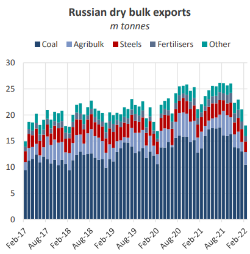
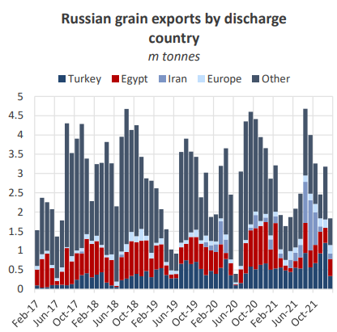
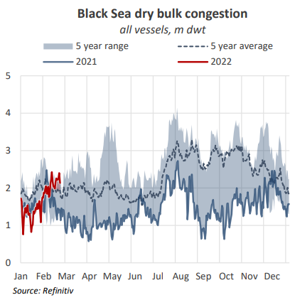
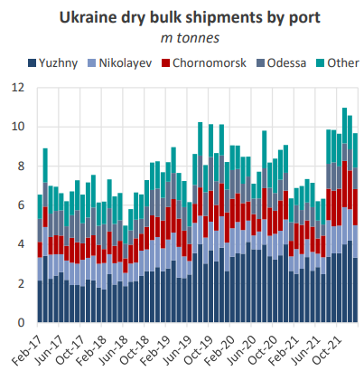
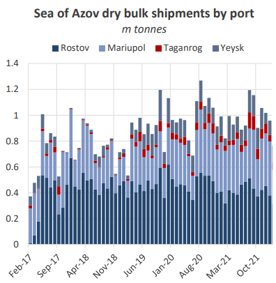

# The Big Picture: Major escalations

**Date:** February 27, 2022  
**Publisher:** Breakwave Advisors | **Category:** Market Insights  
**Original URL:** [https://www.breakwaveadvisors.com/insights/2022/2/27/the-big-picture-major-escalations](https://www.breakwaveadvisors.com/insights/2022/2/27/the-big-picture-major-escalations)  

---

*By*[*Mark Nugent*](https://www.linkedin.com/in/mark-nugent-3724a3192/)

Since our previous analysis on the ongoing situation between Russia and Ukraine, tensions have escalated and a first round of sanctions has been put in place. We update on how things have transpired and how it is affecting the dry bulk market.

### Tensions Rising

In the early hours on Thursday it was revealed the Russian military would conduct ‘special military operations‘ in Ukraine. Following the announcement, attacks were reported across the Russian-Ukrainian border, threatening to start a full-scale war. As a result, risk to commercial shipping vessels in the Black Sea has significantly increased and exports in the region are likely to be suspended. In reaction to the news, front-month FFA prices on Capesizes and Panamaxes declined by 16.2% and 12.6% at the time of writing.

Commodity prices have also reacted sharply, with Brent crude oil increasing by more than 9.0%, surpassing $105 per barrel for the first time since 2014. Further, current-month European TTF natural gas prices increased by 34.7% to €119/MWh. Agricultural commodities also followed suit, with CBOT wheat and corn prices increasing by 5.5% and 5.1% respectively on prospects of a potential major supply shortage in global grain markets.

### Sanctions Rolling Out

As of today, sanctions imposed on Russia include several of the country’s banks and high net-worth individuals. Germany also moved to halt the Nord Stream 2 gas pipeline project, although existing pipelines from Russia into Europe remain operational and unaffected at this time. Several countries have today expressed plans to increase the severity of sanctions on Russia, although it is unclear to what extent at this time.

> **Figure 1: Market Chart 1**  
> [Local Asset](file:///C:/Users/Dell/Github/Shipping/corpus/03-breakwave/insights/2022/assets/2022-02-27_the-big-picture-major-escalations_img_image028129_eeae9f7aea77.png)

In the event further sanctions are placed on Russia, in which the likeliness seems high given the events of the past 24 hours, these may be extended to Russia’s largest financial institutions. The country’s major banks typically manage transactions with foreign buyers of Russian exports. Sanctions would halt transactions between buyers in these countries and sanctioned banks, therefore removing foreign buyers’ ability to purchase Russian commodities. In this case, grain and energy flows would be altered. The primary destination for Russian dry bulk shipments, namely coal and wheat, is likely to be China with which Russia has a seemingly better relationship. On Thursday, the Chinese government approved Russian wheat imports despite traditionally importing minor volumes, favouring other sources such as Australia, with only 520k tonnes loaded for Chinese ports in 2021. However, as we mentioned in our previous analysis in January, the majority of Russia’s wheat has already been shipped for this year. Other major buyers of Russian grain, Turkey, Egypt and Iran, have also yet to impose sanctions on the country, maintaining scope for these trades to continue.

> **Figure 2: Market Chart 2**  
> [Local Asset](file:///C:/Users/Dell/Github/Shipping/corpus/03-breakwave/insights/2022/assets/2022-02-27_the-big-picture-major-escalations_img_image128129_97a949b46d40.png)

In 2021, Russian grain exports totalled 33.6m tonnes, decreasing by 10.4% YoY. Of these volumes, 23.6% were shipped to Turkey, 15.7% to Egypt and 13.8% to Iran. In comparison, only 5.9% was loaded for EU countries.

### Congestion

Bulker queues in the Black Sea region stood at 2.1m dwt before the events of last night, amounting to 37 vessels across all vessel types sub-Cape. At 2.1m dwt, bulker queues in the Black Sea stood 10.1% above the 5 year average and 61.2% higher than levels seen this time last year.

> **Figure 3: Market Chart 3**  
> [Local Asset](file:///C:/Users/Dell/Github/Shipping/corpus/03-breakwave/insights/2022/assets/2022-02-27_the-big-picture-major-escalations_img_image228129_cefbe39e9018.png)

According to satellite tracking data, several dry bulk vessels in the Black Sea have reversed course and are sailing towards the Bosphorus strait in Turkey to exit the region. With the region remaining high-risk, diversions are likely to increase in the coming days resulting in potential tonnage overcapacity in other regions.

### Ukraine Port Operations Halted

Whilst the situation continues to unfold, the Ukrainian military has reportedly suspended all port operations in Ukraine, particularly as regions such as Odessa become increasingly under fire. Before this, some ports had already declared force majeure as port staff returned home for safety. For the same reason, several vessels remain stuck at ports due to a lack of pilots. Given the unpredictability of the situation, the timeframe for a resumption in operations is currently unclear.

> **Figure 4: Market Chart 4**  
> [Local Asset](file:///C:/Users/Dell/Github/Shipping/corpus/03-breakwave/insights/2022/assets/2022-02-27_the-big-picture-major-escalations_img_image328229_fba3255c101e.png)

On Thursday morning, Russian officials announced that it had suspended the movement of commercial vessels in the Sea of Azov until further notice. Risk in the Azov region was amplified amid reports of missile strikes hitting civilian cargo ships. The Sea of Azov, home to both Ukrainian and Russian ports, primarily exports steels, grains and slight volumes of coal. Due to its shallow water ports, dry bulk shipments out of this region are almost exclusively on the Handies.

> **Figure 5: Market Chart 5**  
> [Local Asset](file:///C:/Users/Dell/Github/Shipping/corpus/03-breakwave/insights/2022/assets/2022-02-27_the-big-picture-major-escalations_img_image428129_c5459e523983.png)

### Moving Forward

Increased sanctions on major Russian financial institutions will prohibit these banks from transacting with buyers of Russian exports in the countries which enforced them. In the scenario of mass sanctions on Russian exports, this will have a similar effect. This would have a significant impact on coal and natural gas flows into Europe, which the EU would need to source from elsewhere in this case. Finally, trade flows out of Russia to countries bypassing sanctions such as China may increase, which may be able to purchase Russian commodities at discounted prices.

Although it is unclear on the severity of any further sanctions, given Europe’s reliance on Russia’s energy resources it will be vastly difficult to source these volumes from elsewhere given the supply constraints already present in these markets.

---

**Tags:** Ukraine, Russia, Shipping, Economy  
