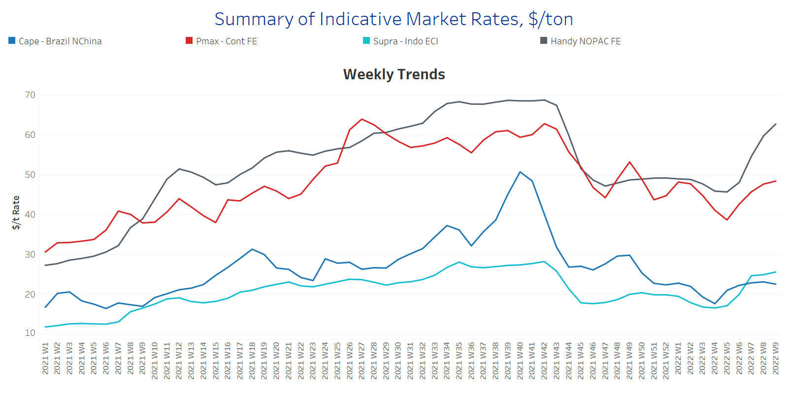
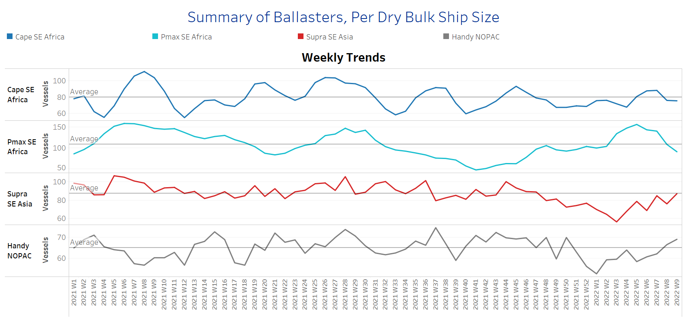
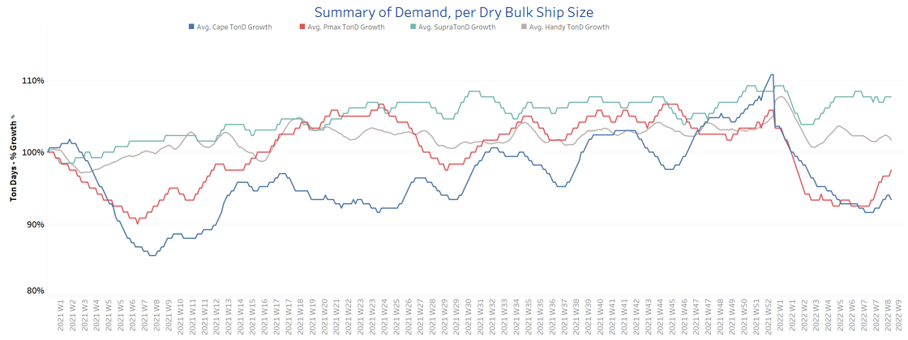

# Signal Dry Bulk Weekly Report

**Date:** March 03, 2022  
**Publisher:** Breakwave Advisors | **Category:** Market Insights  
**Original URL:** [https://www.breakwaveadvisors.com/insights/2022/3/3/signal-dry-bulk-weekly-report](https://www.breakwaveadvisors.com/insights/2022/3/3/signal-dry-bulk-weekly-report)  

---

The expanded Russian-Ukraine invasion intensifies worries for disruptions in the exports of all commodities from oil and metals to grains, while commodity prices are rising. Grain and soybean futures settled at sharply higher levels and current estimates indicate a further rise given that Black sea commodity exports are already facing port closures with vessels avoiding sailings towards key export hubs of high risk.

In the iron ore market, commodity prices also climbed, and the most-traded May iron ore contract ended at $112/t on Monday. Although Russia and Ukraine are not major suppliers of iron ore to China, these two countries export iron ore to other European countries and the prolonged war tension has tightened the global balance.

In the coal segment, the existing high pricing sentiment elevated with Asian buyers struggling to find alternatives to replace Russian coal. Prices for top-quality Australian thermal coal are hovering around $100/t for the last nine months, while on Friday they ended at the record high of $256/t.

Looking at the port congestion, there are signals for ship queues in the Black Sea, while Australian coal ports are suffering from heavy rain disruptions. In China, the level of congestion also gave a strong signal of increase over the last few days, but it maintains a pace lower than the one-year average of 1100 vessels.

Freight rates have now increased significantly for Panamax, supramax and handysize rates, whereas there is a softer pace of upward movements in the Capesize, while the concerns for the disruption in commodity flows has led the evolution of demand to firmer levels for the smaller vessel sizes.

## Section 1 - Freight -Market Rates ($/T) - Firmer

‘The Big Picture’ - Capesize and Panamax Bulkers and Smaller Ship Sizes

> **Figure 1: Ch1**  
> **Interactive Data & Source:** [Signal Ocean Platform](https://www.thesignalgroup.com/signal-ocean-platform) | [Local Asset](file:///C:/Users/Dell/Github/Shipping/corpus/03-breakwave/insights/2022/assets/2022-03-03_signal-dry-bulk-weekly-report_img_ch1_4a0ef70be2ff.png)

- Capesize Brazil to NChina rates dropped to levels of below $23/t this week, but they maintain stronger momentum compared to the lows of $18/t at Week 3. Panamax Continent to Far East rates continued the spike of last week and are now above $48/t.

- In the supramax segment, Indo ECI rates surged at levels $25/t with a trend of further upward movement compared to the steady momentum of the previous two weeks.
- Handysize NOPAC FE rates jumped to 63/t, compared to the bottom of $46/t at Week 5.

## Section 2 - Supply - Ballasters View

## Number of Vessels -Decreasing

Supply Trend Lines for Key Load Areas

> **Figure 2: Ch2**  
> **Interactive Data & Source:** [Signal Ocean Platform](https://www.thesignalgroup.com/signal-ocean-platform) | [Local Asset](file:///C:/Users/Dell/Github/Shipping/corpus/03-breakwave/insights/2022/assets/2022-03-03_signal-dry-bulk-weekly-report_img_ch2_1e803e90acf8.png)

- The ballasters’ view keeps the downward correction that was signaled almost three weeks ago in the Capesize and Panamax sectors.

- In the Capesize segment, the number of vessels sailing in ballast status has now eventually dropped below the one-year average of 80 vessels, while in the Panamax, the trend is near to 90 vessels compared to the peak of 156 vessels at Week 5.
- In SE Asia, the number of supramax vessels sailing in ballast status has now paused the accelerated increase and almost reached the one-year average of 87 vessels.
- In the handysize, the number remains higher than the average trend line of 65 vessels, however, the trend of growth seems now softer than the weeks 7 and 8.

## Section 3 - Demand - In Ton Days

## Increasing

> **Figure 3: Ch3**  
> **Interactive Data & Source:** [Signal Ocean Platform](https://www.thesignalgroup.com/signal-ocean-platform) | [Local Asset](file:///C:/Users/Dell/Github/Shipping/corpus/03-breakwave/insights/2022/assets/2022-03-03_signal-dry-bulk-weekly-report_img_ch3_ef0d6eccbc3a.png)

- The dry bulk demand evolution shows significantly higher growth this week for the Panamax size, followed by worries for disruptions on Russian coal,

- In the supramax segment, we see also the trend to be aggressively higher than the other vessel sizes, with Ukrainian grain ports now closed and buyers seeking alternatives.

## Section 4 - Chinese Port Congestions -

## Number of Vessels - Increasing

## Dry Bulk Ships Congested Around Chinese Ports

> **Figure 4: Ch4**  
> **Interactive Data & Source:** [Signal Ocean Platform](https://www.thesignalgroup.com/signal-ocean-platform) | [Local Asset](file:///C:/Users/Dell/Github/Shipping/corpus/03-breakwave/insights/2022/assets/2022-03-03_signal-dry-bulk-weekly-report_img_ch4_7d8d82877cf5.png)

- Although the last week gave signals for a downward movement of Chinese port congestion, we see now eventually an increase with levels above the one-year minimum of 860 vessels.

- The ships queues are longer in the handysize, supramax and Panamax sizes. In the handysize, there are 20 more vessels congested than last week, in the handysize and supramax segment, and 16 in the Panamax.

Data Source:[Signal Ocean Platform](https://www.thesignalgroup.com/signal-ocean-platform)

---

**Tags:** Shipping, Dry Bulk, Freight, Rates  
