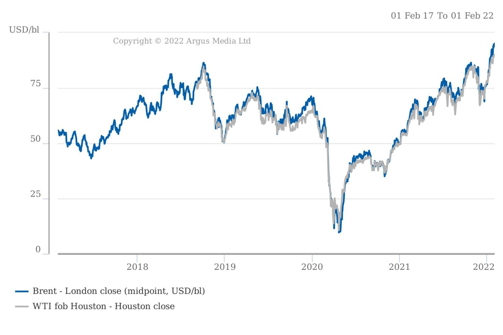

# Oil price fluctuations & tanker rates

**Date:** March 05, 2022  
**Publisher:** Breakwave Advisors | **Category:** Market Insights  
**Original URL:** [https://www.breakwaveadvisors.com/insights/2022/3/4/1aozoe8qjjo8zf5mcznujk9a5sunpo](https://www.breakwaveadvisors.com/insights/2022/3/4/1aozoe8qjjo8zf5mcznujk9a5sunpo)  

---

*By*[*Arthur Richier*](https://www.linkedin.com/in/arthurrichier/)

### Shipping: A Derived Demand

When I signed up for my first shipping exam, as part of the[**Institute of Chartered Shipbrokers**](https://www.linkedin.com/school/instituteofcharteredshipbrokers/)’ foundation course, I diligently purchased the relevant textbook: “Introduction to shipping”. The first chapter starts as follows: ‘*Shipping is a derived demand. It is not the ships themselves that are in demand, but the goods they carry*’. What a game-changer! Though intuitive, I had never read this fact expressed so simply. A lot of things started making a lot of sense after that! Those of you that have attended one of my presentations will have no doubt heard me start many of them with the same statement.

So what does it mean exactly? Derived demand is a demand based on, a good or service’s ability to acquire another good or service. Let’s use the California Gold Rush as an example. After an initial discovery in the late 1840s, news of gold deposits in California brought close to half a million people westwards. These people wanted gold. Yet, I am sure the guy that decided to not take a shot at finding gold, but instead manufacture picks and shovels ended up much richer than the huge majority of prospectors. You see, demand for picks and shovels was a derived demand that allowed the acquisition of gold nuggets. Similarly, shipping is a derived demand that allows for the efficient, safe and in most cases relative to the value of the cargo, cheap transportation of a good in demand. In the first edition of Making Waves in 2022 we will explore the relationship between the price of a cargo, in this case crude oil (or black gold as it is sometimes referred to) and the cost of shipping, or tanker freight rates.

> **Figure 1: Gold Fever (Courtesy Ofnational Geographic)**  
> *Gold Fever (Courtesy ofNational Geographic)*  
> **Interactive Data & Source:** [Linkedin](https://www.linkedin.com/company/national-geographic-society/) | [Local Asset](file:///C:/Users/Dell/Github/Shipping/corpus/03-breakwave/insights/2022/assets/2022-03-05_1aozoe8qjjo8zf5mcznujk9a5sunpo_img_tankers_3eaaf4216f74.png)

### So If One Goes Up, So Does the Other?

One could easily argue no single commodity has ever had a greater influence on all aspects of one’s life than oil. Every change in the price of oil is greatly analysed, with one question in all minds being where does it go from here? Fluctuations in the price of oil lead to an infinite possibility in terms of ramifications, from the cost of energy to heat one’s home, to the cost of transportation to drive to work, to the cost of the chair one is sitting in reading this, and so much more. Behind every barrel of oil there’s most likely a tanker that carried this oil from its point of extraction to the refinery which would have processed it. So, it should be safe to say that, based on all of the above, if the price of oil goes up, so do tanker rates? As the price of oil goes up because more people want it (i.e. higher demand) so that means more people need ships to carry that oil (i.e. higher derived demand). Let’s assume supply remains constant for a minute and we have higher demand thus higher prices. It is, however, slightly more complex in reality.

### Oil Prices and Tanker Rates 101

Before we dive into the effects of oil price fluctuations on tanker rates, it is important to understand there is an extra layer of complexity in our case. A fluctuation in the price of oil will have not one but two consequences for tankers. Firstly, it will impact the price of the cargo on-board, fairly straightforward but unique to tanker markets (as opposed to the dry bulk market for example). But it will also impact the cost of bunker fuel used to power the ship, which is a common trait across shipping markets, when the price of oil fluctuates.

### 1.what Moves Oil Prices?

Oil prices in general, are a function of supply and demand. In the case of crude oil, supply pertains to barrels extracted from the ground, in large producing countries such as Saudi Arabia, or Russia. Both are members of the OPEC+ alliance, a group or 23 countries with a stated mission "coordinate and unify the petroleum policies of its member countries and ensure the stabilization of oil markets, in order to secure an efficient, economic and regular[**supply**](https://en.wikipedia.org/wiki/Energy_supply)of petroleum to consumers, a steady income to producers, and a fair return on capital for those investing in the petroleum industry." Slightly long winded, I’ll give you that, but the idea is one of coordinated increase or decrease in supply in line with market conditions at the time. Demand on the other hand, in the case of crude oil again, comes from refineries, which utilise crude oil as a feedstock, or raw material, to refine petroleum products more familiar to us such as jet fuel, gasoline or diesel. In that sense, crude oil is itself a derived demand!

Thus, the price of crude oil is dependent on the balance between supply and demand at any given time. On top of that, countries will have their own oil inventories, known as strategic reserves, whilst companies may have also built up stocks in case of significant disruption to their supply. The price of aforementioned refined products will also have an impact on the demand for crude oil and in turn lead most likely to a market impact on decisions or trades around the supply of oil.

> **Figure 2: This Year Prices Have Been at Their Highest in the Last 5 Years**  
> *This year prices have been at their highest in the last 5 years and more due to supply tightness in the market (if you’re interested in learning more about US crude oil prices and freight specifically join me for the followingwebinar)*  
> **Interactive Data & Source:** [Linkedin](https://www.linkedin.com/posts/vortexa_vortexa-argus-virtualevent-activity-6891719717254414339-6zl9) | [Local Asset](file:///C:/Users/Dell/Github/Shipping/corpus/03-breakwave/insights/2022/assets/2022-03-05_1aozoe8qjjo8zf5mcznujk9a5sunpo_img_tankers_f4ee65b525c2.png)

### 2. What Moves Tanker Rates?

In the[**December issue**](https://www.linkedin.com/pulse/december-2021-why-freight-pricing-used-art-science-until-richier/)of Making Waves, we took a closer look at freight pricing. We left out however, how fluctuations in the price of oil could impact freight rates, and tanker rates in particular. To answer that question, I have both good and bad news for you. The good news is that this topic has been extensively researched in past academic journals. From maritime economics heavyweights such as Martin Stopford (recently retired after an illustrious career spanning half a century), to international organizations such as the[**UNCTAD**](https://www.linkedin.com/company/unctad/), I am not the first, nor will I be the last, to ask the question: how do oil price changes affect freight prices? The bad news is that everyone seems to have a subtly different view. Whilst an excess of crude oil in the market can negatively affect prices, it will translate to higher available cargoes for charter and, if supply of vessels remains constant, be a positive for tanker rates. So whilst demand for shipping is a result of oil demand, tanker rates are then affected by the supply of ships in a given region, for a given period of loading, which is far easier to measure.

Simply put, shipping demand is not as clearly correlated with oil demand as one might expect but a function of the supply and demand of oil as well the logistical constraints at the time (taking into account onshore and offshore inventories, pipeline flows, etc.). Whilst the supply of ships can be assessed more accurately, a number of subtle market dynamics can blur the picture.

### 3. the Impact of Bunker Fuel Prices

As a reminder, bunker fuel is technically any type of fuel oil used aboard a ship. It is derived from crude oil. The introduction of IMO 2020 brought bunker fuel and the different types of bunker fuels based on sulphur content into the limelight. Pitch black and thick, clearly seen when vessels are steaming, bunker fuels are a strong visual representation of the industry’s “dirty little secret” as some politicians have called it. For the purposes of this edition of Making Waves we won’t dive into the controversies and challenges facing the industry but focus on the fact that as a refined product derived from crude, the price of bunker fuel is highly dependent on the price of the latter. For a shipowner, the cost of bunker fuels has always represented its largest expenditure with estimates varying between 50 to 75% of operating expenses for a given vessel. What does this mean for freight rates?

When the price of bunker fuel goes up, so does the operating cost of owners. However, that does not always translate into higher freight rates, even though owners will usually try and push for them. On the flip-side, only too often do we see how a fall in crude oil prices and thus bunker prices will lead to overall freight rates in the market declining.

### In Summary

With rising oil prices and the shipping industry increasingly in focus for its use of ‘dirty fuels’, the link between oil prices and tanker rates is a crucial one to understand. Like many elements of shipping market dynamics, the answer is not a clear cut one and many elements need to be considered for the relationship to be fully understood. From the above we can infer that the price of oil and freight rates can at best only be partly correlated as only one leg of the voyage is related to oil market fundamentals whilst oil prices are not dependent on the level of supply of ships, and thus the needs of the shipping market.

What remains certain is the dependency today of the industry on crude oil as its main cargo as well as bunker oil as its main fuel. A future without both brings into question the very reason for being of the industry. Will oil price fluctuations matter in three decades time? Let us know what you think in the comments.

---

**Tags:** Tankers, Freight, Price  
