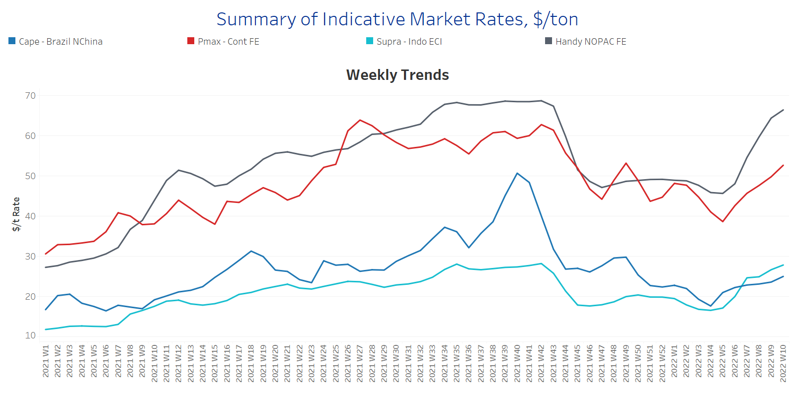
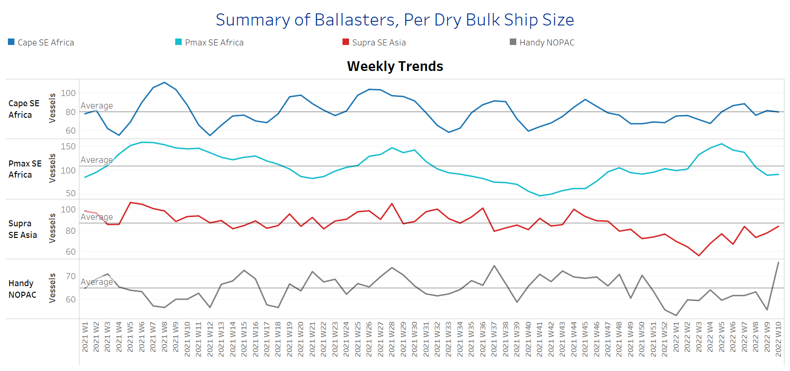
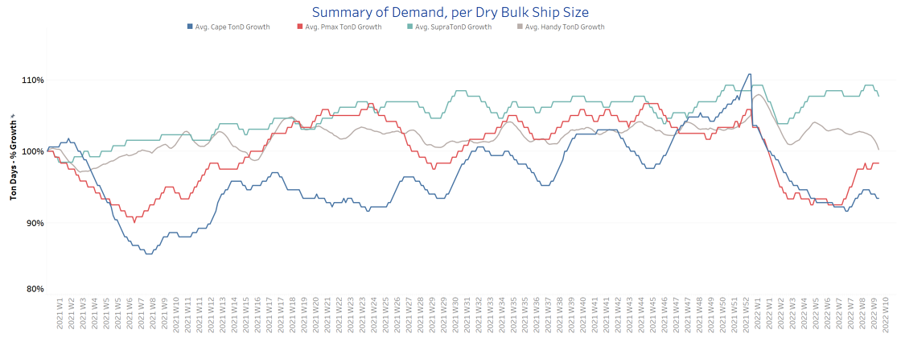
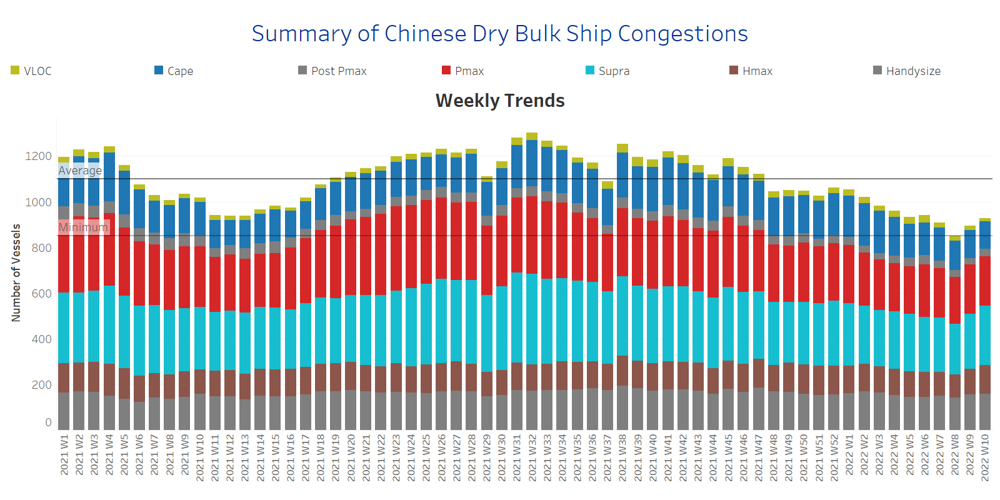

# Signal Dry Bulk Weekly Report

**Date:** March 09, 2022  
**Publisher:** Breakwave Advisors | **Category:** Market Insights  
**Original URL:** [https://www.breakwaveadvisors.com/insights/2022/3/9/signal-dry-bulk-weekly-report](https://www.breakwaveadvisors.com/insights/2022/3/9/signal-dry-bulk-weekly-report)  

---

The dry bulk freight market is gaining further upward momentum in the main trading routes, with the handysize and Panamax vessel segments signaling record high levels for the first time since the beginning of this year. The booming of freight rates raises concerns about the future as the uncertainty of the Russian-Ukrainian war has shocked the world economy with the rise in commodity prices.

The historical surge of wheat prices is said to trigger Canadian farmers to sow more acres to replace the loss in Ukrainian wheat supplies. The only concern in the potential boost is the drought conditions, while the current Canadian stockpiles are insufficient to support new wheat exports without a new crop.

In the iron market, prices recorded a 6-month high last Thursday following expectations for a released series of COVID-19 measures. At the beginning of this week, prices for iron ore cargoes with a 63.5% iron content for delivery into Tianjin have surpassed $150/t, while the Russia-Ukraine tensions are going to stimulate demand for Chinese steel overseas supplies. Russia is estimated to account for about 10% of the global steel trade, while Ukraine has a 4% share. Chinese iron ore demand seems not to be affected by today’s geopolitical uncertainty, as the government keeps with its stimulus package for investments in the infrastructure sector that will support the euphoria in Capesize freight rates.

The levels of iron ore prices compared to the coal and grain segments is of lower magnitude, as the rally in coal prices has shocked the consuming countries. It is important to note that Russian coal supplies feed about 70% of European thermal coal exports and any potential ban will accelerate the demand for supplies from other big exporting countries, such as Indonesia and Australia.

The spot coal price for shipments from the Port of Newcastle in New South Wales fetched more than $400/t, dismissing the previous record of around $270/t four months ago, whereas in 2020, the price dropped below $50/t. The Asian and European utilities have already been trying to find alternative supplies as the global energy crisis has flowed concerns on the future availability of coal supply in a market that faces tight supplies after mid-February.

## Section 1 - Freight -Market Rates ($/T) - Firmer

‘The Big Picture’ - Capesize and Panamax Bulkers and Smaller Ship Sizes

> **Figure 1: Ch1**  
> [Local Asset](file:///C:/Users/Dell/Github/Shipping/corpus/03-breakwave/insights/2022/assets/2022-03-09_signal-dry-bulk-weekly-report_img_ch1_cc89c4c57361.png)

- Capesize Brazil to NChina rates increased to levels $25/t this week, with an accelerated trend since Week 7, compared to the lows of $18/t at Week 3. Panamax Continent to Far East rates continue the outstanding rise following the Russian-Ukraine tensions and surged to $53/t, when they were around $39/t at Week 5.

- In the supramax segment, Indo ECI rates increased but with a softer momentum compared to the accelerated pace recorded in the handysize and Panamax vessel segment. Rates are now at $28/t, but it is interesting to note that their performance is stronger than in the Capesize segment following the war tension.
- Handysize NOPAC FE rates jumped even higher than last week to 66/t, compared to the bottom of $46/t at Week 5.

## Section 2 - Supply - Ballasters View

## Number of Vessels -Decreasing

Supply Trend Lines for Key Load Areas

> **Figure 2: Ch2**  
> [Local Asset](file:///C:/Users/Dell/Github/Shipping/corpus/03-breakwave/insights/2022/assets/2022-03-09_signal-dry-bulk-weekly-report_img_ch2_2c22724cc891.png)

- The ballasters’ view keeps the same contradictory picture of three weeks ago, which is a decreasing trend in the Capesize and Panamax sectors, and an aggressive increase in the handysize segment.

- In the Capesize segment, the number of vessels sailing in ballast status has now dropped to the one-year average of 80 vessels, while in the Panamax, the trend is below the average to 92 vessels compared to the peak of 156 vessels at Week 5.
- In SE Asia, the number of supramax vessels sailing in ballast status has started again to increase, and it is now trending near to the one-year average by standing at around 84 vessels, 3 vessels below the one-year average of 87 vessels.
- In the handysize, the number is aggressively higher than the average trend line of 65 vessels, standing now at around 76 vessels compared to 56 ships in the previous week.

## Section 3 - Demand - In Ton Days

## Increasing

> **Figure 3: Ch3**  
> [Local Asset](file:///C:/Users/Dell/Github/Shipping/corpus/03-breakwave/insights/2022/assets/2022-03-09_signal-dry-bulk-weekly-report_img_ch3_5aadbbba1ae0.png)

The dry bulk demand evolution keeps a significantly higher growth for the Panamax size in two consecutive weeks, followed by worries for disruptions on Russian coal. It is interesting to see that the growth in the Panamax is evolving higher than in the Capesize segment in the aftermath of war tensions.

- In the supramax segment, the demand keeps an aggressively higher trend than the other vessel sizes, with Ukrainian grain ports under uncertainty and high insurance risks on vessels' trading. The London insurance markets Joint War Committee is said to have widened its high-risk areas in the Black Sea and Azov in response to the ongoing threat. The listed areas include the Black Sea from the Russia-Ukrainian border, across to the Russia-Georgia border and parts of the high seas.

## Section 4 - Chinese Port Congestions -

## Number of Vessels - Increasing

## Dry Bulk Ships Congested Around Chinese Ports

> **Figure 4: Ch4**  
> [Local Asset](file:///C:/Users/Dell/Github/Shipping/corpus/03-breakwave/insights/2022/assets/2022-03-09_signal-dry-bulk-weekly-report_img_ch4_69b29a32e59a.png)

- The number of ship congestion is on an increasing trend for two consecutive weeks. The levels have surpassed the minimum of 860 vessels, while the lowest figure for this year was evidenced at Week 8.

- For this week, the increase is stemming from the supramax segment, where 260 vessels appear congested, around 40 more vessels than Week 8.

---

**Tags:** Shipping, Dry Bulk, Freight, Rates  
