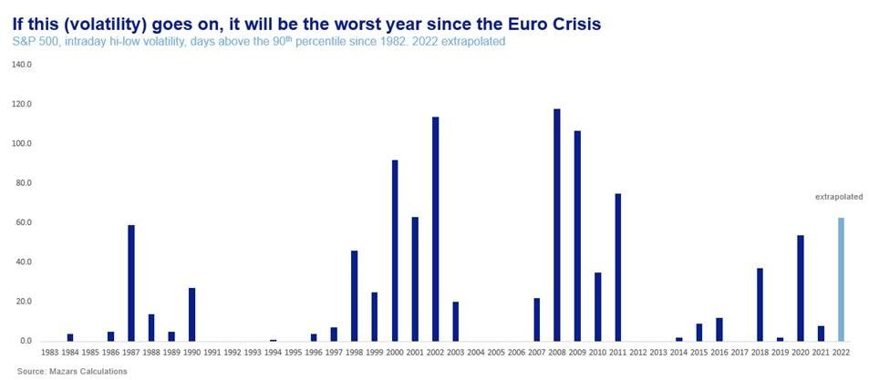
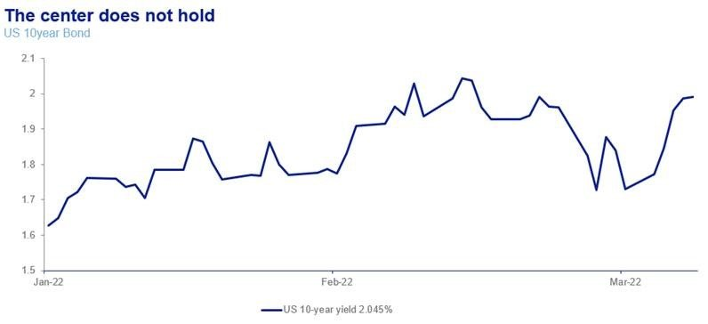
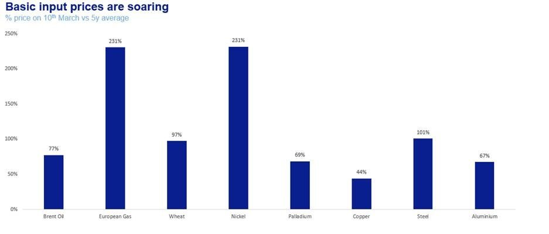

# The Great Commodity Crisis (GCC) may force the Fed’s hand

**Date:** March 14, 2022  
**Publisher:** Breakwave Advisors | **Category:** Market Insights  
**Original URL:** [https://www.breakwaveadvisors.com/insights/2022/3/14/the-great-commodity-crisis-gcc-may-force-the-feds-hand](https://www.breakwaveadvisors.com/insights/2022/3/14/the-great-commodity-crisis-gcc-may-force-the-feds-hand)  

---

*By*[*George Lagarias*](https://www.linkedin.com/in/george-lagarias-mba-3baa769/)

One of the great myths of capitalism is that financial markets are predictive mechanisms. The idea is that “there’s wisdom in the crowds” and therefore wherever markets choose to go, this is the highest probability event. Reality is, of course, far removed from ideological fantasies. Markets are not a singular homogeneous organism. They are, for lack of a better word, chaotic. Which is why no one has ever found a way to predict them. Prices are usually led by a narrow cohort of “fast” money with short term profit targets, whose unpredictable average sets the market trend. “Slow” money is usually reactive only to long term events.

Markets brushed off the possibility of an actual Russian invasion of Ukraine, until the time it actually happened. Just like they failed to predict sharp inflation a year ago. In the same way, markets were caught off guard in March 2021, when they collapsed after the first Covid-19 victim in Europe, two months after the outbreak in Wuhan. Markets failed to predict the 2016 Presidential Election, Brexit, the possibility of Lehman Brothers collapsing and a host of other very important events.

Failures to predict lower probability events, which are far too often, result in high market volatility, the enemy of portfolios and trades with low liquidity thresholds. Many clients have reduced the size of their portfolios on high volatility, never to return until the rebound was completed. And many more traders who got the market right but lost money anyway because they could not sustain a position due to high volatility.

Developed governments and markets believed that Russia would not pull the trigger as sanctions would be crippling. Russia did not believe that the western world, barely standing after the pandemic, would impose such heavy sanctions on a global commodity producer. The result, predictably, is mutually assured (economic) destruction.

Why are markets so bad at predicting is a big conversation. Humans have seldomly shown any capability of correctly assigning probabilities for an event, especially when they have a stake in it. Call it “Optimism Bias”, a staple of capitalism, short-termism, or simply inability to adjust a portfolio for fringe events, markets consistently get big events wrong. Three Economic Nobel prizes have been given to behaviourists and I find myself ill-equipped to fully explain the intricate workings of human logic.The result in failing to predict Russia’s invasion has been further upheaval in the equities market, where volatility (if extrapolated to year end) would reach that of the Euro Crisis.

> **Figure 1: A1.png**  
> [Local Asset](file:///C:/Users/Dell/Github/Shipping/corpus/03-breakwave/insights/2022/assets/2022-03-14_the-great-commodity-crisis-gcc-may-force-the-feds-hand_img_a1png_184c471855e8.jpg)

Making things worse, instead of flocking to bonds, the traditional safety asset, last week saw the return of the US 10 year above 2%.

> **Figure 2: A2**  
> [Local Asset](file:///C:/Users/Dell/Github/Shipping/corpus/03-breakwave/insights/2022/assets/2022-03-14_the-great-commodity-crisis-gcc-may-force-the-feds-hand_img_a2_6b02deaac29a.jpg)

### Why?

Because at the heart of this crisis is not the financial system like 2008. Instead, it’s the global commodities markets. Errand commodity prices exacerbate inflation pressures and, as usual, the first victim is low yielding fixed income.

But things are taking a turn for the worse very quickly.

Just last week, global Nickel trading froze and remains thus, after Tsingshan Holding Group, the world’s biggest producer of nickel and stainless steel found itself on the wrong side of the market and is now subject to Billions of Dollars of losses. It’s owner, Xiang Guangda has been hailed as the industry’s Steve Jobs. While we are talking about a Chinese company, it’s near (?) collapse is already impacting western economies, whose companies can’t hedge their own exposure. Global economies and markets are as interconnected as they were in 2008, the derivatives market is as big and a large enough dislocation may reverberate across the world.

It's not just nickel of course. Global commodity prices are rising at a very fast pace, and the dislocations only grow. It’s only a matter of time before a western “Tsingshan” finds itself against the ropes.

> **Figure 3: A3.png**  
> [Local Asset](file:///C:/Users/Dell/Github/Shipping/corpus/03-breakwave/insights/2022/assets/2022-03-14_the-great-commodity-crisis-gcc-may-force-the-feds-hand_img_a3png_4ea8f4e91153.jpg)

Sanctions on Russia are taking an enormous toll on western markets. Volatility for stocks and bonds is one thing. But commodities markets are experiencing serious dislocations. The result of commodity volatility has a very direct impact on economies. Maybe ATMs won’t freeze within a week and the crisis won’t be as fast as in 2008. But it may well be equally potent. Price rises and shortages of everything for the second time in two years will prove challenging even for the most robust economies.

Make no mistake. Commodity prices are now a runaway train. The global markets are dislocated, trendless and in desperate search of a paradigm- and leadership. The Fed, the world’s de facto central bank, may now persist that inflation is its primary mandate, but it surely knows it can do precious little to stop prices rising due to shortages. Whatever its says on the tin, it’s primary mission is economic stability. The nature of this crisis is so unique, that it may even have to consider new tools, like Quantitative Easing was in 2008.

The simultaneous fall of stocks and bonds coupled with crippling volatility in the alternatives space confirms that we are living through another systemic event. The quicker investors and policy makers realise that, the more contained the consequences. But every day that passes when the Fed is focused on inflation and developed market governments worry about debt and fiscal outlays, is a day when a systemic problem is getting exponentially worse. It’s a day which will eventually cost billions of freshly printed money and put even more distance between investors and any sort of market normality.

Investors should be on the lookout for policy announcements soon, lest the Great Commodity Crisis seriously threatens both investment portfolios and cash.

---

**Tags:** Commodities, Economy, Volatility  
