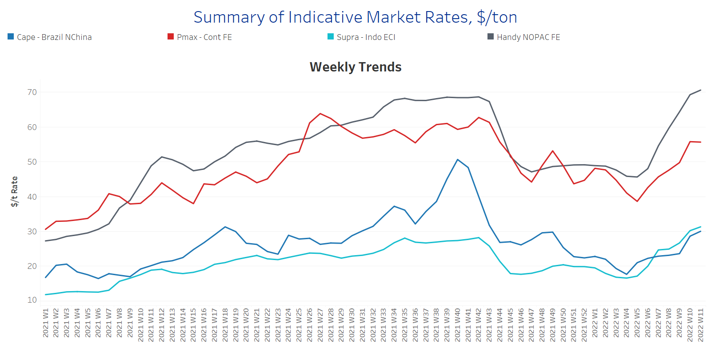
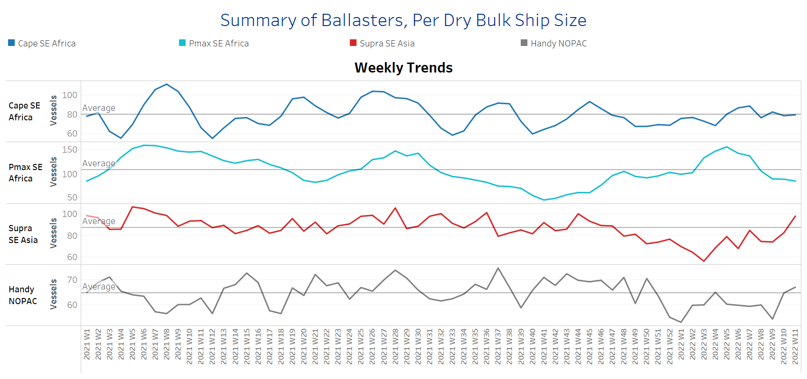
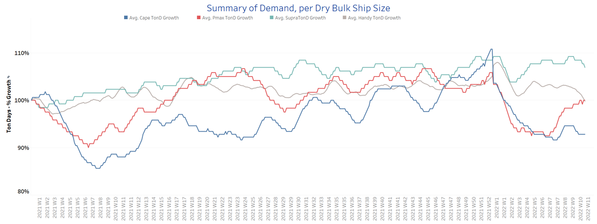
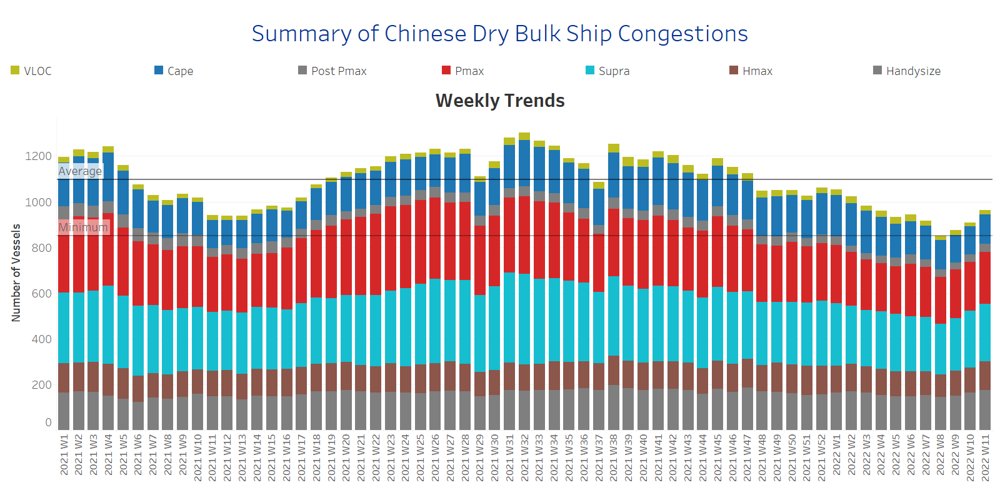

# Signal Dry Bulk Weekly Report

**Date:** March 16, 2022  
**Publisher:** Breakwave Advisors | **Category:** Market Insights  
**Original URL:** [https://www.breakwaveadvisors.com/insights/2022/3/16/signal-dry-bulk-weekly-report](https://www.breakwaveadvisors.com/insights/2022/3/16/signal-dry-bulk-weekly-report)  

---

We are experiencing an ongoing upturn of dry bulk freight rates, while Russia has moved forward with the ban on exports for specific commodities and countries. The economy ministry has also warned of further measures that could restrict foreign ships from Russian ports. The Russia ban will be imposed on countries that have committed unfriendly actions to Russia. Commodities under focus are agricultural as well as some forestry products such as timber. In further action, Russia already announced yesterday that it is going to temporarily ban grain exports to ex-Soviet countries and mainly sugar exports.

Commodity prices are still soaring with the price of coal being doubled since the onset of war tensions. Coal prices are now climbing to an annual high of more than $300/t, while Rystad Energy research estimates that prices are likely to pass US$500/t this year. For the third week of March, we see a drop in the surging sentiment with coal prices falling to 2-week lows of $361/t on the hopes of a diplomatic solution to the ongoing Russia-Ukraine conflicts. In addition, there are fears of a resurgence of coronavirus cases in China, the biggest producer and consumer of coal, that could lead to lower demand and prices. On the other hand, European coal demand is on fire due to low inventories and expectations are this trend will continue sparking the upturn of Panamax freight rates to higher levels than today in the next few days.

In the grain market, fertilizers are at risk following Russian temporal suspension on exports. Furthermore, additional risks appear from the announcement of grain giants ADM, Bunge, Cargill and LDC scaling back their business activity in Russia. In the meantime, global wheat prices seem unlikely to freeze their rally as Russian-Ukraine grain market has a tremendous key role for the European supplies. According to farmer market analysts, if the conflict persists there could be more than 10mil tons of wheat lost in Ukraine as grain farmers remain unable to fertilize their crops.

In the iron ore market, prices have shown retreat as in the coal segment, from demand concerns following rising COVID-19 cases in China. Prices for iron ore cargoes with a 63.5% iron content for delivery into Tianjin declined to below $140/t, and moved away from the high of $159 hit earlier this month. However, there are expectations that prices will come back to higher levels with Beijing keeping its stimulus package for infrastructure spending.

## Section 1 - Freight -Market Rates ($/T) - Firmer

> **Figure 1: Ch1**  
> [Local Asset](file:///C:/Users/Dell/Github/Shipping/corpus/03-breakwave/insights/2022/assets/2022-03-16_signal-dry-bulk-weekly-report_img_ch1_6c06669250fd.png)

Capesize Brazil to NChina rates increased to levels above $30/t this week, almost 5 points up from previous week, while there is a constant accelerated trend since Week 7. The turnaround is remarkable compared to the low of Week 3 $18/t. Panamax Continent to Far East rates have shown a soft decrease, however, levels are still above $50/t. Uncertainty in coal supplies seems to hold the outstanding surge of Panamax freight rates following the Russian-Ukraine tensions.

- In the supramax segment, Indo ECI freight rates surpassed the levels of previous week and hover above $30/t, as the Russian grain market has influenced severely the seaborne wheat exported volumes and created more demand for new supply sources. Supramax freight rates are still growing at a higher pace than in the Capesize segment following the war tension.
- Handysize NOPAC FE freight rates eventually surpassed the barrier of $70/t and the performance is expected to continue the boom as long as the war tension remains and Far Eastern countries are trying to replace any existing and future grain supply losses.

## Section 2 - Supply - Ballasters View

## Number of Vessels -Decreasing

Supply Trend Lines for Key Load Areas

> **Figure 2: Ch2**  
> [Local Asset](file:///C:/Users/Dell/Github/Shipping/corpus/03-breakwave/insights/2022/assets/2022-03-16_signal-dry-bulk-weekly-report_img_ch2_874dabf8ff0e.png)

The ballasters’ view has recorded a firm decrease in the Panamax segment, while the number of ballasters is aggressively increasing in the handysize and supramax segment.

- In the Capesize segment, the number of vessels sailing in ballast status is now near to the one-year average of 80 vessels for almost three consecutive weeks, while in the Panamax, the number dropped to 86 vessels compared to the peak of 156 vessels at Week 5.
- In SE Asia, the number of supramax vessels sailing in ballast status increased to almost 100 vessels, and it is now trending above the one-year average of 87 vessels.
- In the handysize, the number is aggressively higher than the average trend line of 65 vessels for three consecutive weeks, standing now at around 67 vessels compared to 54 ships in Week 9.

## Section 3 - Demand - In Ton Days

## Decreasing

> **Figure 3: Ch3**  
> [Local Asset](file:///C:/Users/Dell/Github/Shipping/corpus/03-breakwave/insights/2022/assets/2022-03-16_signal-dry-bulk-weekly-report_img_ch3_ea7e64567df8.png)

The dry bulk demand evolution keeps growing in the Panamax and supramax vessel segments. It is interesting to see that demand growth in the handysize segment is evolving significantly at lower volumes than in the supramax segment. However, demand growth for smaller vessel sizes is still higher than in the Capesize segment in the aftermath of war tensions.

- Looking at the current trend, it seems likely that the demand for the Panamax vessel size will exceed the growth of the handysize as European coal buyers are seeking to replenish their shortages.

## Section 4 - Chinese Port Congestions -

## Number of Vessels - Increasing

## Dry Bulk Ships Congested Around Chinese Ports

> **Figure 4: Ch4**  
> [Local Asset](file:///C:/Users/Dell/Github/Shipping/corpus/03-breakwave/insights/2022/assets/2022-03-16_signal-dry-bulk-weekly-report_img_ch4_c7509126e1ad.png)

- The number of ship congestion is on an increasing trend for three successive weeks. The levels have surpassed the minimum of 860 vessels since Week 8, while the overall trend is still below the record highs witnessed last quarter of the previous year.

- Last week, the increase was stemming from the supramax segment, while for the last days, handysize and Panamax vessels are in the spotlight of increase.

---

**Tags:** Shipping, Dry Bulk, Freight, Rates  
