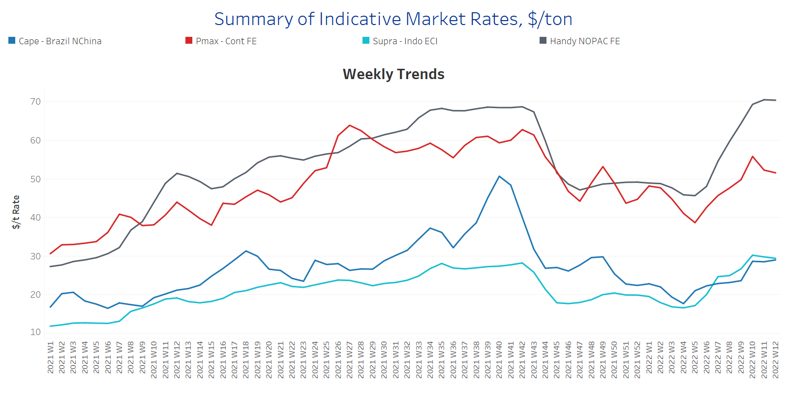
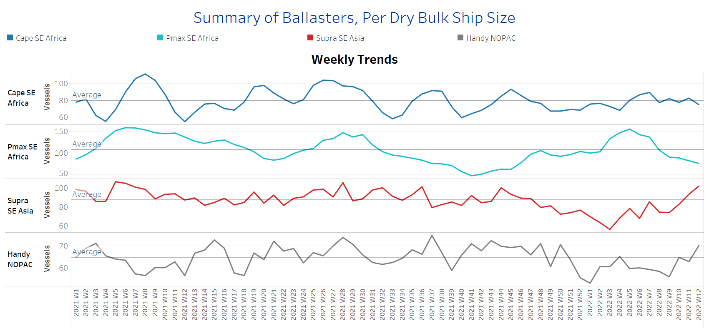
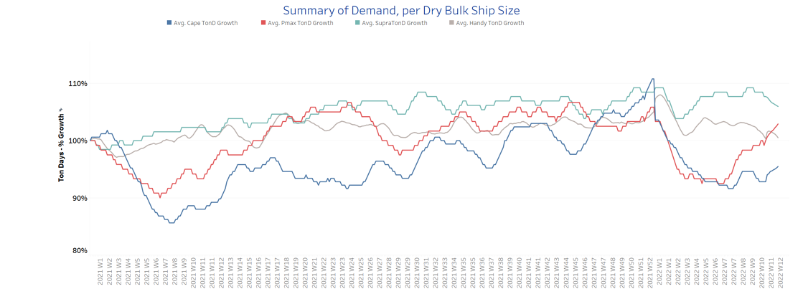
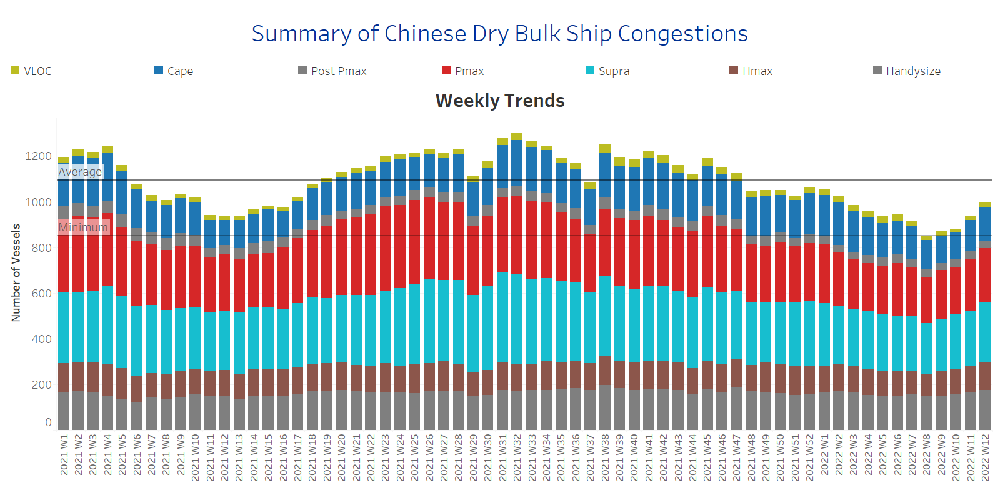

# Signal Dry Bulk Weekly Report

**Date:** March 23, 2022  
**Publisher:** Breakwave Advisors | **Category:** Market Insights  
**Original URL:** [https://www.breakwaveadvisors.com/insights/2022/3/23/signal-dry-bulk-weekly-report](https://www.breakwaveadvisors.com/insights/2022/3/23/signal-dry-bulk-weekly-report)  

---

The last days of March are trending a softer momentum in dry bulk freight rates with Russian geopolitical uncertainty having a significant influence on grain trading. Germany's largest agricultural trader BayWa confirmed last week that wheat exports from Ukraine and Russia are still being blocked by Russia from leaving the Black Sea. The Panamanian Maritime Authority also revealed that the Russian Navy was preventing 200 to 300 vessels from departing from the Black Sea, most of them transporting grain, while other reports suggested that around 100 vessels were blocked.

The International Grain Council in its latest Grain market report highlighted the concerns about potential food security risks, mainly for the most import-dependent countries in the Near East and Africa, with the spike in agricultural commodity prices remaining extremely high. The current threat is mainly the disruption in export flows, as Commercial Black Sea port loadings are currently suspended in Ukraine. There are some efforts for the[increase of exports via railway routes](https://email.thesignalgroup.com/e3t/Ctc/LX+113/cJpWv04/MWSY2hsM9S0W3nGhms2j_xN0W70RWGB4G_t-RN2bpb_B5nCTJV3Zsc37CgCcbW4Kxp651sRkHLW2pvKcX3CDFHLW93JGyr1GlxKzW2Z928052d4TYW6v-CBS89pZcXN7tC2DHG4VGKW3FjsKk3tZSGbW1TGcMM61GgVPW3cx9YF2B_0TlW4Jdh505HHd-DW1xCzCc2jHmm-W6BHQj91j5xY9W29CvTR8qmBNPW5W0GXQ82MRhNW34wkMP7XKxfnW6jW77m5BKZczW2KHgWN2vR7H5W8FqqRJ6Zj603W4q_bPY4LMTmVN79tPRtYnGYhW8CxJsX2RpBFsW3r9vtf2254mkW42J3Rn5C5z3CW5vssXr8JXTZYW2F1PxW4dY_T8W3YFSHF2WPHZ2W4RLJY06Rl2yXW1KpYRK3wTlV5N5fv2fnwwpdbW7K7ns_5jylMpW1rPr7s8g1wmCW7HCTNC7ChJMh32wL1)through the country's western borders, however, overall volumes are likely to be limited.

The Indian grain market is now emerging and takes advantage of the current uncertainty in wheat supplies. India now has a rare opportunity to export profitably large quantities of wheat from its stockpiles, as global prices have surged above the domestic minimum support price. The central government is pushing to fill the gap and the existing plans indicate that India is set to export a record 7 million tons of wheat this year, higher than the previous record of 6.5 million tons in 2012-13.

In the iron market, prices for iron ore cargoes with a 63.5% iron content for delivery into Tianjin have bottomed around $145/t, moving away from a seven-month high of $159/t hit earlier this month weighed due to demand concerns following the recent resurgence of Covid-19 cases in China.

We also see a downward trend in prices in the coal segment, where Newcastle coal futures came below $350 per tonne in late March, a level not seen in three weeks, as the latest coronavirus-induced restrictions in China, particularly in Tangshan, hurt transportation and eventually led to increased inventories at mines while also dampened demand. The rally of prices at the beginning of this year was mainly triggered by supply disruptions in the top exporting countries such as Indonesia and Australia, while Russia-Ukraine tensions escalated further the existing upward momentum.

## Section 1 - Freight -Market Rates ($/T) - Weaker

‘The Big Picture’ - Capesize and Panamax Bulkers and Smaller Ship Sizes

> **Figure 1: Ch1**  
> [Local Asset](file:///C:/Users/Dell/Github/Shipping/corpus/03-breakwave/insights/2022/assets/2022-03-23_signal-dry-bulk-weekly-report_img_ch1_dde6a69e6644.png)

- Capesize Brazil to NChina rates sustained levels around $29/t one week before the end of March, almost at the same levels from the previous week, with a soft declining sentiment due to Chinese economic instability from the rising COVID-19 cases. Market rates remain remarkably higher than the low of Week 3 $18/t. Panamax Continent to Far East rates continues at lower levels than the first half of March, dropping this week to around $50/t. It seems that the soaring levels of coal prices are reflected in uncertainty for seaborne coal transportation and freight rates.

- In the supramax segment, Indo ECI freight rates are now less than $30/t almost at the same levels of Capesize rates. Over the last weeks, supramax Indo ECI freight rates stood higher than in the Capesize segment.
- Handysize NOPAC FE freight rates have kept the exceeding rates of $70/t, however, a sense of optimism for a compromise between Russia-Ukraine last week froze the frenzied acceleration.

## Section 2 - Supply - Ballasters View

## Number of Vessels -Decreasing

Supply Trend Lines for Key Load Areas

> **Figure 2: Ch2**  
> [Local Asset](file:///C:/Users/Dell/Github/Shipping/corpus/03-breakwave/insights/2022/assets/2022-03-23_signal-dry-bulk-weekly-report_img_ch2_9944aa0c229c.png)

- The ballasters’ view keeps a firm decrease in the panamax segment over the last three weeks, while the number of ballasters remains significantly high in the supramax segment.

- In the Capesize segment, the number of vessels sailing in ballast status has now dropped below the one-year average of 80 vessels, while in the Panamax, the number is now at one of the lowest levels of the last year at 76 vessels. The current levels are much lower than the peak of 156 vessels at Week 5.
- In SE Asia, the number of supramax vessels sailing in ballast status surpassed the barrier of 100 vessels, and the trend remains on increase.
- In the handysize, the number is still above the one-year average of 65 vessels for four consecutive weeks, standing now at around 70 vessels compared to 54 ships in Week 9.

## Section 3 - Demand - In Ton Days

## Decreasing

> **Figure 3: Ch3**  
> [Local Asset](file:///C:/Users/Dell/Github/Shipping/corpus/03-breakwave/insights/2022/assets/2022-03-23_signal-dry-bulk-weekly-report_img_ch3_9db3e73507d0.png)

- The last days of March confirm the upward evolution of demand ton days for the Panamax vessels, while the trend decreases for the smaller vessel sizes, supramax and Handysize.

- In the Capesize segment, we see a reversed sentiment this week towards a positive note despite the ongoing concerns for a weaker Chinese iron ore demand and signs of decrease last week.
- Overall, the Panamax demand growth finally surpassed this week the evolution of the handysize segment, whereas Supramax vessel size is still at a stronger demand growth compared to other vessel sizes.

## Section 4 - Chinese Port Congestions -

## Number of Vessels - Increasing

## Dry Bulk Ships Congested Around Chinese Ports

> **Figure 4: Ch4**  
> [Local Asset](file:///C:/Users/Dell/Github/Shipping/corpus/03-breakwave/insights/2022/assets/2022-03-23_signal-dry-bulk-weekly-report_img_ch4_af7bbfb3c499.png)

- The number of ship congestion is on an increasing trend for four successive weeks. The levels have surpassed the minimum of 860 vessels since Week 8, while the overall trend is still below the record highs witnessed last quarter of the previous year.

- Last week, the increase was stemming from the handysize and Panamax vessels, with the last signs showing still increase for these vessel sizes but also in the supramax.
- It is interesting to note that the congestion has also risen significantly in the Capesize segment, with an almost 14% increase in the number of vessels, compared to Week 8.

---

**Tags:** Shipping, Freight, Rates  
