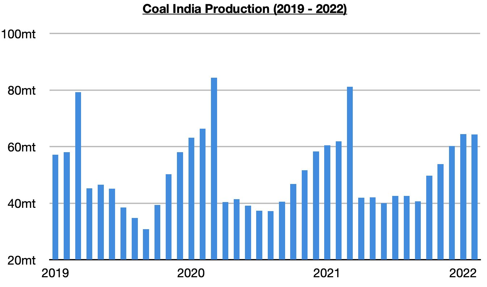
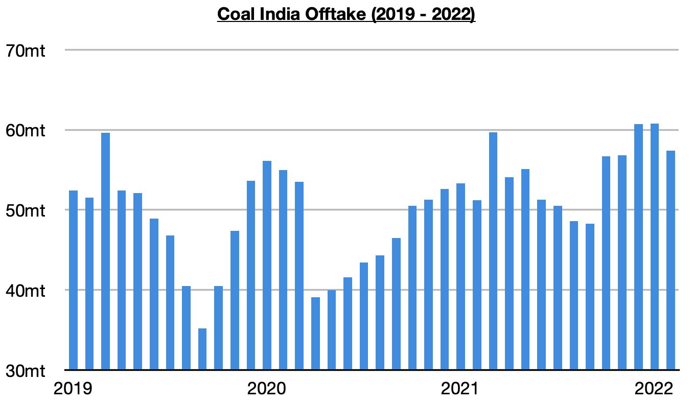
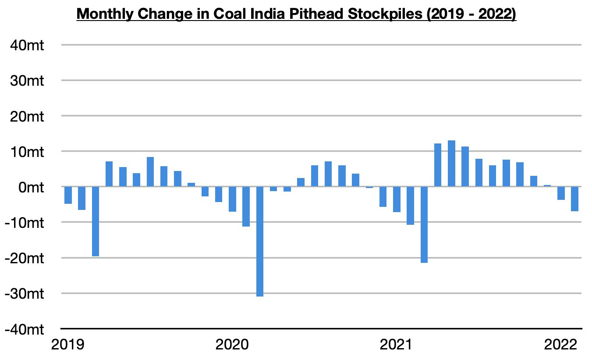
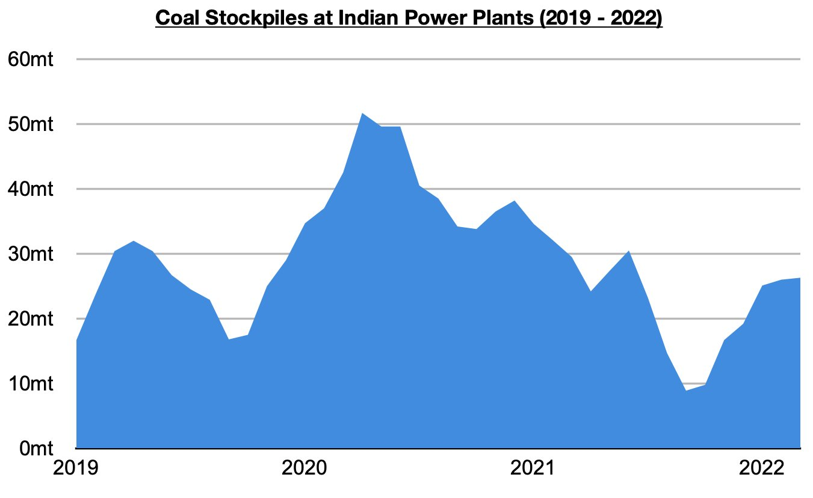

# Coal India's Production Remains Strong

**Date:** March 24, 2022  
**Publisher:** Breakwave Advisors | **Category:** Market Insights  
**Original URL:** [https://www.breakwaveadvisors.com/insights/2022/3/24/coal-indias-production-remains-strong](https://www.breakwaveadvisors.com/insights/2022/3/24/coal-indias-production-remains-strong)  

---

*By*[*Jeffrey Landsberg*](https://www.linkedin.com/in/jeffrey-landsberg-70ab957/)

Coal India produced approximately 64.3 million tons of coal last month, which marks a month-on-month decline of 200,000 tons but a year-on-year increase of 2.4 million tons (4%). Coal India’s production has climbed significantly since September and has continued to lead to a rise in the nation’s power plant stockpiles.

> **Figure 1: Chart 1 (23)**  
> [Local Asset](file:///C:/Users/Dell/Github/Shipping/corpus/03-breakwave/insights/2022/assets/2022-03-24_coal-indias-production-remains-strong_img_chart1282329_41e13d7fa5d6.jpg)

Offtake (amount sent to customers) totaled 57.4 million tons last month, which marks a month-on-month decline of 3.4 million tons (-6%) but a year-on-year increase of 6.2 million tons (12%). Offtake has now increased on a year-on-year basis for twelve straight months (production has increased on a year-on-year basis for eleven straight months).

> **Figure 2: Chart 2 (20)**  
> [Local Asset](file:///C:/Users/Dell/Github/Shipping/corpus/03-breakwave/insights/2022/assets/2022-03-24_coal-indias-production-remains-strong_img_chart2282029_2d400d0e19f8.jpg)

Also of note is that coal stockpiles at Coal India’s pitheads have continued to decline. The stockpiles now stand at approximately 42.5 million tons. In April, they stood at 99 million tons. Since April, Coal India has produced 542.5 million tons but their offtake during this period has totaled 600.3 million tons (Coal India’s offtake exceeded production every month during April 2021 through December 2021).

> **Figure 3: Chart 3 (16)**  
> [Local Asset](file:///C:/Users/Dell/Github/Shipping/corpus/03-breakwave/insights/2022/assets/2022-03-24_coal-indias-production-remains-strong_img_chart3281629_299d61993906.jpg)

The company has very wisely made it a priority to draw down stockpiles in order to help rebuild the nation’s power plant stockpiles. Power plant stockpiles remain up significantly from the lows seen late last year.

> **Figure 4: Chart 4 (10)**  
> [Local Asset](file:///C:/Users/Dell/Github/Shipping/corpus/03-breakwave/insights/2022/assets/2022-03-24_coal-indias-production-remains-strong_img_chart4281029_47bd6a689db9.jpg)

---

**Tags:** Coal, India, Exports  
